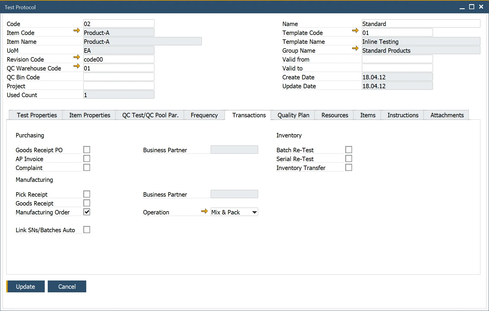
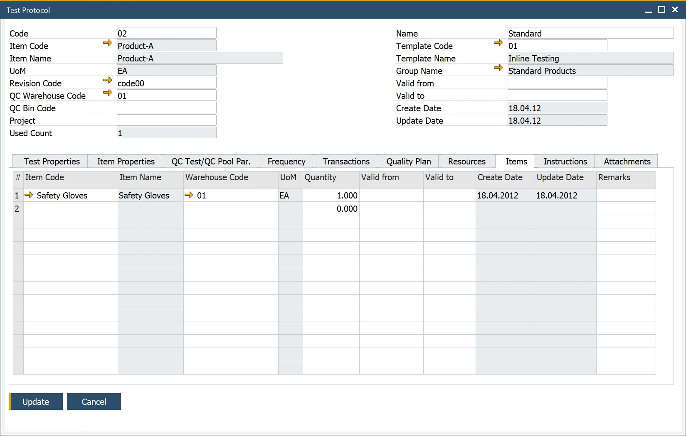

# Overview

A Test Protocol or Testing Plan outlines all the necessary details for conducting a quality control test, including:

- **Who**: the Business Partner
- **What**: is the Item to be tested
- **Where**: the transaction
- **When**: the frequency

And contains the following information:

- **Header Details**: what will be tested
- **Item/Test Properties**: the quality and Item related tests
- **Frequency of Testing**: when testing will occur
- **Transactions**: where testing will occur
- **Resources**: the assets required to conduct the testing
- **Items**: quality-specific materials
- **Instructions**: the documented plan
- **Attachments**: related documentation

---

## Test Protocols

:::info Path
    Quality Control → Test Protocol
:::

### Header

The left side of the header displays key information about the Test Protocol, including its Code and the related Name (displayed on the right). It also shows the Used Count, which reflects how many times the Test Protocol has been utilized—this is intended for reporting and analysis purposes only. Additionally, users can define item-specific details here, such as the Item, Revision (if applicable), the default Quality Control Test Warehouse, Bin location, and Project.

The right side holds information on the [Test Protocol Template](#templates-for-test-protocols)  associated with the Test Protocol. It includes fields like Template Name, Group, Created Date, and Update Date (indicating the most recent update to the template). These fields are automatically populated upon selecting a Template Code.

Users can also specify Valid from and Valid to dates for the Test Protocol. If the current date falls outside this range, it will not be possible to add a Quality Control Test based on the Test Protocol.

### Test Properties

Here you can manage [Test Properties](../test-properties.md): data elements representing the tests to be conducted within the Quality Control Test. Test Properties are copied from a [Test Protocol Template](#templates-for-test-protocols) chosen in the header. After this, you can add or remove the Properties before saving the Test Protocol.

Note. When the user adds the Item Number to the Header, the Item Properties defined within the Item Details/Properties Tab and have the Quality Control Testing field checked are copied into the Item Property Code (bottom grid).

The user can enter valid from and to date details, the expression, and corresponding values for each Property type.

### Item Properties

In this tab, you can define  [Item Properties](../../item-details/item-properties.md) – physical and chemical characteristics of an Item. When the user adds the Item Number to the Header, the Item Properties that are explained within the [Item Details > Properties tab](../../item-details/overview.md#properties) of a related Item and have the Quality Control Testing field checked on  the [Item Property](../../item-details/item-properties.md) form are copied into the Item table. You can now add or remove properties and edit their details.

### QC Test/QC Pool Par

Click [here](./quality-control-tests-pool.md) to find out more.

### Frequency

The Frequency tab allows users to specify 'When' a test will be conducted.

- **Sample size**: choose between manually entering a quantity or defining a percentage of the quantity from a specific document. Only one method can be selected at a time.
- **Frequency**: select one method at a time to determine testing intervals.
- **Time Between Tests**: define an interval for subsequent tests using 'd' (days), 'h' (hours), and 'm' (minutes), e.g., '14d', '13d23h', '20d22h15m', or '15d40m'. This value calculates the next test date.
- **After No. of Batches**: you can define the number of Batches after the recording of which a test will be performed.
- **Batch Record Inspection Date**: if checked, the Inspection Date in the [Batch Master Data form > Date Details tab](../../inventory/batch-control/batch-master-data/details-tab.md) is taken under consideration.
- **Specific date**: put a specific date manually.
- **Date of Last Test**: date of the last test performed.
- **Date of Next Test**: a date calculated based on the chosen option.
- **Auto Create QC Test / QC Test Pool**: when enabled, automatically creates a QC Test or QC Test Pool based on defined conditions (applies to QC Tests Pool if the "Create QC Test Pool" option is selected).
- **Input Quantity From/To**: specifies the quantity range for which the Test Protocol applies.
- **Refers to**: indicates the basis for creating the Test Protocol (e.g., Lot, Batch, Document Line).
- **Create QC Tests Pool**: click [here](./quality-control-tests-pool.md) here to find out more of quality control tests pool.

### Transactions

The Transactions form allows users to define 'Where' a Quality Control Test will take place.

Users can also select a Business Partner to specify 'Who' the test will be conducted against (Supplier) and for (Customer).

For in-process testing, the Operation and Status (Not Started, Started, Held, Finished) can be set, provided a Routing has been added to the Bill of Materials (BOM) Technology.

Additionally, a single Test Protocol can be assigned to multiple transactions.

### Quality Plan

Click [here](../test-protocols/quality-plan.md) here to find out more.

### Resources

This form allows users to add [Resources](../../routings/resources.md) to the Quality Control Test.

Users can specify the required quantity and optionally provide valid from and to dates, which are currently intended for informational purposes only.

### Items

This form allows users to add [Items](../../quality-control/quality-control-configuration.md) used for the Quality Control Test.

Users can specify the required quantity and optionally enter valid from and to dates, which serve as informational references.

### Instructions

The Instructions tab can record written instructions and notes related to the Quality Control Test.

### Attachments

This allows the user to add attachments used within the Quality Control Test.

## Test Protocol Groups

:::info Path
    Administration → Setup → Quality Control → Test Protocol Groups
:::

The Test Protocol Groups form enables users to categorize Test Protocols into groups, such as Chemicals, Labeling, Packaging, and more. These categories help streamline organization and improve data management.

The defined groups are utilized within the Test Protocol Template form to ensure consistency and efficiency during template creation.

## Templates for Test Protocols

:::info Path
    Quality Control → Test Protocol Template
:::

The Test Protocol Template form enables users to define multiple Test Properties within a template, streamlining data entry for Test Protocols.

For instance, if a user needs to define 10 tests, they can create a template to avoid manually entering these values for every Test Protocol. Instead, the template's predefined values are automatically copied into the Test Protocol.

**Key Features**:

- Users can add or remove Test Properties and choose from various expressions to record details, such as specific values, ranges (from/to), or reference codes, including units of measurement (UoM).
- The form also allows for specifying valid dates (from and to) for informational purposes.
- Additionally, the Used Count field tracks how often the Reason Code has been applied, supporting reporting and analysis. The creation and update fields record when the template was initially created and when it was last modified, ensuring traceability for auditing purposes.

### Test Protocol Template Duplication

Duplicating a Test Protocol Template allows you to use an existing template as the foundation for creating a new one. This option can be accessed via the context menu on the Test Protocol Template form.

Test Protocol Template is duplicated with all its content, and the Template code is changed from `[original]` to `[original]_`, e.g., `02` to `02_`. The duplicated template enters an editable mode, enabling you to modify all content, including the default Template Code.

Once all required changes are made, click the "Add" button to save the new template. The duplicate template is now ready for use.

---
Test Protocols play a vital role in ensuring effective and efficient Quality Control processes. Test Protocols empower businesses to maintain high-quality standards while optimizing workflows.

By integrating these structured plans, organizations can achieve better compliance, transparency, and overall quality assurance.
