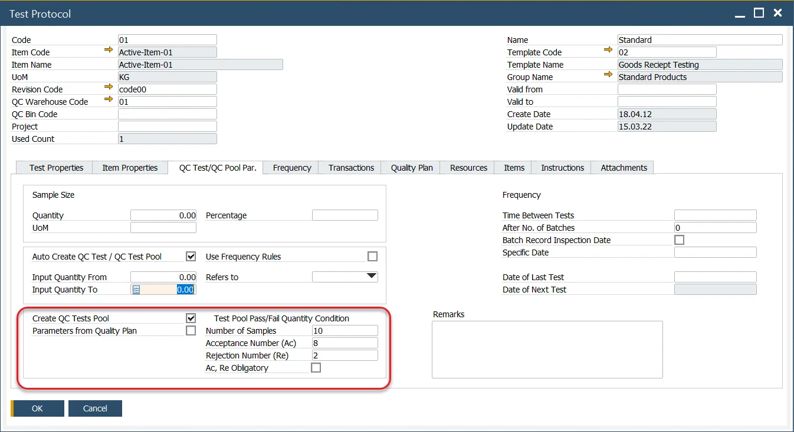
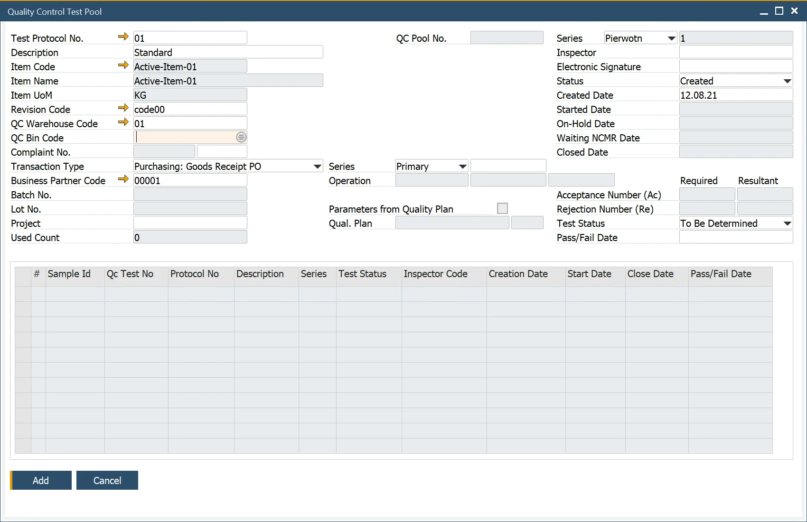

# Quality Control Tests Pool

The Quality Control Tests Pool feature evaluates the overall pass/fail status of a group of quality tests. It does this by applying predefined acceptance rules to multiple individual samples. When enabled in a Test Protocol, the system automatically creates a series of linked Quality Control Tests, streamlining quality-assurance processes that involve multiple samples from the same lot.

A QC Tests Pool represents a group of individual tests conducted on different samples of the same material or batch. The pool passes or fails based on configurable acceptance criteria, including:

- The number of samples to be tested.
- The allowed number of nonconforming (failed) tests.
- Mandatory acceptance/rejection thresholds that control whether the QC Order may be released.

This mechanism helps ensure consistent evaluation of quality at the lot level, especially in regulated or high-volume environments.

---

## Configuration

When defining a Test Protocol, configure the following:

- **Create QC Tests Pool**: Enables automatic generation of a QC Tests Pool when the protocol is used.
- **Number of Samples**: Specifies how many individual tests will be created in the pool.
- **Test Pool Pass/Fail Quantity Condition**: Defines the numerical relationship between passed and failed tests. Entering a value in one field automatically calculates the complementary value to match the total number of samples.
- **Acceptance Number (Ac)**: The highest number of nonconforming units or defects in the sample that still allows the lot to be accepted.
- **Rejection Number (Re)**: The lowest number of nonconforming units or defects in a sample that leads to the rejection of the lot.
- **Ac. Re Obligatory**: Determines whether the Acceptance and Rejection numbers are mandatory for releasing the QC order. If unchecked, the final result can be adjusted manually.
- **Parameters from Quality Plan**: Inherits configuration from the Quality Plan. click [here](quality-plan.md) to find out more about Quality Plan.

## Usage

To access Quality Control Test Pool, navigate to:

:::info Path
    Quality Control → Quality Control Test Pool
:::

To use this function:

1. Open the Quality Control Test Pool form.
2. Select the pre-configured Test Protocol.
3. Choose the required Transaction Type to determine the inventory flow stage for the tests.
4. Select the corresponding document based on Series and Document Number.

    The system then:
        - automatically fills item details.
        - calculates the Acceptance and Rejection numbers fields.
        - generates the list of individual tests based on the Number of Samples.

5. Click Add after entering all required fields. After saving, you can open and review each individual test generated as part of the pool.

---
