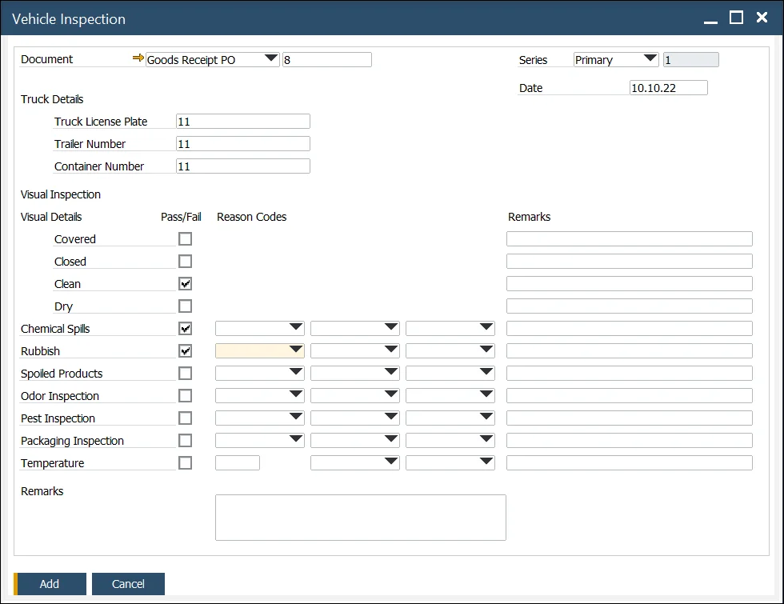

# Overview

The Vehicle Inspection function allows you to document the condition of a truck during the Goods Receipt process, specifically when linked to a Goods Receipt PO. This feature helps capture important details regarding the delivery of ordered items, providing a comprehensive record of the truck's condition upon arrival at the warehouse.

You can reach the function through the Main Menu:

:::info Path
    Purchasing - AP → Vehicle Inspection
:::

or from the context menu on Goods Receipt PO (with the already chosen document):

This option is available for Goods Receipt POs in any status.

---

## Vehicle Inspection Document

The Vehicle Inspection document is organized into three main sections:

1. **Header**: Goods Receipt PO to which this document is referring, Inspection series, number, and date.
2. **Truck Details**: Here, you can manually enter details such as the Truck License Plate, Trailer Number, and Container Number. These fields are open for manual entry, with no predefined values.

### Visual Inspection

This section allows you to document inspection results for various categories (e.g., Chemical Spills, Pest Inspection). Each category offers a pass/fail option, with predefined values ranging from 1 to 3, and space for additional remarks. For the Temperature category, you can also specify the temperature.

Values in the drop-down list are predefined. Click [here](./vehicle-inspection-reason.md) to find out how to define it.

The drop-down list for values is predefined, and the selection does not depend on the Pass/Fail checkbox. This feature enables flexibility, allowing minor defects to be recorded even if the inspection passes overall.

Once all required fields are completed, click OK to post the document. Please note that the Truck License Plate and Trailer Number are mandatory fields for posting.

---
By using this function, you can efficiently document the condition of incoming deliveries, ensuring that any issues are recorded, and that the Goods Receipt process is well-documented for future reference.
