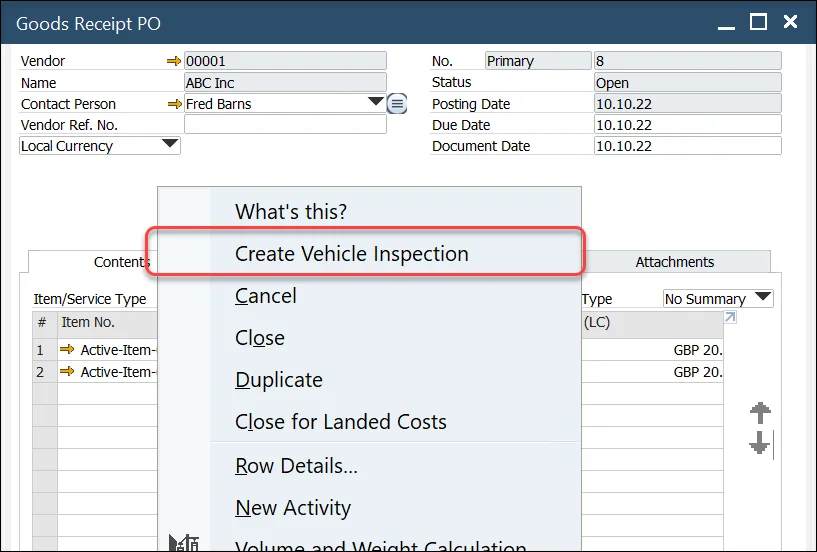

# Overview

The Vehicle Inspection function is designed to streamline the documentation process of a truck’s condition during the Goods Receipt process, particularly when linked to a Goods Receipt PO. This feature provides a structured way to capture essential details about the delivery of ordered items, ensuring that the condition of the truck and its cargo are thoroughly documented upon arrival at the warehouse. By using this tool, users can ensure that all relevant information is captured and any issues are properly noted.

You can access the Vehicle Inspection function via the Main Menu:

:::info Path
    Purchasing - AP → Vehicle Inspection
:::

Alternatively, it is also accessible from the context menu of a Goods Receipt PO (with the relevant document already selected):

This option is available for Goods Receipt POs in any status.

---

## Vehicle Inspection Document

The Vehicle Inspection document consists of three main sections:

1. **Header**:  this section displays the Goods Receipt PO to which the inspection document is related, along with the inspection series, number, and date.
2. **Truck Details**: This section allows you to manually enter truck-related information such as the Truck License Plate, Trailer Number, and Container Number. These fields are open for manual entry with no predefined values.
3. **Visual Inspection**: This section allows you to record inspection results across several categories (e.g., Chemical Spills, Pest Inspection). For each category, you can mark the result as pass/fail, select predefined values (ranging from 1 to 3), and add remarks as necessary. In the Temperature category, the specific temperature can also be documented.

Values in the drop-down list are predefined. Click [here](./vehicle-inspection-reason.md) to find out how to define these values. The drop-down list is independent of the Pass/Fail checkbox, allowing flexibility in documenting minor defects even if the overall inspection is passed.

Once all necessary fields have been completed, simply click OK to post the document. Please note that the Truck License Plate and Trailer Number are mandatory for posting the document.

---
