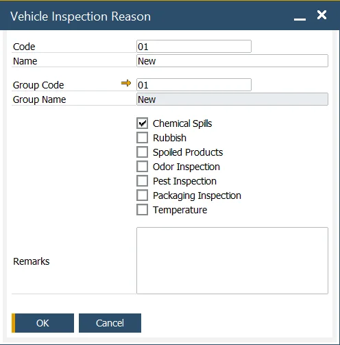

# Vehicle Inspection Reason

The Vehicle Inspection Reason feature allows you to create predefined values that can be used later in the [Vehicle Inspection](../vehicle-inpection/overview.md) document. These reasons appear in a drop-down list for specific options (e.g., for documenting spoiled products, you can select "Rotten" as the Vehicle Inspection Reason). This feature ensures consistency and accuracy in categorizing inspection results.

You can access the Vehicle Inspection Reason setup through the following path:

:::info Path
    Administration → Setup → Vehicle Inspection → Vehicle Inspection Reasons
:::

When setting up a Vehicle Inspection Reason, you can define both a Code and Name for each reason. Additionally, you can assign it to one of the predefined Group Codes, which helps organize and categorize the reasons.

By checking a specific checkbox, you can control which options will be available in the Vehicle Inspection document, streamlining the selection process during the inspection.

## Vehicle Inspection Reason Group

The Vehicle Inspection Reason Group feature allows you to organize and manage related inspection reasons into groups. You can define the Code and Name for each Vehicle Inspection Group, making it easier to categorize and access reasons during the inspection process.

You can access the Vehicle Inspection Reason Group setup via this path:

:::info Path
    Administration → Setup → Vehicle Inspection → Vehicle Inspection Groups
:::

[Vehicle Inspection Reason Group](./media/vehicle-inspection-reason/vehicle-inspection-reason-group.webp)

This feature helps ensure that your inspection reasons are well-organized and easily selectable when completing vehicle inspections

---
By utilizing both the Vehicle Inspection Reason and Vehicle Inspection Reason Group, you can streamline the inspection documentation process, ensuring consistency and accuracy in recording inspection results. This functionality helps maintain a high standard of quality control and efficiency during the Goods Receipt process.
