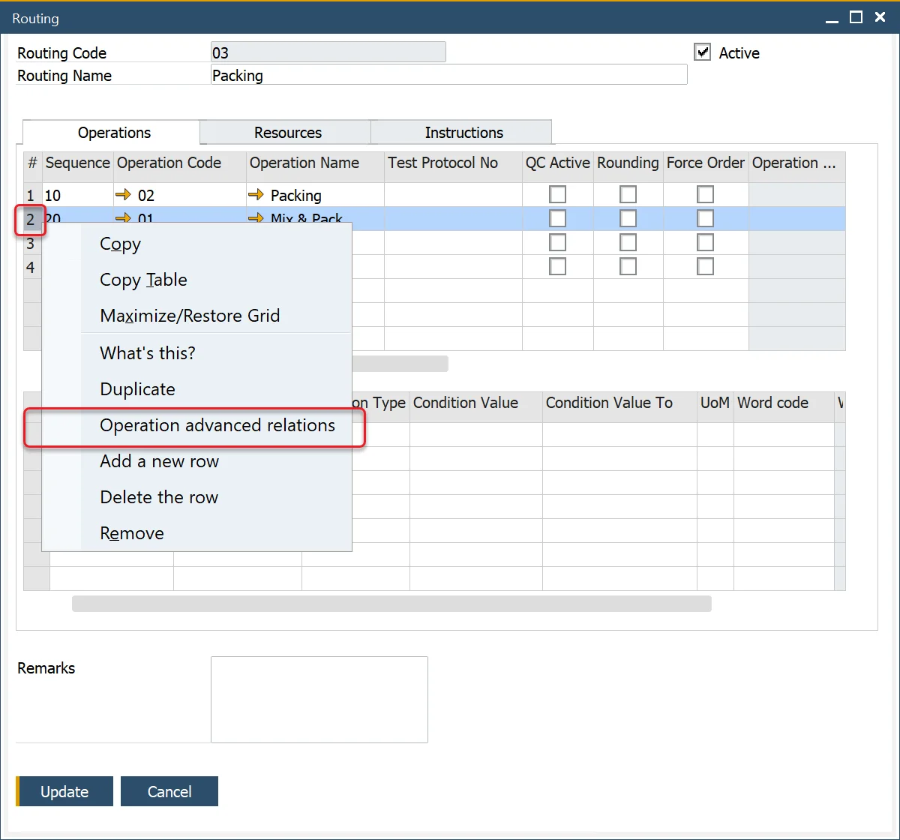
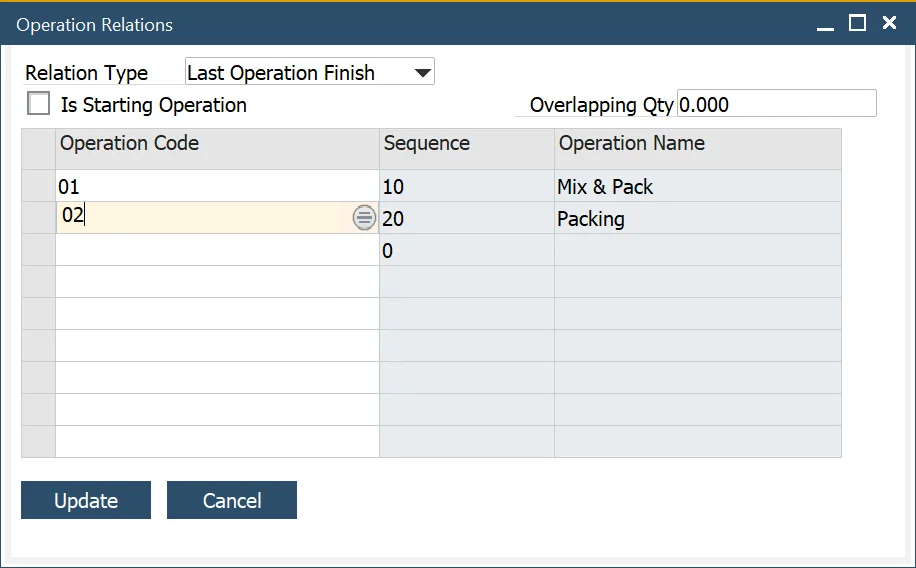
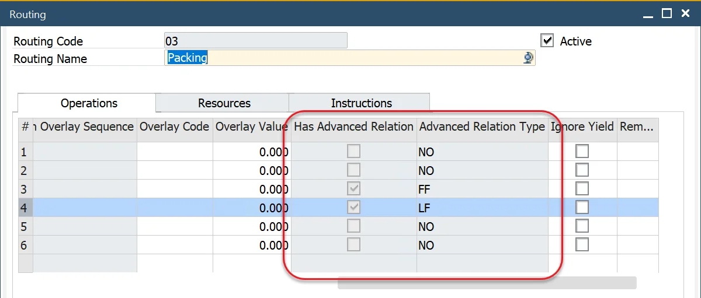
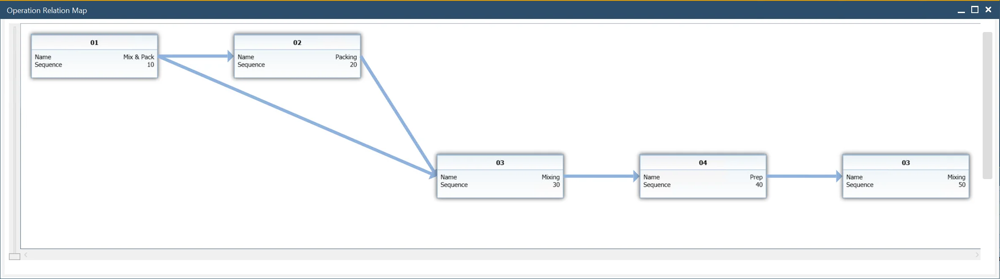

# Advanced Operation Relations

In earlier versions of CompuTec ProcessForce, operations within a routing could only follow a strict sequential order - one operation had to finish before the next could begin.
The Advanced Operation Relations feature introduces more flexible and intelligent dependencies between operations, allowing multiple sequences, overlaps, and conditional starts. This enhances production planning, scheduling efficiency, and resource utilization.

---

## When to Use

Use Advanced Operation Relations when:

- Multiple operations can run in parallel or partially overlap.
- The start of an operation depends on specific conditions (e.g., another operation finishing or producing a certain quantity).
- You want to optimize production flow and reduce idle time or bottlenecks.

---

## How to Configure

You can define or edit operation relations directly from the following screens by right-clicking on an operation:

:::note Path
    - Production → Routing → Routings → Operations tab
    - Production → Manufacturing Order → Manufacturing Order → Operations tab
    - Production → Bill of Materials → Production Process → Routings tab → Routings tab
:::

## Operation Relations

Advanced Operation Relations enable different types of dependencies between operations. This ensures better workflow management, improved scheduling, and reduced production bottlenecks.

Example Routing:

Standard sequence:

Available options:

## Relation Types

Each relation type defines when a specific operation can begin.

| Relation Type | Description | Example |
| --- | --- | --- |
| None | No dependency is defined. | The operation starts as per the standard sequence. |
| First Operation Finish | The operation starts when the first of the selected operations is finished. | Operation 04 starts when Operation 01 finishes.   |
| Last Operation Finish | The operation starts when the last of the selected operations is finished. | Operation 04 starts when Operation 02 finishes.   |
| Is Starting Operation | Marks an operation as a starting point, creating a parallel production path. | Operation 03 is marked as a starting operation.   |
| Overloading | The operation starts once another operation has produced a defined quantity. | Useful when subsequent processes can begin as partial output becomes available. |

### Advance Operation Relations Indicator

To quickly identify whether an operation has advanced relations assigned, review the relation indicators in the operations list.

| Indicator | Meaning |
| --- | --- |
| SO | Is Starting Operation |
| FF | First Operation Finish |
| LF | Last Operation Finish |

## Operation Relation Map

To get a graphical view of how operations are interconnected, use the Operation Relation Map.

You can open the relation map by right-clicking on a routing in either of the following locations:

:::info Path
    Production → Manufacturing Order → Manufacturing Orders → Operations tab → Operations tab

    Production → Bill of Materials → Production Process → Routings tab → Routings tab
:::

Example Operations relations chart:

---
