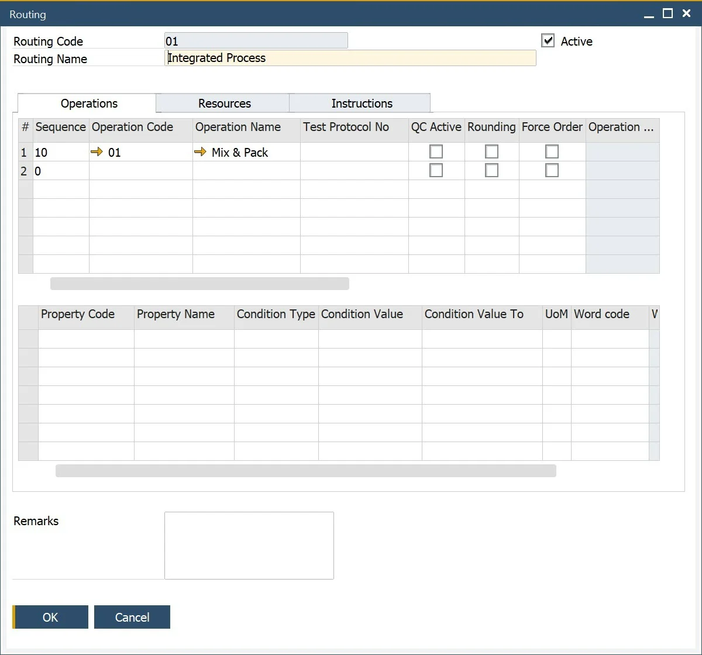

# Overview

The following pages contain information on working with Routings.

A Routing defines the sequence of specific operations carried out on designated Resources during the manufacturing of an Item. Together with the Bill of Materials, Routing forms the foundation of the production process for an Item.

To access Routings, navigate to:

:::info Path
  Production → Routings
:::

