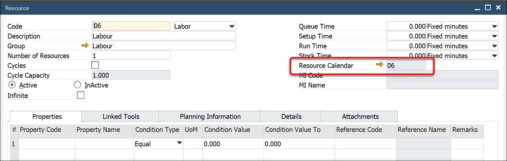
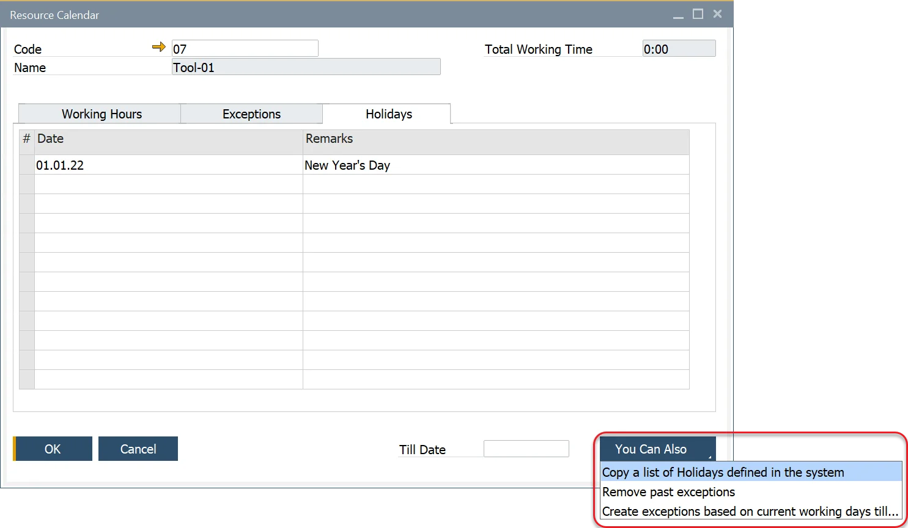

# Resources

Effective production planning requires managing various resources efficiently. Resources in manufacturing include machines, labor, tools, and subcontracting services, each playing a crucial role in the production process. This document outlines the different resource types, their attributes, and how they interact with planning and scheduling in a manufacturing environment.

To access Resources, navigate to:

:::info Path
    Production → Routings → Resources
:::


---

## Resource Types

| Type of Resource | Has Calendar? | Visible on Gantt Chart? |    Hourly rates    | Connected with | Time Booking    | Times (Setup, Run) | Number of resources |
| --- | --- | --- | --- | --- | --- | ---| --- |
| Machine | :heavy_check_mark: | :heavy_check_mark: | :heavy_check_mark: | N/A  | :heavy_check_mark: | :heavy_check_mark: | Changeable |
| Labor | :x: | :x: | :heavy_check_mark: | N/A | :heavy_check_mark:  | :heavy_check_mark: | Always 1 |
| Tool |  :heavy_check_mark:  | :heavy_check_mark: | :x: | Machine | :x: | :x: | Always 1 |
|  Subcontracting  | :heavy_check_mark: | :heavy_check_mark: | :heavy_check_mark: | N/A | :heavy_check_mark: | :heavy_check_mark: | Changeable |

### Header

#### Time and Rates

##### Types of Time

- **Queue Time**: an initial time before setup. In calculations, it does not use a calendar or consume resources.
- **Setup Time**: time for setting up a machine, uses a calendar, and occupies a resource.
- **Run Time**: active usage time of the resource.
- **Stock Time**: the last time, after the run. In calculations, In calculations, it does not use a calendar or consume resources.

##### Rates

- For the Queue, Setup, and Stock time, the following rates are available:
  - Fixed hours,
  - Fixed minutes,
  - Fixed seconds.
- For the Run time, the following rates are available:
  - Fixed hours
  - Fixed minutes
  - Fixed seconds
  - Hours per piece
  - Minutes per piece
  - Seconds by piece
  - Pieces per hour
  - Pieces per minute
  - Pieces per second

- When using cycles, only Fixed Rates can be used for Run Time.
  - Define the fixed and variable time elements of the resource.
  - This also includes the unit of rate for each time element.
  - Piece equates to the unit of measure of the item number being produced.
  - The valid rates for Queue, Setup and Stock time are fixed seconds, minutes, and hours.
  - Run Time can use any of the unit rates.
  - Cycles can be checked to define the resource has a cycle capacity.
  - Cycle capacity is the number of production units processed per cycle.
  - Number Of Resources allows defining the default number of units of resources to work on. Note that setting a Number Of Resources affects run time.
    - Example: If the Run Time is 10 hours and only 1 resource is assigned, the Planned Run Time remains 10 hours. If the resource count increases to 2, the Planned Run Time adjusts to 5 hours.
    - While the production process is affected by this change, cost calculations consider the total work performed. For instance, if 10 hours of work is completed in 5 hours using 2 resources, the cost is calculated based on each resource working 5 hours (totaling 10 hours).

#### Infinite checkbox

Enabling this checkbox allows the Resource to bypass its associated Resource Calendar, effectively making it available at all times by permitting overloads.

This feature is primarily intended for Subcontracting Resources but can also be applied to other Resources, such as Machines or Tools, that do not have capacity constraints.

#### Resource Status

Each Resource can be set to either Active or Inactive status:

- **Active**: the Resource is available for use in Manufacturing Orders and Bills of Materials.
- **Inactive**: the Resource cannot be added to Manufacturing Orders or Bills of Materials.

Example Usage: Marking a Resource as Inactive can be useful for tracking equipment that was once used in production but is no longer in operation, such as assets that have been sold or scrapped.

### Properties

The Properties section allows for adding and removing attributes related to a Resource. These properties provide additional details such as:

- Machine setup configurations and consumable requirements.
- Numeric values with conditions (e.g., setting Temperature limits between 10 and 20).
- Reference codes (e.g., Property Color = White).
- Custom remarks for documentation.

Click [here](/docs/processforce/user-guide/routings/resources#resource-properties) to find out more about Resource Properties.


### Linked Tools tab


A Linked Tool is a Tool-type Resource that is associated with a primary Resource. These tools are considered during production when the parent Resource is included in the relevant Production Process as an alternative Resource. The default Resource of the Operation (in the Production Process) is replaced by a Resource with a Linked Tool on Manufacturing Order based on the [Resource Balancing option](/docs/processforce/user-guide/scheduling/resource-balancing/) (it has to be checked).

Linked Tools are also on the Gantt chart (under the parent Resource).

### Planning Information tab

:::caution
    If you update Planning Information while the Scheduling Board is open, you must reopen it to reflect the changes.

  A Resource configures Planning Information, allowing different settings to be defined for each Resource in the system.
:::


Here you can define columns displayed on Scheduling Board → [Resource Planning Board](/docs/processforce/user-guide/scheduling/gantt-chart/resource-planning-board/) on Task rows for a specific Resource.

You can define:

- Name of a column (Planning Information column),
- Type of retrieving method of data to be displayed in a specific column:
  - **Object**: (Enable SQL? checkbox unchecked): choose a field from three kinds of Objects (Manufacturing Order, Operation, Resource - values are taken at the start of Gantt chart) and Dynamic option (times connected to specific Operation or Resources, e.g., Operation Duration - these options are updated dynamically; they change on changes made to Gantt Chart),

    <details>
    <summary>Example of a Label added to a specific Resource</summary>
        <div>
            We want a Revision of a Manufacturing Order displayed on Tasks of Prep Resource.

            Choosing the right option:

            
        </div>
    </details>

  - **Query** (Enable SQL? checkbox checked): you can create a query based on which data for the column will be retrieved.

    Parameter syntax:

        ```sql
        @[Table Name - without fixed prefixes].[Field Name]
        ```

    **Example**

        ```sql
        @OMOR.U_PlannedStartDate
        ```

    <details>
    <summary>Example: a query to calculate how many Employees will be working on the Resource</summary>
    <div>
        Query:

            ```sql
            SELECT
                (SELECT MIN(T0."U_RunTime" * T0."U_NrOfResources") FROM "@CT_PF_MOR16" T0 WHERE T0."DocEntry" = @OMOR.DocEntry AND T0."U_RtgCode" = @MOR16.U_RtgCode AND T0."U_RtgOprCode" = @MOR16.U_RtgOprCode AND  T0."U_RscType" = 'L' )
                /
               (SELECT MIN(T0."U_RunTime") FROM "@CT_PF_MOR16" T0 WHERE T0."DocEntry" = @OMOR.DocEntry  AND T0."U_RtgCode" = @MOR16.U_RtgCode AND T0."U_RtgOprCode" = @MOR16.U_RtgOprCode AND  T0."U_RscType" = 'M' )
            FROM DUMMY
            ```

        Result:

        
    </div>
    </details>

### Warning Information

If the settings here return any result, a warning icon will appear on Scheduling → Resource Planning Board for the specified Resource.

### Resource Details Tab

### Accounting Panel

**Resource Accounting** – Selecting the 'No Posting' option ensures that the associated Resource times are not considered in financial transactions (e.g., when recording a Time Booking). Choosing a predefined Resource Accounting scheme enables financial tracking of Resource times, with postings directed to the account specified in the scheme.

**Relevant for Cost Accounting Project and Dimensions** - This setting can be configured based on the number of cost centers enabled in SAP Business One General Settings. Depending on the configuration, one or more dimension fields will be displayed.

### Additional Details Panel

Issue Whs Code and Receipt Whs Code are fields specific to CompuTec PDC. [CompuTec PDC Production Issue/Receipt](/docs/pdc/user-guide/task-activities/overview#resource-properties) options are not available unless Issue/Receipt Warehouses are assigned to a specific Resource. For a Production Issue, a Bin Location is not required - only a Warehouse must be assigned. However, **for a Production Issue, it is mandatory to choose a Bin Location**.

To enable Bin Locations, navigate to:

:::info Path
  Administration → Setup → Inventory → Warehouses → General tab`
:::

### Resource Calendar

- A Resource Calendar is automatically created when a Resource is added.
- Clicking the yellow arrow next to the Resource Calendar field navigates to its definition.
- Click [here](/docs/processforce/user-guide/scheduling/resource-calendar/) to find out more about Calendars.



## Resource Groups

To access Resource Groups, navigate to:

:::info Path
Administration → Setup → Production → Resource Groups
:::

This form allows users to define resource groups, such as mixing vessels, blenders, and ovens.


## Resource Properties


To access Resource Properties, navigate to:

:::info Path
    Administration → Setup → Production → Resource Properties
:::

This form enables users to define resource properties, such as pressure, temperature, and machine speed.

- A property can have reference values assigned, e.g., White, Red for Color, or numeric values, e.g., Temperature = 20.
- Reference values set in the Resource Properties form can be selected in the Properties tab of the Resource form.
- Numeric values can also be defined in the Properties tab of the Resource form.

### Property Reference Library

To access Property Reference Library, navigate to:

:::info Path
    Administration → Setup → Item Details → Property Reference Library
:::

The Property Reference Library allows you to define a set of valid reference values for properties.

These values can be assigned to a single property type or multiple property types, including items, resources, operations, and operation inputs and outputs.

To enable a value as a reference for a Resource Property, select the Resource Property checkbox.


## Resources Accounting

To access Resource Accounting, navigate to:

:::info Path
    Administration → Setup → Financials → Resources Accounting
:::

Resources Accounting allows defining multiple posting accounts for Time Bookings.

You can select accounts for posting for every resource time type:

- Queue Time,
- Setup Time,
- Run Time,
- Stock Time.

Further, for every resource time type, you can select accounts for the type of time:

- Base,
- Fixed Overhead,
- Variable Overhead

:::caution Time Variance Accounts
    Time Variance Accounts
  Time Variance Accounts are currently not configurable but will be utilized in future updates for Manufacturing Order closure postings.
:::

The Work In Progress Account can be added here or is based on the WIP account defined for the Document type – Production Order.


## Resource Calendar

To access Resource Calendar, navigate to:

:::info Path
    Production → Routings → Resource Calendar
:::

Resource Calendar is used to define the availability of a Resource for production, which is further used for production planning.

- On the first tab, you can define hours for each day of a week. As you can see in the example, there is an option to define multiple periods per one day.
- On the right upper corner of this form, you can check Total Working Time in a week.

  
- The Exceptions tab is used to mark additional capacity of Resources for a specified date and time.

  
  
- The Holidays tab you define days on which resource is not available.

  
- You Can Also button let you perform the following tasks automatically:
  - Copying holidays from the holidays defined in SAP,
  - Remove past exceptions – this will remove every exception before the actual date,
  - Create exceptions based on current working days till date. This one adds exceptions from actual date to date defined in the Till Date field for hours and days defined in the Working Hours tab.

  
- At any time you can view Resource Calendar by clicking on View calendar in a context menu of a Resource form.

  
- This will open a graphical presentation of resource availability. At the bottom of the window, you will find a legend for colors on the calendar.

  

## Alternative Resource

A Resource can have assigned a number of other Resources, to which a Manufacturing Order task can be switched, e.g. in case of downtime of an original Resource.

➡️ Learn more: About [Alternative Resources](/docs/processforce/user-guide/scheduling/gantt-chart/alternative-resources/).

---
