# Alternative Resources

In this section, you can check how to set Alternative Resources.

---

The "Alternate" option allows you to reschedule and adjust production tasks in the system based on availability or changes in the scheduling. Here’s a detailed breakdown of the steps involved:

**1. Select the Resource Tasks**

    - Before making any changes, you begin by selecting the resource tasks that you need to reschedule.
    - On the scheduling screen, locate and select the specific tasks (in this case, labeled as "Vessel" and others).
    - Right-click on the selected task block to bring up the scheduling options. The “Alternate” option is among the choices available.

        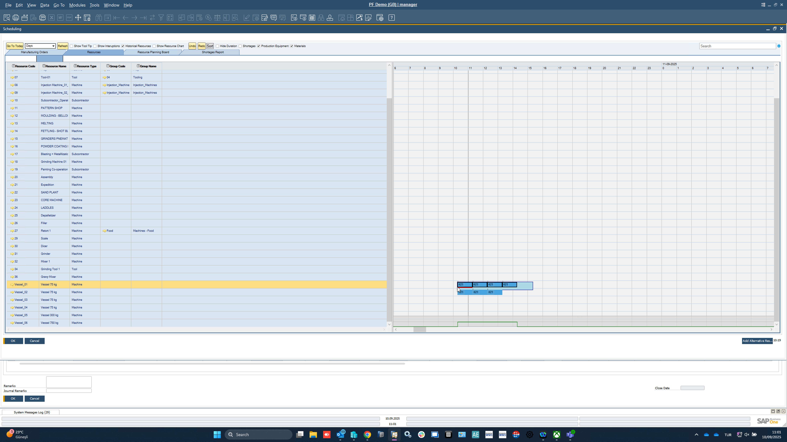

**2. Launch the "Alternate" Option**

    - Click on the "Alternate" option in the right-click menu after selecting your tasks. This will bring up a new window where you can specify alternate resources or configurations.
    - The system will allow you to either choose another resource line or make adjustments to the setup according to specific requirements.

        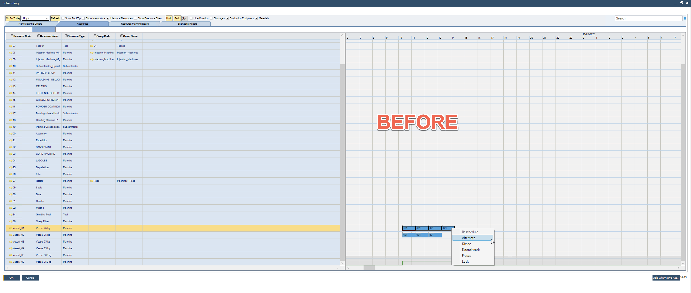

**3. Select the Alternative Resource**

    - Choose the alternative resource from the list. This could be another machine, tool, or any other resource depending on your scheduling needs.
    - The alternate resource can be selected either per line (specific task or sequence) or based on mass (group of tasks or resources).

        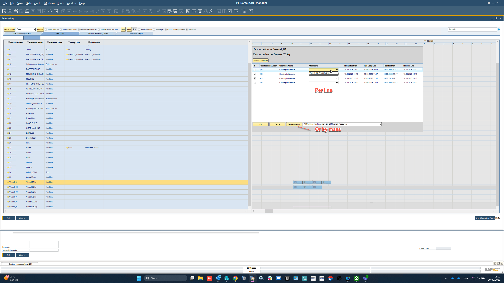

**4.** **Move the Task to the New Resource**

        - After selecting the new alternative resource, move the task block to the new time slot or resource. This ensures that the tasks are rescheduled correctly and without conflicts.
        - You will now see the tasks appear on a different time slot or assigned to another resource, indicating that the scheduling change has been applied.

            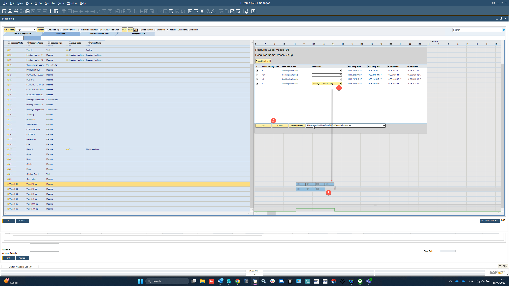

**5.** **Compare and Confirm**

    - Once the tasks are moved, compare the new schedule with the old one to ensure that the changes are correctly applied.
    - You can review the changes visually to verify if everything is aligned as per the new scheduling requirements.

        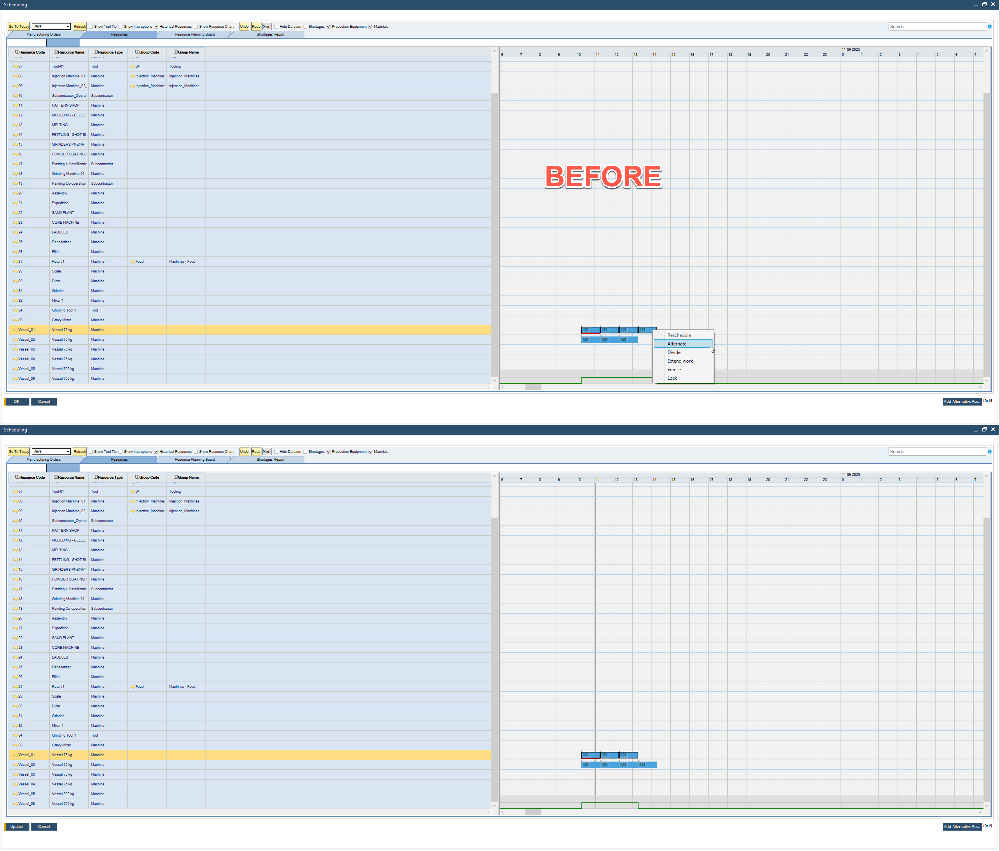

## Alternative Resources Master Data

Within the Production Process form > Routings tab, define Resources assigned to a specific Operation:

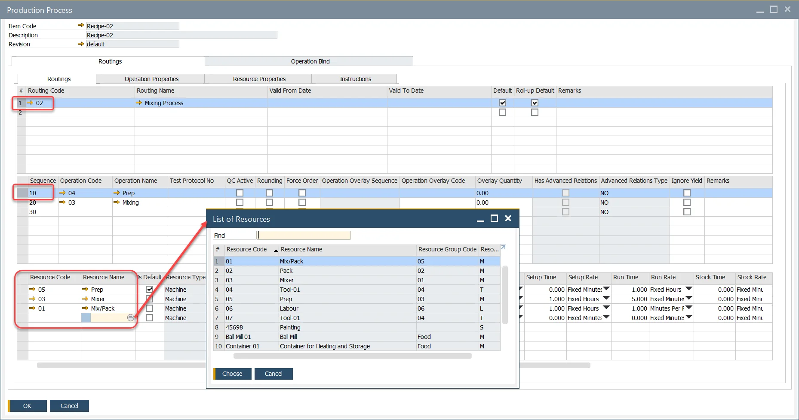

Checking if Default checkbox causes the chosen Resources to be displayed in the corresponding table on Manufacturing Order.

## Manufacturing Order

The default Resource is displayed within the Resource Grid of the Operations Tab. (It is possible to define more than one default Resource).

Click Choose From List button to open the list of alternative resources previously defined in a corresponding Production Process.

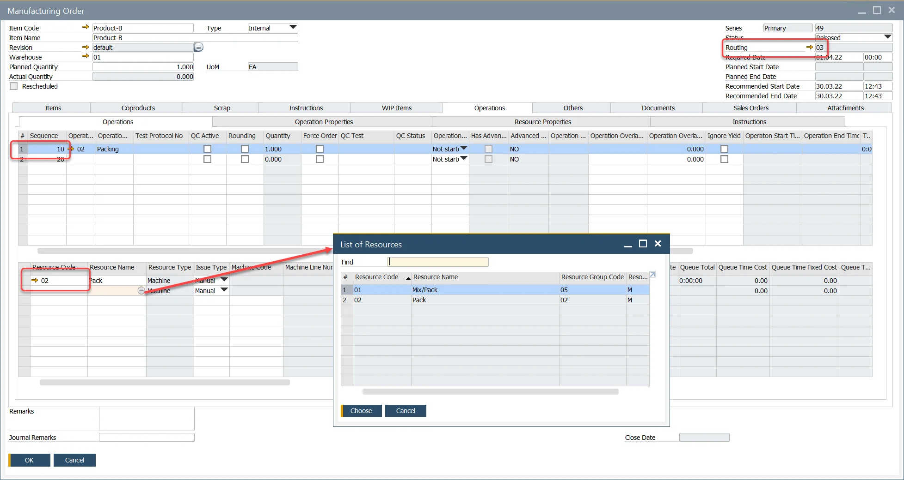

## Selecting Alternative Resources

- Press the "Add Alternative Resources" button to open the List of Resources table.
- Select the required Resources.
- Press "Choose."

    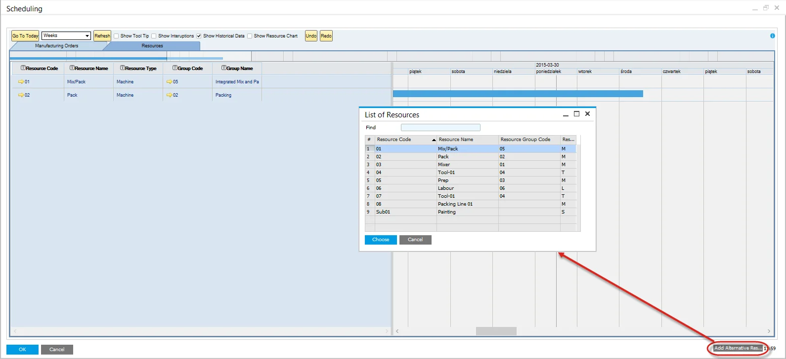
- The select resources are now displayed within the Resources Tab of the Gantt.

    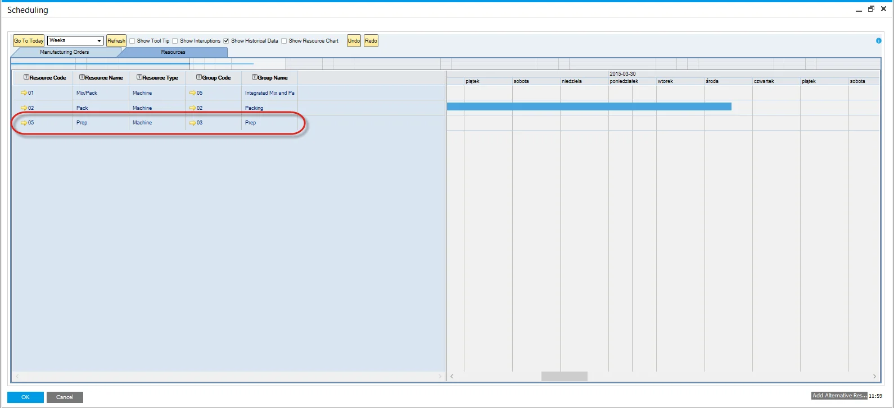

## Highlighting the Alternative

- Hover the mouse over the resource block to be moved.
- A dotted area under the resource block will indicate that there are alternative resources.
- Left-click and hold on the dotted area.
- Gray vertical lines will highlight the alternative resources.

    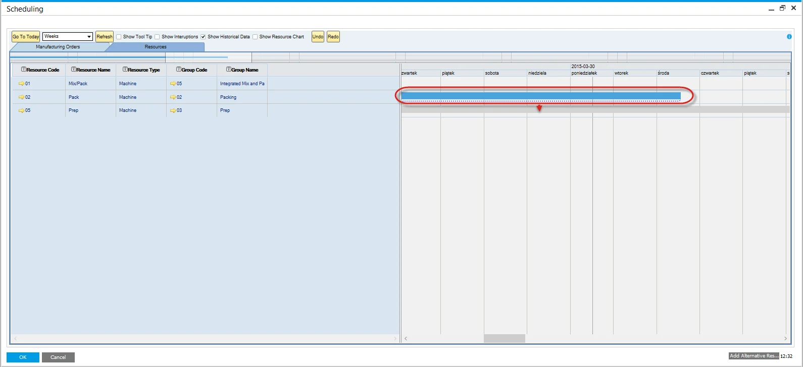

## Moving to the Alternative

- Continue to Press the right mouse button.
- Drag the resource block to the desired alternative.
- A red block will display, representing the new time.
- Drop, Un-Press the right mouse button.

    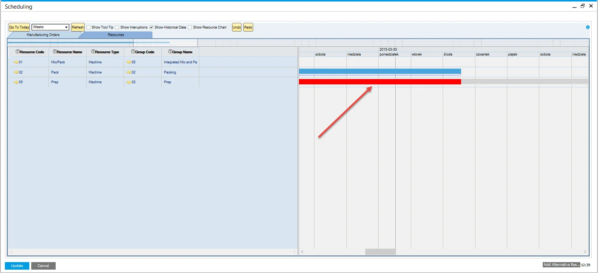
- The resource block will now be placed on the selected alternative:

    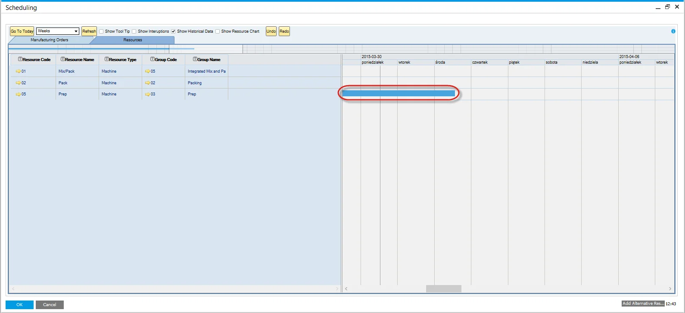
- To view these resources alternative, use the same navigation as above.

## Manufacturing Order Changes

- The Update function saves the changes made in the Gantt.
- It updates the planned resource to reflect the selected alternative resource.
- Lead time and start date are recalculated automatically to account for the changes.

## CompuTec PDC

Additionally, you can switch a [Task to an Alternative Resource from the CompuTec PDC level](/docs/pdc/user-guide/task-activities/overview).

---
