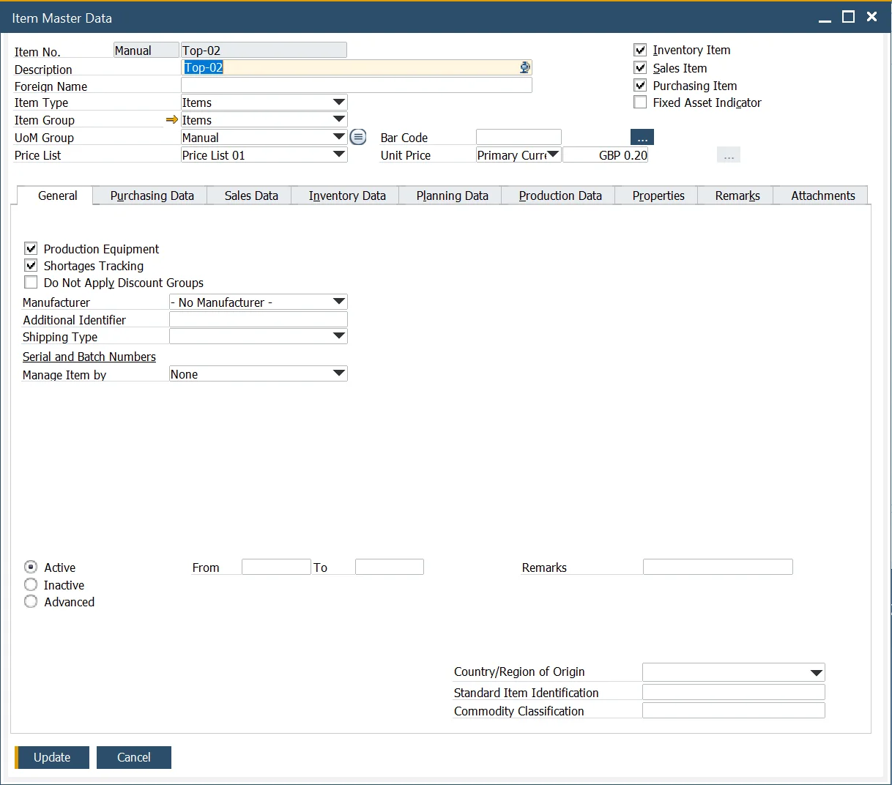
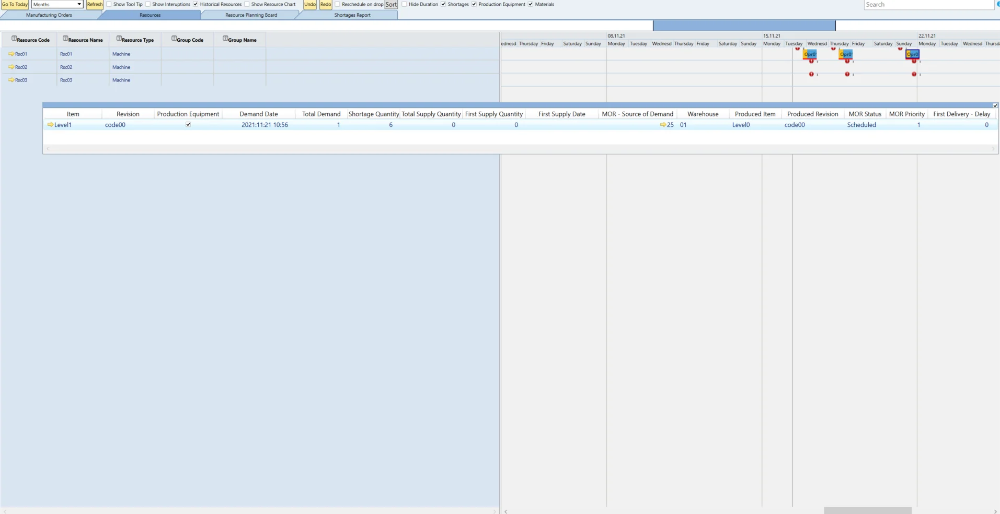
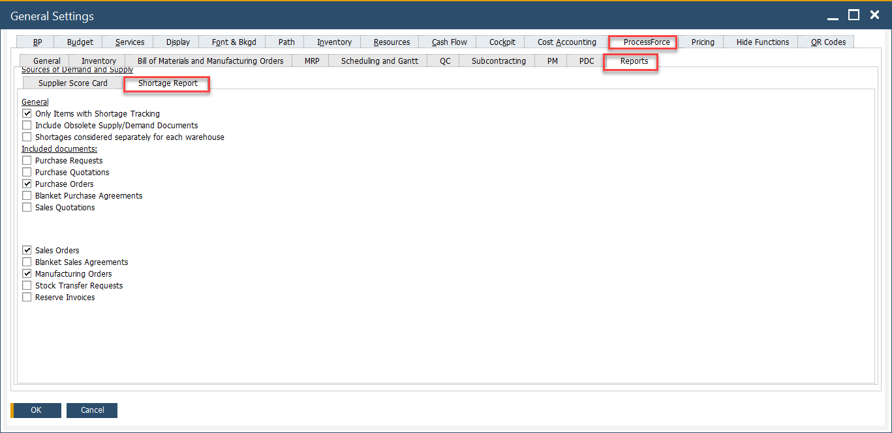

# Material Shortage

This tutorial walks you through identifying and tracking material shortages using the Gantt Chart and Shortages Report in CompuTec ProcessForce. You'll learn how to visually interpret shortages, explore supply and demand, and use the Floating Panel to track changes dynamically.

This functionality aims to:

- plan tools within the Gantt chart.
- trace tools and material shortages (defined as traced) within the Gantt chart, along with information about the planned supply (first delivery).
- trace tools and material shortages (defined as traced) in the Tools/materials shortages report and information about all the planned supplies.

---

## The Gantt Chart Functionality

### Configuration

#### Item Master Data

There are two related checkboxes in the Item Master Data form:

    

- **Production Equipment** (tool, set): items marked as production equipment can be filtered on the Gantt chart. Selecting this checkbox automatically enables Shortages Tracking.
- **Shortages Tracking**: if checked, the item is included in the shortage report and highlighted on the Gantt chart as part of the shortages tracking functionality.

### Usage

The Gantt chart includes a Shortages checkbox in its header, allowing users to toggle visibility for production equipment and material shortages. Shortages are visually marked with a red line on Manufacturing Orders within the Gantt chart. Additionally, a dynamic Floating Panel provides real-time updates on shortages as changes occur.

1. The floating Panel is visible if the "Shortages" checkbox is enabled:

    1. By default, both Production Equipment and Materials checkboxes are selected. In the Floating Panel, all items with shortages for all Manufacturing Orders are shown, marked with a shortage indicator according to the settings in General Settings (Only Items with Shortages Tracking).
    2. If the Production Equipment checkbox is not checked and Materials is selected, Production Equipment will not be visible in Floating Panel.
    3. If the Production Equipment checkbox is selected and Materials is not selected, only Production Equipment will be visible in Floating Panel.
    4. Always one of them (Production Equipment or Materials) has to be selected.
2. Upon start, the Floating Panel displays shortage information for all Manufacturing Orders marked with a shortage indicator. When a specific Manufacturing Order is selected in the Gantt chart, the Floating Panel updates to show shortages only for that selected order.
3. The Floating Panel is dynamic and updates in real-time as changes occur in the Gantt chart.

## Shortages Report

The Shortages Report helps identify and analyze material shortages across items and revisions, enabling proactive supply planning and decision-making.

### Configuration

You can configure how shortages are calculated and displayed using the following settings in **General Settings**:

- **Only Item with Shortage Tracking**: When enabled, the report includes only items that have the **Shortages Tracking** checkbox selected in Item Master Data.
- **Include Obsolete Supply/Demand Documents**: Includes supply/demand documents with a delivery date on or before the current date in the calculation of the opening balance.
- **Shortage considered separately for each warehouse**: When enabled, shortages are calculated based on supply and demand within the same warehouse as defined in the MO’s Items tab. When disabled, all warehouses are considered collectively.

### Usage

The **Shortages Report** tab provides a detailed overview of shortages per item and revision. It includes:

- A timeline of past and current supply and demand transactions.
- Graphical representations of available vs. required quantities.
- Insight into when shortages are expected to be resolved through planned deliveries.

    

---
