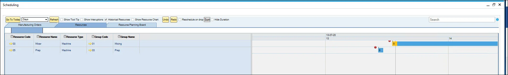
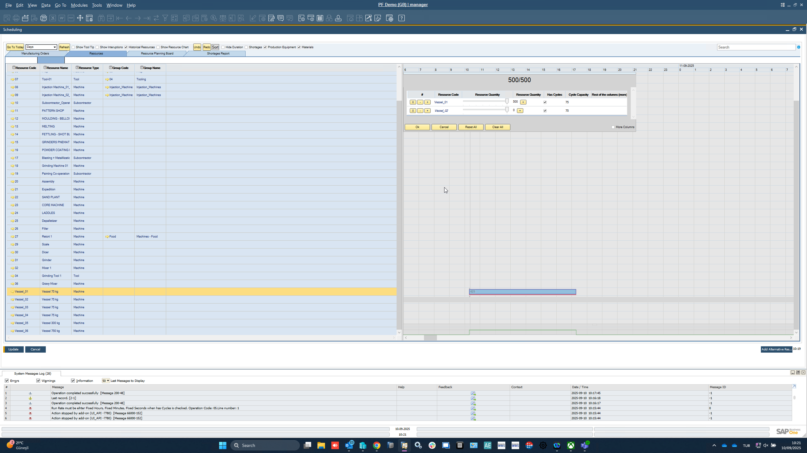
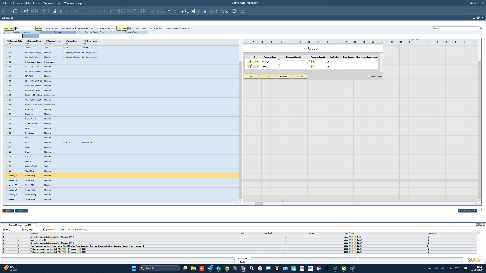
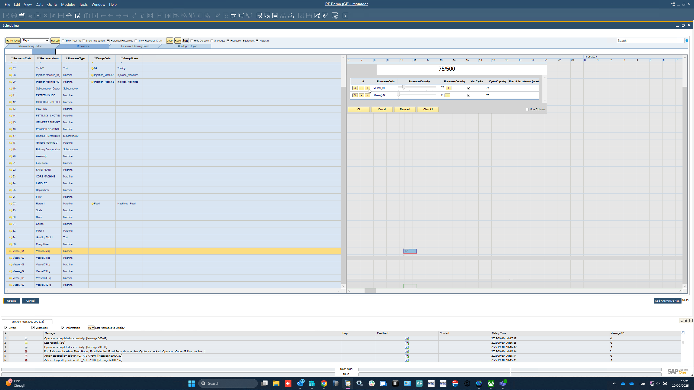
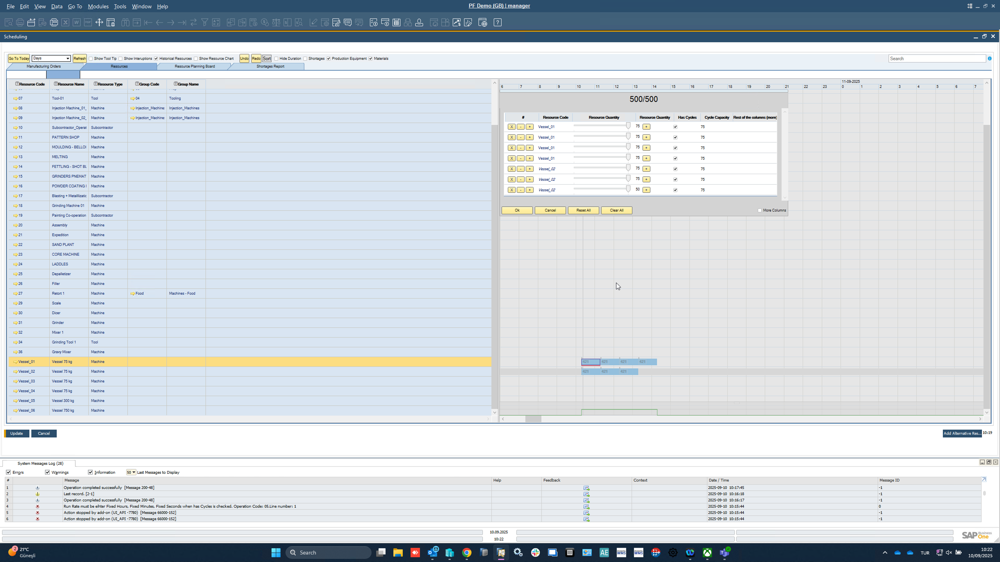
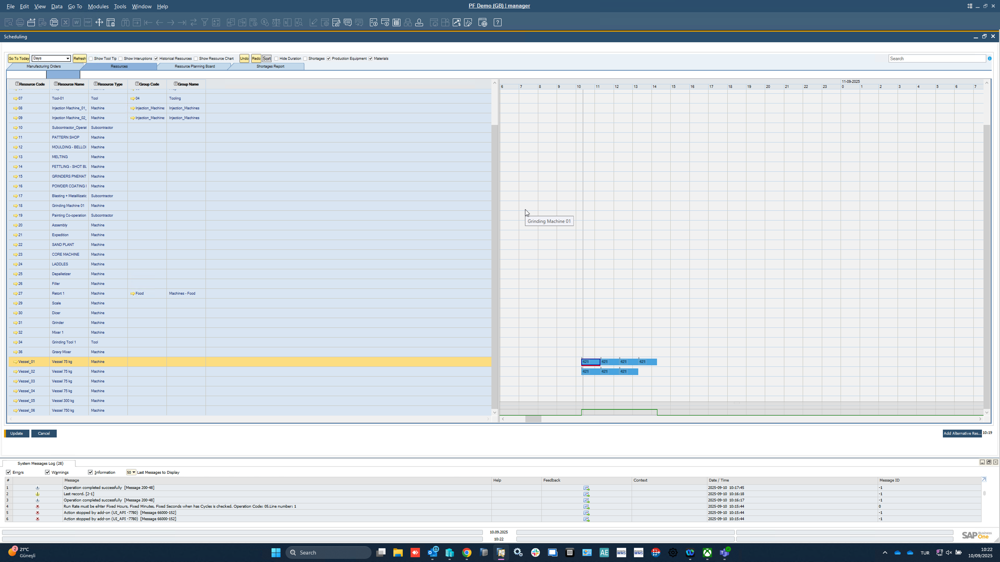
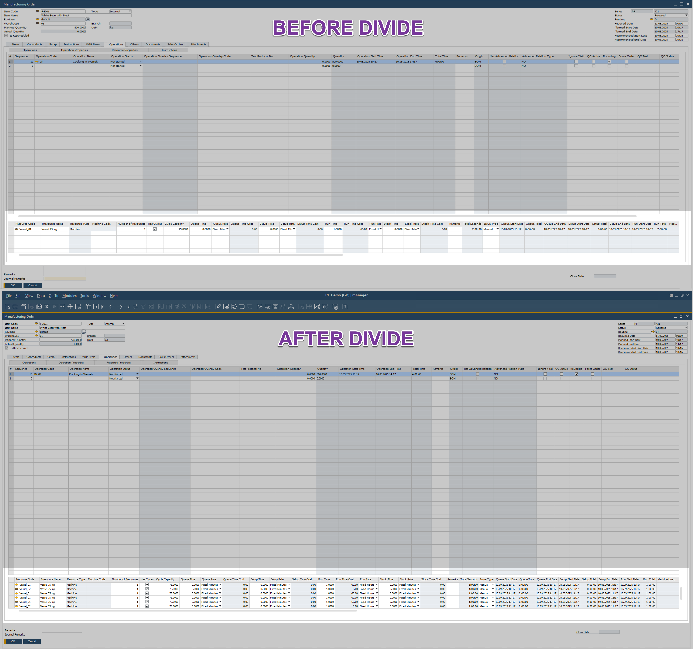

# Overview

The Gantt chart is a versatile bar chart used for project scheduling, providing a visual representation of tasks, timelines, and resources. In CompuTec ProcessForce, the Gantt chart plays a crucial role in managing and modifying production processes. It allows users to visualize manufacturing orders, schedule operations, and adjust timelines while offering a host of features to streamline the production workflow.

This guide details the options and functionalities available within the Gantt chart, ensuring you can maximize its potential to improve efficiency and resource allocation.

---

:::info
    Forward scheduling is the only method supported in the Gantt chart, and not backward (forward and backward scheduling is possible in other places in CompuTec ProcessForce, e.g., on Manufacturing Order).
:::

:::caution
    The Gantt chart is available only in [Direct Data Access](/docs/processforce/administrator-guide/licensing/license-server/direct-access) mode.
:::

:::caution
    Please note that users must have appropriate Gantt Authorizations to utilize this feature.
    
        
  :::

## Header Options

The Gantt chart header provides numerous functionalities to customize and manage the chart's display:

1. **Go to Today**: shows the current date and time.

2. **Days/Weeks/Months drop-down list**: a choice made here changes the scale of view, e.g., choosing Days results in displaying a day stretched across the chart.

    

        
Click here to expand

        

        This option allows you to change the view ratio. There are three templates:

        **Template 1:**
        | Date - Beginning of the week | 21.03.22 | | | | | | | 28.03.22 | | | | | | |
        | --- | --- | --- | --- | --- | --- | --- | --- | --- | --- | --- | --- | --- | --- | --- |
        | Day Names | Monday | Tuesday | Wednesday | Thursday | Friday | Saturday | Sunday | Monday | Tuesday | Wednesday | Thursday | Friday | Saturday | Sunday |
        
        

        **Template 2:**
        | Date - Beginning of the week | 21.03.22 | | | | | | | 28.03.22 | | | | | | |
        | --- | --- | --- | --- | --- | --- | --- | --- | --- | --- | --- | --- | --- | --- | --- |
        | Day Number | 21 | 22| 23 | 24 | 25 | 26 | 27 | 28 | 29 | 30 | 31 | 1 | 2 | 3 |

        
        
        **Template 3:**
        | Date - Each Day | 21.03.22 | | | | | | | | | | | | | | | | | | | | | | | | 22.03.22 | | | | | | | | | | | | | | | | | | | | | | | | 
        | --- | --- | --- | --- | --- | --- | --- | --- | --- | --- | --- | --- | --- | --- | --- | --- | --- | --- | --- | --- | --- | --- | --- | --- | --- | --- | --- | --- | --- | --- | --- | --- | --- | --- | --- | --- | --- | --- | --- | --- | --- | --- | --- | --- | --- | --- | --- | --- | --- |
        | Hours | 0 | 1 | 2 | 3 | 4 | 5 | 6 | 7 | 8 | 9 | 10 | 11 | 12 | 13 | 14 | 15 | 16 | 17 | 18 | 19 | 20 | 21 | 22 | 23 | 0 | 1 | 2 | 3 | 4 | 5 | 6 | 7 | 8 | 9 | 10 | 11 | 12 | 13 | 14 | 15 | 16 | 17 | 18 | 19 | 20 | 21 | 22 | 23 |

        

        The above templates can be switched based on the user's user adjustment in the Day/Week/Month option or manually by extending or cutting the scroll bar.

        **By Day/Week/Month Option**:
        

        **By Manually**:
        
        

    

    You can set a default value for every Gantt chart in [General Settings](/docs/processforce/user-guide/system-initialization/general-settings/general-tab/).

3. **Refresh**: updates the chart with the latest data.
4. **Show tool Tip checkbox**: displays task details when checked, making it easy to review operations at a glance.

    

5. **Show Interruptions**: shows breaks in production based on the [Resource Calendar](/docs/processforce/user-guide/scheduling/resource-calendar/).

    

6. **Historical Resources**: show historical/past resource data.
7. **Show Resource Chart**: shows the use of Resources or a Resource Group over a selected period. Click [here](/docs/processforce/user-guide/scheduling/gantt-chart/show-resources-chart/) to find out more.

    

8. **Undo/Redo**: moves to previous/next step.
9. **Reschedule on the drop**: automatically reschedules on a drag & drop action without clicking the Update button.
10. **Sort**: sets a queue for Manufacturing Orders based on defined parameters (this is Resource Planning Board tab related option. Click [here](/docs/processforce/user-guide/scheduling/gantt-chart/resource-planning-board/) to find out more).

    

11. **Hide Duration**: hides the duration details of Manufacturing Order rows in the Resource Planning Board.

    

12. **Shortages, Production Equipment, Materials** – provides options to generate reports related to material shortages. Click [here](/docs/processforce/user-guide/scheduling/gantt-chart/material-shortage/) to find out more.

## Tabs

### Manufacturing Orders

Displays a view of the realization of Manufacturing Orders in time.

It is possible to expand Manufacturing Orders to check all their Operations and to expand Operations to check all their Resources.

### Resources

The Resources tab provides a detailed view of the execution of Manufacturing Orders broken down by resources. This tab helps users visualize resource utilization and streamline production processes effectively.

    

**Key Features**:

1. **Slider**

    At the top of the Gantt chart, a bar represents a specific period with activities. The slider highlights the current viewable section.

        - Left-click and drag the slider to navigate across the timeline.
        - Shrink or expand the slider by dragging its left or right edge. This action adjusts the displayed range of the Gantt chart.

            

2. **Columns filtering**

    Filter rows by clicking on the icons next to the column headers to refine your data view.

        

3. **Find related Manufacturing Order**

    - Right-click a Resource row, select "Show on Chart," and choose the desired Manufacturing Order number.
    - The chart shifts to the starting point of the selected Manufacturing Order.

        

4. **Colors of a Taskbar**

    The Gantt chart uses color-coded taskbars to represent different time categories:
        - grey – Queue Time,
        - yellow – Setup Time,
        - blue – Run Time,
        - green – Stock Time.

5. **Red exclamation mark**

    A red exclamation mark indicates that the Manufacturing Order will not meet its required completion date.

### Resource Context Menu

Right-clicking on a taskbar opens the Resource Context Menu, offering advanced options to manage tasks efficiently.

    

- **Reschedule**: allows rescheduling the Task to another Resource. Rescheduling requires an adequately configured Production Process. Define the Resource and its Alternative. Click [here](../../scheduling/gantt-chart/alternative-resources.md) to check how to do this.

- **Divide**: The Divide function lets users split a task (resource line) into multiple smaller tasks/lines and schedule each one independently.

    In the divide panel, each resource line includes three action buttons.

    | Button | Function |
    | --- | --- |
    | x | Clearing: Sets Quantity to "Zero". |
    | + | Duplicates the current line as a new one. If the resource is cycle-managed, the system automatically duplicates it with the defined Cycle Quantity. |
    | - | Removes the lone. |

    **Here’s a step-by-step explanation of the Divide functionality**:

        - **Step 01: Launching Divide**

            - In the Scheduling Board, right-click on a resource line (task).
            - From the context menu, choose Divide.
            - This opens the Divide Panel where the task can be split into multiple smaller tasks.
                

        - **Step 02: Divide Panel**

            - The task is shown with its Resource Code and Total Quantity.
            - Initially, the full quantity (e.g., 500) is assigned to a single line.
            - From here, you can split the quantity across multiple lines.
                

        - **Step 03: Clear Allocation**

            - Use **Clear All** to reset the allocation.
            - This sets the resource quantity back to 0/Total (e.g., 0/500).
            - Now you can manually or automatically distribute the quantity into multiple lines.
                

        - **Step 04: Allocate by Cycle Capacity**

            - If the resource is cycle-managed, the system can automatically allocate quantities based on Cycle Capacity.
            - For example, if the cycle capacity is 75, the system will suggest splitting the total into multiples of 75.
                

        - **Step 05: New Line per Cycle**

            - Each cycle capacity allocation creates a new line.
            - Example: from 500 units, you get multiple lines of 75 units each, until the total quantity is covered.
            - You can also add or adjust lines manually if needed.
                

        - **Step 06: Allocate All**

            - Once the total (500/500) is fully distributed across the lines, the allocation is valid.
            - You can now schedule each line separately on the planning board.
            >**Note**: You must allocate **all quantity** in order to confirm the allocation.
                

        - **Step 07: Review Allocations**

            - After the task has been divided and allocated, the Scheduling Board now reflects these new, smaller tasks (represented by multiple blue blocks for "Grinding Machine 01").
            - Each block corresponds to a smaller, divided task, and these can now be reviewed in the Scheduling Board.
            - The **System Message Log** at the bottom helps track progress or any issues with the allocation or scheduling process.
                

        - **Step 08: Comparison**

            

            | Before Divide | After Divide |
            | --- | --- |
            | - In the Scheduling Board, view the task before applying the "Divide" functionality.  - The task is represented in a single entry, with operation details like time, equipment, and quantities grouped together.  - At this point, the task is a larger unit, not yet split into smaller segments. | - After applying the Divide functionality, the task is split into multiple smaller units.   - Each divided segment appears as a separate entry in the Scheduling Board, with adjusted quantities, times, and resources.   - The divided tasks are now more granular, allowing for better resource management and scheduling flexibility. |

- **Extend work** – Enables adding extra Run Time to a task, based on the Exceptions tab in the [Resource Calendar](../resource-calendar.md) form. For example, if a resource is scheduled to work Monday through Friday, 7:00 AM to 4:00 PM, and the task is set to finish on Monday at 9:00 AM, you can extend work hours on Friday to complete the task (provided a Resource Calendar exception is defined for Friday from 4:00 PM to 6:00 PM).

- **Freeze**: prevents the scheduling of a task from being altered (on a resource linked to a specific Manufacturing Order). When a task is frozen, its time constraints remain unchanged, even if the entire Manufacturing Order is rescheduled to a different time.

    

    
R6: Freeze a Resource from a Manufacturing order level

    

    :::info
    Since CompuTec ProcessForce 10.0 R6 version, it is possible to freeze a specific Resource from the Manufacturing Order level
    :::

    :::info Path
    Production → Manufacturing Order → Manufacturing Order
    :::

    
    

    

- **Lock**: functions similarly to the Freeze option but applies to an entire Manufacturing Order, impacting all associated Tasks rather than just a single one.

### Resource Planning Board

To know more about Resource planning board, click [here](/docs/processforce/user-guide/scheduling/gantt-chart/resource-planning-board/).

---
