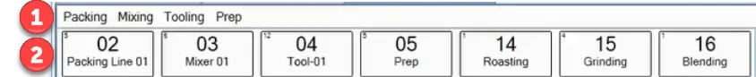
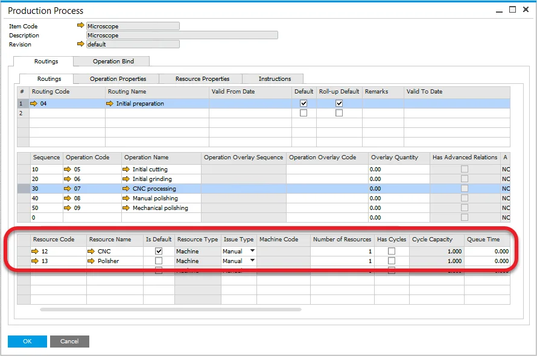

# Resource Planning Board

Resource Planning Board allows rescheduling Tasks on the Gantt chart based on several sorting options or by drag & drop method of specific Tasks in a queue.

Resource Planning Board also gives insight into work being performed on Resources currently and work planned to be performed on them. Along with Resource status, you can also check several related data from the Board level, e.g., a number of the document under which the Resource works, logged work time, finish time of the previous Operation, start time of the following Operation, etc.

Resource Planning Board is complementary to Scheduling: it is available as a tab on the Scheduling board. It is also connected to CompuTec PDC, which allows monitoring actions taken through this application.

The form in the screenshot above contains three areas:

- choosing resource space
- Resource panel
- Scheduling panel

## Choosing Resource

Go to the top bar of the Board to choose a specific Resource:

1. **Resource Group Line**: Click a name of a Resource Group (in this example: Packing, Mixing, Tooling, or Prep). It displays all of the Resources from this group below. Clicking on the blank space just after the last Resource Group name (in this example: right to Prep) shows Resources not assigned to any groups.

    You can choose more than one Resource Group. In this case, all of the Resources from selected Groups are displayed.

2. **Resources Line**: Each of the Resources from the Resource Group(s) chosen in the previous step is represented by a separate tile. Every tile includes a Resource Number, a Resource Name, and a number indicating the number of Operations assigned to a specific Resource (top left corner).

    Data connected to a Resource chosen by clicking the Resource line are displayed in Resource Panel and Scheduling Panel.

After choosing a Resource, both Resource Panel and Scheduling Panel are populated with related data.

## Resource Panel

1. Resource name (top name), Resource group (in which the Resource is included), and Resource type indicator (it can indicate either Machine, Tool, or Subcontractor type of a Resource).
2. Time constraints of a period for which Resource occupancy is calculated (for the graph below).
3. Occupancy graph:

    1. **Availability** – is the overall time of Resources being available to work on, aggregated for the given period. It is based on the Resource Calendar: a period of the Resource being available to work on minus Exceptions and Holidays,

    2. **Occupied** – is the overall time of a Resource being used and cannot be used in other Operations. It is based on Operations assigned to the Resource,

    3. **Free** – is the overall time of a Resource being free to use. Availability - Occupied = Free.
4. Information about the Operation (in the specific Manufacturing Order) is connected to the Resource. This information is available after choosing an Operation for the Resource from the Scheduling Panel.
5. Related Resources.
6. Here you can find a Sales Order connected to the Manufacturing Order for which the current Operation is being worked on.

## Scheduling Panel

### Data Display

Here you can find data on all the Tasks (work on a specific Operation within specific Manufacturing Order) connected to the chosen Resource.

Every row represents a separate Task (four Tasks are displayed in the example above).

Data displayed on the row:

- **red strip** (visible on the second and third Task row on the example above) – indicates overlapping with another Task
- **Task status indicator** – informs the user of the state of the Task - Tasks with any status cannot be rescheduled anymore (on the example about the second and fourth Tasks can be rescheduled):

  -  - work on a Task in progress (in CompuTec PDC),
  -  - partially booked: some work has been recorded on a Task, but currently, no work is being done on it,
  -  - a Task is closed: work on it has been recorded with the option Close Task in CompuTec PDC
  -  - this Task is frozen
  -  - this task is assigned

   

  :::info
      Only Tasks with no status yet (blank status indicator field) can be rescheduled (it is only possible to highlight the Task and see its details in the Resource panel).
  :::
- **Manufacturing Order Related Data** – Document Number, Item Code, Priority, Order Quantity, Status
- **CompuTec PDC-related Data** – Resource Quantity, Duration, Effort
- **Freeze** – checking this checkbox and clicking Update, fixes a Task to a specific date and time. After changing data and time, and clicking Update on the lower part of the panel, a Task with this checkbox checked will not change its date and time.
- **Lock MOR** – freezes all tasks in a specific Manufacturing Order. (Check the Freeze option described above)
- **Red Sign** – if it is displayed, Required Date from the related Manufacturing Order has been exceeded
- **Resource Relation Indicator** (brown strip with a number on the far right of the Task rows on the example above) – if the chosen Resource is a Machine type, a Resource code of a related Tool Resource is displayed here. If the Resource is a Tool type, a Resource code of a related Machine Resource is shown here.

You can define up to 8 columns to be displayed on a Task row related to a specific Resource. You can check [here](../../routings/resources.md) how to do this.

### Scheduling

You can set an order of Tasks manually or by using Sort options. After setting up a desired order, date, and time, click Update to load it to the Gantt chart.

Click and hold a row. The chosen row is highlighted, and you can drag it up and down the queue. Drop it on a required position. At this point, Tasks have not been rescheduled yet. To do this, it is necessary to set the date and time in the form's lower right corner and click Update.

Note that after dropping a Task, there is a blue strip on a Resource box. It indicates that the queue for it has been changed but not updated yet (therefore, it has not been loaded to the Gantt chart yet).

#### Reschedule on Drop

Selecting this checkbox at the top of the form automatically reschedules tasks when a task is moved to a new position in the queue. The Update button is not needed to apply changes to the Gantt chart.

This option is not recommended when the Gantt chart contains many Manufacturing Orders, as rescheduling each change may take a considerable amount of time.

#### Sort

You can sort the rows by several predefined settings. Click the Sort button on the top part of the form to open the Sort menu in a Resource Panel:

Apart from the default values (displayed in the drop-down list), it is also possible to sort Tasks by Labels.

Creating multilevel sorting patterns and selecting ascending or descending order is possible. In the example below, rows should be sorted first by Document Number in descending order. For records with duplicate Document Numbers, rows should then be sorted by Revision Code in ascending order. Note that the checkbox for each specific sorting method must be selected to be considered in the sorting process.

Records can be sorted manually by selecting the Sort Entries option and rearranging them through drag-and-drop:

Click Sort to apply the order to Scheduling Panel and click Update to load it to the Gantt chart.

#### Alternative Resources

This option allows you to reschedule Tasks between Alternative Resources.

You can define multiple Resources connected to a specific Operation in Routing on the Production Process of a particular Item (than used on a Manufacturing Order). Click [here](../../scheduling/gantt-chart/alternative-resources.md) to find out more.

Check the Show Alternative Resources (lower left corner of Scheduling Panel) checkbox to activate the option. Now, when you highlight a Task that has alternative Resources defined, a new panel with alternative Resources will be displayed:

The time of work of highlighted Task on another resource is displayed on the alternative resource tile.

You can now move the Task between Resources using the drag-and-drop method.
