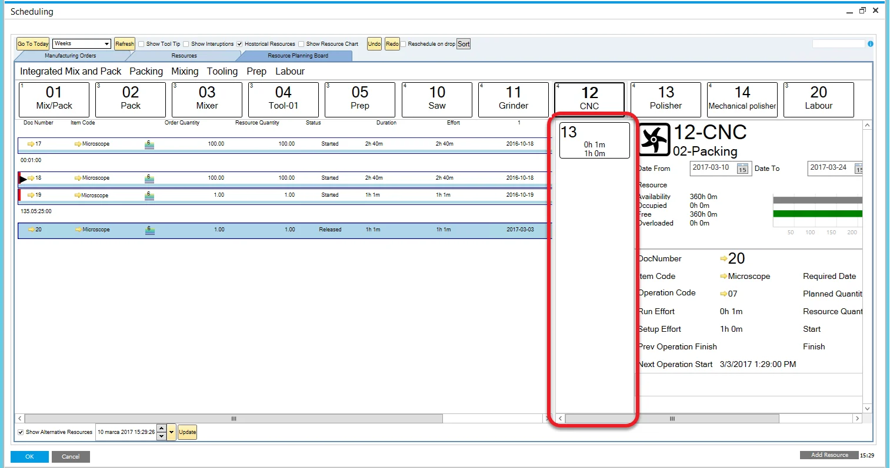

# Resource Planning Board

The Resource Planning Board provides an efficient way to reschedule tasks on the Gantt chart, offering multiple sorting options or a drag-and-drop method to rearrange tasks in the queue. It also offers valuable insights into the current and planned work for resources, allowing users to monitor key details like the document number, logged work time, finish time of the previous operation, and start time of the next operation.

Serving as a complementary feature to the Scheduling Board, the Resource Planning Board is accessible as a tab within the Scheduling interface. It is also integrated with CompuTec PDC, enabling users to track actions taken through this system.

The interface is divided into three main areas:

- choosing resource space
- Resource panel
- Scheduling panel

---

## Choosing Resource

To select a specific resource, navigate to the top bar of the Resource Planning Board:

1. **Resource Group Line**: Click on the name of a Resource Group (e.g., Packing, Mixing, Tooling, or Prep) to display all resources within that group. If you click the blank space after the last Resource Group (e.g., right of Prep), you'll see resources that are not assigned to any group.

    You can select multiple Resource Groups at once to display all the resources from the chosen groups.

2. **Resources Line**: Each resource within the selected group(s) is represented by a separate tile. Each tile shows the Resource Number, Resource Name, and the number of Operations assigned to that resource (located in the top left corner).

When you click on a resource, both the Resource Panel and Scheduling Panel are populated with data relevant to that resource.

## Resource Panel

The Resource Panel provides detailed information about the selected resource, including:

1. **Resource Name**: Displays the name of the resource at the top.
2. **Resource Group**: Shows the group to which the resource belongs.
3. **Resource Type Indicator**: Indicates the type of resource, such as Machine, Tool, or Subcontractor.
4. **Time Constraints**: Displays the time period used to calculate the resource's occupancy, helping you understand its availability over time.
5. **Occupancy graph**:
        - **Availability**: is the overall time of Resources being available to work on, aggregated for the given period. It is based on the [Resource Calendar](../resource-calendar.md): a period of the Resource being available to work, excluding Exceptions and Holidays.
        - **Occupied**: is the overall time of a Resource being used and cannot be used in other Operations. It is based on Operations assigned to the Resource,
        - **Free**: is the overall time of a Resource being free to use. Availability - Occupied = Free.
6. **Operation Information**: provides details about the operation connected to the resource, specifically for a particular Manufacturing Order. This information is available after selecting an operation for the resource from the Scheduling Panel.
7. **Related Resources**: displays resources that are related to the selected resource, helping you manage dependencies.
8. **Sales Order**: shows the Sales Order connected to the Manufacturing Order for which the resource is currently working, providing a clear link to customer orders.

## Scheduling Panel

### Data Display

In this section, you’ll find information on all the Tasks connected to the selected resource. Each row represents a separate task (as shown in the example, there are four tasks displayed).

Here’s the data shown for each task row:

- **red strip**: if displayed (like on the second and third tasks in the example), it indicates that the task overlaps with another task.
- **Task status indicator**: informs the user of the state of the Task - Tasks with any status cannot be rescheduled. For example, in the case of the second and fourth tasks, rescheduling is still possible. The statuses include:

  -  - work on a Task in progress (in CompuTec PDC),
  -  - partially booked: some work has been recorded on a Task, but currently, no work is being done on it,
  -  - a Task is closed: work on it has been recorded with the option Close Task in CompuTec PDC
  -  - this Task is frozen
  -  - this task is assigned

   

  :::info
      Only tasks with a blank status indicator can be rescheduled. You can click on the task to view its details in the Resource Panel, but it cannot be moved unless no status is assigned.
  :::
- **Manufacturing Order Related Data**: includes the document number, item code, priority, order quantity, and task status for the connected manufacturing order.
- **CompuTec PDC-related Data**: displays data related to Resource Quantity, Duration, and Effort associated with the task.
- **Freeze**: when the checkbox is selected and Update is clicked, the task is fixed to a specific date and time. Even if you change the date or time later, clicking Update will preserve the task's fixed schedule.
- **Lock MOR** – freezes all tasks in a specific Manufacturing Order. (Check the Freeze option described above)
- **Red Sign**: if it is displayed, Required Date from the related Manufacturing Order has been exceeded.
- **Resource Relation Indicator** (brown strip with a number on the far right of the Task rows on the example above) – if the chosen Resource is a Machine type, a Resource code of a related Tool Resource is displayed here. If the Resource is a Tool type, a Resource code of a related Machine Resource is shown here.

You can configure up to 8 columns to display specific information on each task row. You can check [here](../../routings/resources.md) how to do this.

### Scheduling

You can manually set the order of tasks or use sorting options to arrange them. Once you’ve set the desired order, date, and time, click Update to apply the changes to the Gantt chart.

To reorder tasks, click and hold a row. The selected row will be highlighted, allowing you to drag it up or down the queue. Release it in the desired position. At this stage, tasks have not been rescheduled yet. To finalize, enter the date and time in the lower-right corner of the form and click Update.

Keep in mind that after dragging a task, a blue strip will appear on the Resource box. This indicates that the task queue has been modified but not updated yet (meaning it hasn’t been reflected on the Gantt chart).

#### Reschedule on Drop

By selecting this checkbox at the top of the form, tasks will be automatically rescheduled when moved to a new position in the queue. The Update button is no longer needed to apply changes to the Gantt chart.

However, this option is not recommended when the Gantt chart includes numerous Manufacturing Orders, as rescheduling each change could take significant time.

#### Sort

You can sort the rows by several predefined settings. Click the "Sort" button on the top part of the form to open the Sort menu in a Resource Panel:

In addition to the default options in the drop-down list, you can also sort tasks by "Labels".

You have the option to create multilevel sorting patterns and choose between ascending or descending order. For example, rows can be sorted by Document Number in descending order. If there are duplicate Document Numbers, you can then sort those by Revision Code in ascending order. Remember to check the box next to each sorting method you want to apply.

Records can be sorted manually by selecting the Sort Entries option and rearranging them through drag-and-drop:

Click "Sort" to apply the order to Scheduling Panel and click "Update" to load it to the Gantt chart.

#### Alternative Resources

This feature enables you to reschedule tasks across alternative resources.

You can assign multiple resources to a specific operation within the Routing of a Production Process for a particular item, which is then used in a Manufacturing Order. To learn more, click [here](../../scheduling/gantt-chart/alternative-resources.md) to find out more.

To activate this feature, check the Show Alternative Resources checkbox located in the lower left corner of the Scheduling Panel. Once enabled, when you select a task with alternative resources defined, a new panel displaying the alternative resources will appear:

The work time for the highlighted task on an alternative resource is shown on the respective resource tile.

You can then drag and drop the task to reschedule it between resource.

---
The Resource Planning Board provides a comprehensive and intuitive way to manage and optimize resource allocation within a manufacturing environment. By using the Resource Planning Board, you can ensure that tasks are properly allocated, manufacturing orders are tracked accurately, and resources are utilized effectively. Whether it's manually adjusting task order, leveraging alternative resources, or managing time constraints, the board helps streamline production planning and boost overall efficiency.
