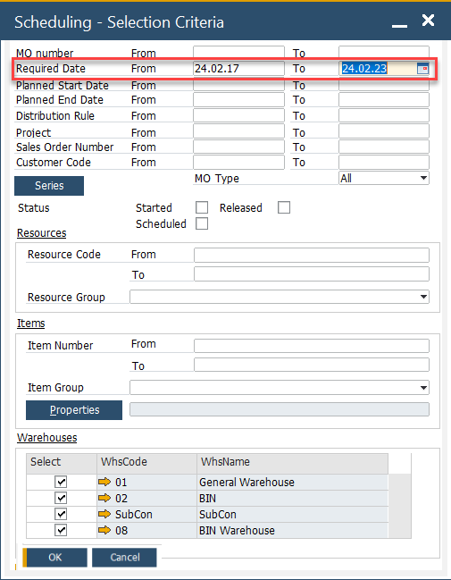
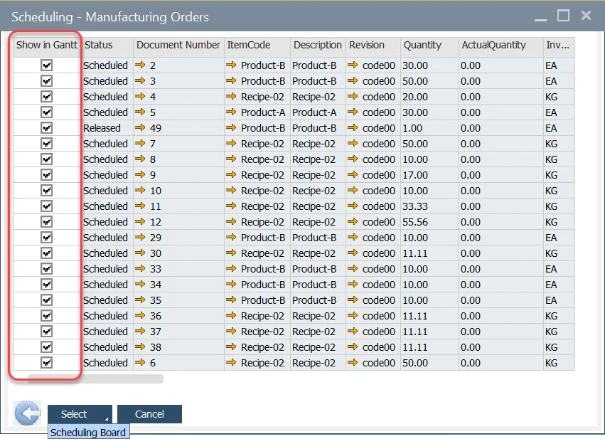

# Selecting Manufacturing Orders

This guide explains how to select and deselect Manufacturing Orders (MOs) for scheduling visualization within the Gantt chart. You will learn how to use filters, apply criteria, and control which MOs appear in the chart.

## Prerequisites

Before you begin:

- Ensure you have access to the Manufacturing Orders list within the scheduling interface.
- Confirm that your user role allows viewing and modifying order selections.

---

Follow these steps to filter, select and display Manufacturing Orders on the Gantt chart:

1. **Open the Extended Filter**

    Open the Extended Filter section in the scheduling interface.  
    This feature allows you to define criteria for selecting Manufacturing Orders that will be displayed on the Gantt chart.

2. **Apply Selection Criteria**

    You can filter and select Manufacturing Orders using one or multiple criteria.  
    Common options include:

    - **Required Date (From/To):** Filter orders based on their required completion date range.  
    

    - **Status:** Choose orders based on their production stage or status (e.g., Released, Planned).  
    - **Used Resources:** Filter by specific machines or work centers.  
    - **Manufacturing Order Item:** Focus on particular items being produced.  
    - **Warehouse:** Select orders linked to a specific storage or production location.

    You can mix multiple criteria to refine the results.

3. **Deselect Manufacturing Orders**

    By default, all Manufacturing Orders that meet your criteria are automatically selected.  
    To refine which ones are displayed:

    - **To deselect a specific order:** Uncheck the corresponding line in the list.  
    - **To deselect all orders:** Click the column header **“Show in Gantt.”**  
    - **To confirm your selection:** Click the **Select** button to display the chosen orders in the Gantt chart.  
    

4. **Access the Scheduling Board**

    If you wish to proceed directly to the Scheduling Board view:

    - Click the arrow down on the Select button.  
    - Choose Scheduling Board from the dropdown menu to navigate there immediately.  

    For more details, see [Scheduling Board](../scheduling-board.md).

---
