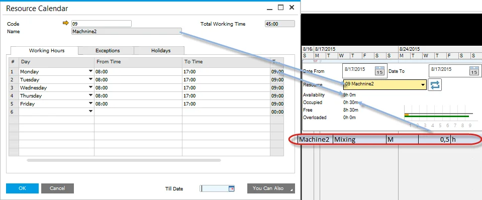

# Show Resources Chart

The Resource Chart is an essential tool for visualizing the allocation of resources and managing their capacity effectively. By using this chart, users can monitor the availability, usage, and overall workload of specific resources or resource groups over a given period. If the Show Resource Chart checkbox is checked, a form with Resource Chart is displayed.

## Resource Chart

The Resource Chart communicates four critical metrics related to time for a resource or group of resources:

- **Availability**: derived from the Resource Calendar, this metric indicates the total time a resource is available, including both occupied and free time.
- **Occupied**: Calculated from all Manufacturing Orders assigned to a specific resource within the selected period.
- **Free**: the remaining time when the resource is not occupied. This is calculated as Availability minus Occupied time.
- **Overloaded**: Displays the amount of time a resource’s workload exceeds its Availability.

After setting the required time constraints (in the example screenshot, the period starts on 2015-01-15 and ends on 2015-02-05), a resource chart will be filled with data:

- a value of time next to each type of time mentioned above.
- a graphic representation of those values, which allows fast comparison of different times.

Within the Chart, data for a specific resource or a group of resources can be displayed. The chart dynamically updates in real-time when data changes, such as modifications made on the Gantt Chart. This ensures the most accurate representation of resource allocation.

### Refresh Button

The capacity graphs in the Gantt chart are generated based on the Manufacturing Orders selected and loaded into the form. Users can filter and choose a specific subset of orders in the Manufacturing Order selection screen. To ensure an accurate view of resource capacity, including both selected and unselected orders, clicking the refresh button recalculates and updates the capacity data accordingly.

## Example

To better understand the data displayed on the resource chart and its sources, let’s examine the following example.

The screenshots below illustrate the Manufacturing Orders used to generate data for the resource chart:

The table below summarizes the resources utilized in these Manufacturing Orders, along with their attributes:

|            | Resources | Resource Group | Type | Run time | UoM |
| :--------: | :-------: | :------------: | :--: | :------: | :-: |
| Operation1 | Machine1  |     Mixing     |  M   |    1     |  h  |
|            |  Tool-01  |    Tooling     |  T   |    1     |  h  |
| Operation2 | Machine2  |     Mixing     |  M   |   0,5    |  h  |
|            |   Labor   |    Tooling     |  L   |   0,5    |  h  |

Users can select resources and resource groups for display on the chart using a dropdown list:

### Resource

The following screenshots show the resource chart for specific resources. Note that labor is not taken into calculation account:

Tool-01:

Machine1:

Machine2:

### Resource Group

The following screenshots show a resource chart with a specific resource group selected. When a resource group is chosen, the chart displays the combined time for all elements within the group. It is important to note that labor is excluded from the calculations.

Tooling:

Mixing:

---
The Resource Chart is a powerful tool for ensuring efficient resource management in manufacturing processes. By offering real-time insights into resource availability, workload, and capacity, it helps users make informed decisions and optimize their operations. Whether focusing on individual resources or entire resource groups, this functionality provides the clarity needed to prevent overloads and maximize productivity.
