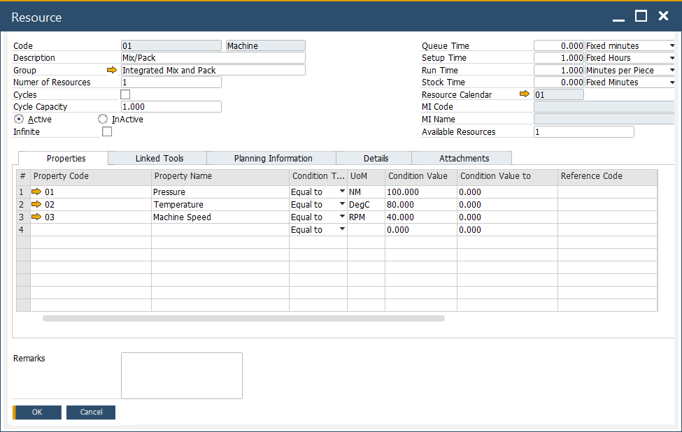
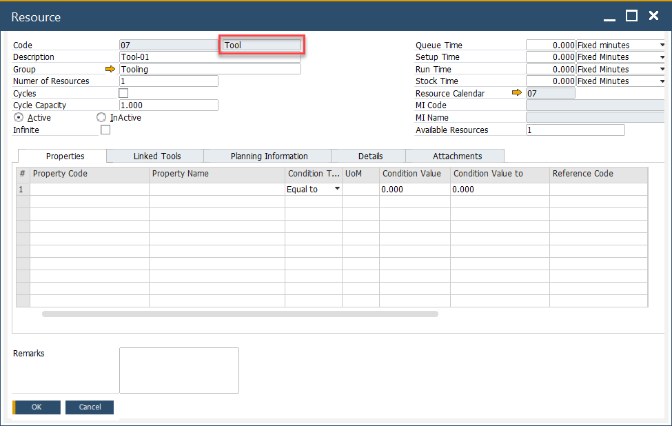
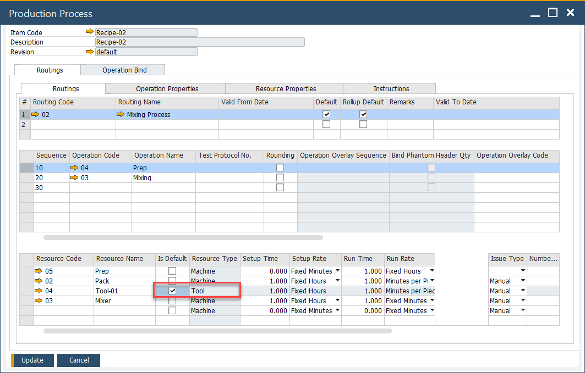

# Overview

CompuTec ProcessForce scheduling solution supports efficient management and real-time planning of Manufacturing Orders (MOs) through a visual and interactive Gantt chart. This system considers various production constraints - including resource availability, calendar setups, and overlapping operations - making it easier for planners to optimize schedules and respond dynamically to shop floor realities.

---

## What is the Scheduling Module?

The scheduling module in CompuTec ProcessForce helps manufacturers coordinate production activities by offering a centralized and interactive tool to:

- Visualize Manufacturing Orders across time and resources.
- Identify resource bottlenecks or conflicts.
- Adjust start/end times dynamically.
- Filter and sort based on project, customer, sales order, MO number, and more.

It serves as the central planning cockpit to monitor progress and modify workloads efficiently.

---

## Key Components of the Scheduling Setup

### Resources

Resources are the backbone of production scheduling. Resources represent machines, labor, or work centers involved in production. Accurate resource definitions are crucial for effective scheduling and workload distribution.  Setting up and managing resources ensures efficient utilization within the plant.

➡️ [Learn how to define and manage resources](../routings/resources.md)

➡️ [Watch video tutorial](https://www.youtube.com/playlist?list=PLtT6kgaz5YneralBjyvyCSYXbTT0QRHYx)

### Calendars

Resource calendars define working hours, shift patterns, weekends, and holidays. These directly impact schedule feasibility and capacity planning.

➡️ Learn how to [Set up resource calendars](./resource-calendar.md)

➡️ [Watch video tutorial](https://www.youtube.com/playlist?list=PLtT6kgaz5YneralBjyvyCSYXbTT0QRHYx)

### Tooling

Tooling resources refer to specific tools or machines that must be available and assigned for a given MO or operation. These need to be defined to prevent conflicts and ensure production precision.

➡️ Explore [tooling configuration](./resource-calendar.md).

---
