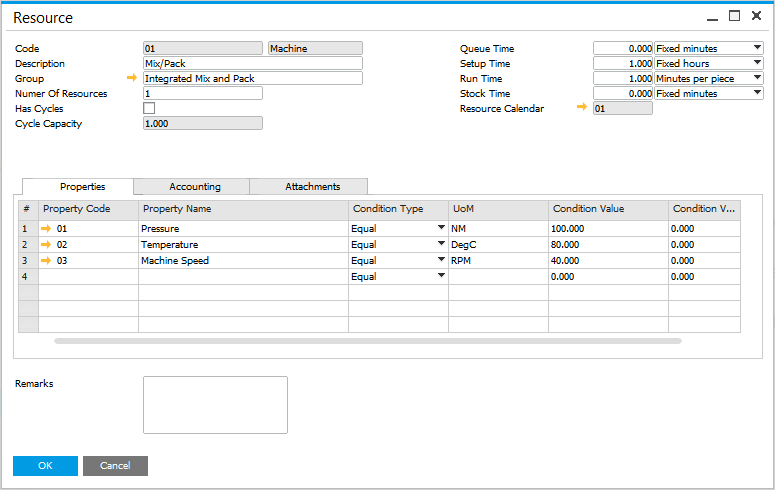
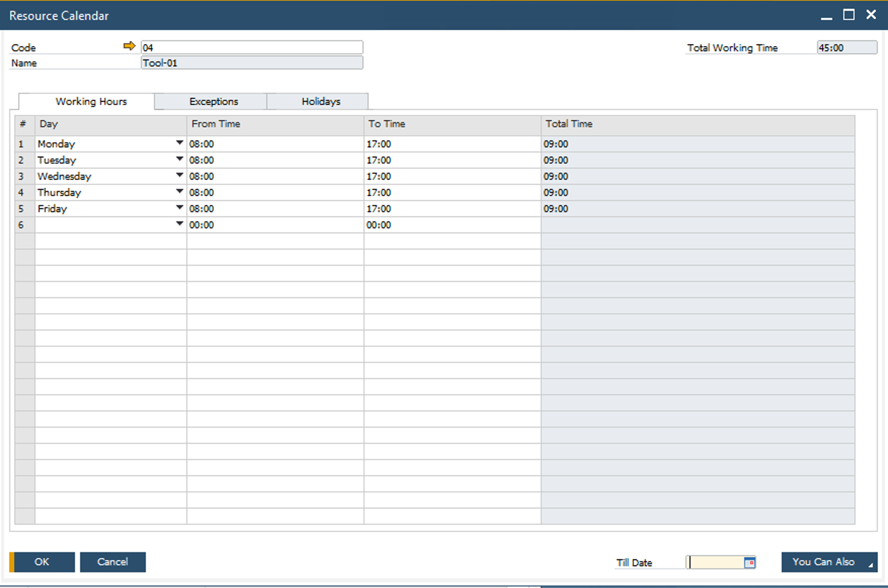
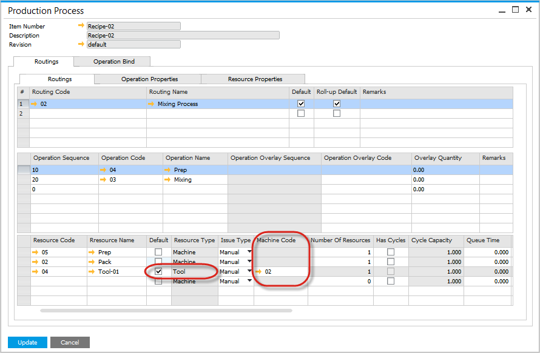

# Overview

ProcessForce scheduling solution allows to manage Manufacturing Orders within the plant. You can plan the production process considering, among other things, resource occupancy, time constraints, or overlapping processes. All data are available to modify via a dynamic, easy-to-change Gantt chart. Extended filtering option (by MO number, date, planned start and end date, distribution rule, project, Sales Order number, or Customer Code) allows picking required data to be displayed on a chart specifically.

---

## Master Data

### Resources

Click [here](../routings/resources.md) to find out more about resources and how to set them.

To view related videos, click [here](https://www.youtube.com/playlist?list=PLtT6kgaz5YneralBjyvyCSYXbTT0QRHYx).

### Calendars

Click [here](./resource-calendar.md)to find out more about setting up Resource Calendars.

To view related videos, click [here](https://www.youtube.com/playlist?list=PLtT6kgaz5YneralBjyvyCSYXbTT0QRHYx).

### Tooling

To view additional documentation, click [here](./resource-calendar.md).

