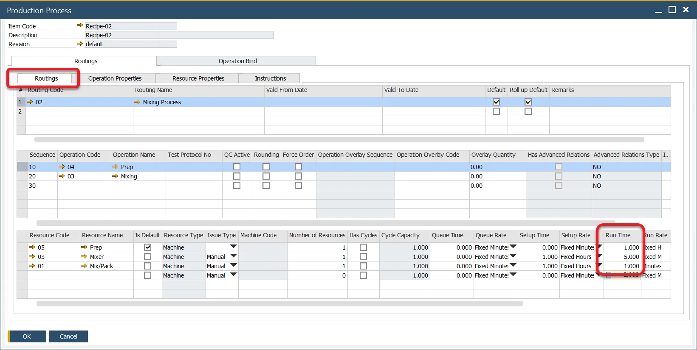
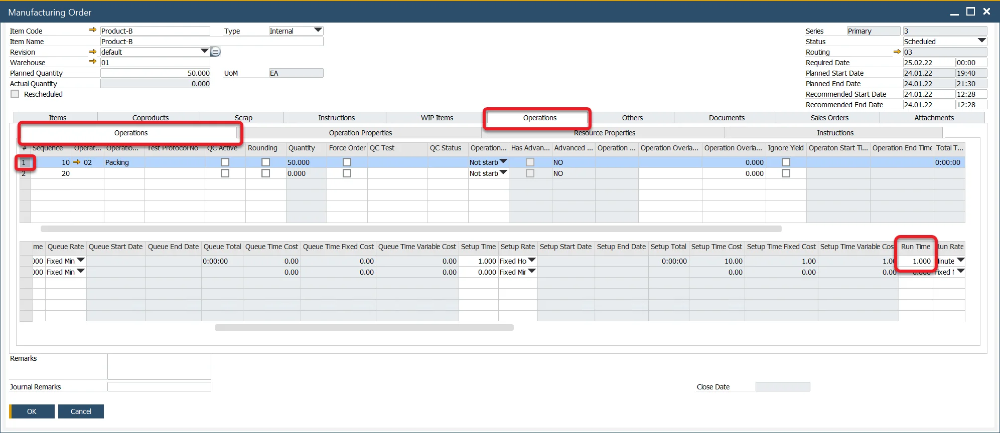

# Resource Balancing

This option allows choosing the most optimal Resource (defined in Production Process / Manufacturing Order / [Alternative Resources](./gantt-chart/alternative-resources.md)) for a specific task from a Manufacturing Order.

:::danger
    Testing the option in a test environment before using it in a production environment is recommended.
:::

## Description

Resource Balancing allows you to select the most suitable resource for a task in a Manufacturing Order by evaluating multiple factors like operation quantities, related times, resource availability, and resource calendars. Instead of relying on a default resource, the system calculates the optimal resource that can complete the work in the least amount of time.

**Example**

**Quantity on Manufacturing Order**: 100

**Bill of Materials' Resources on Operation**:

- M1 10pcs/h
- M2 10 pcs/h
- M3 5 pcs/h
- M4 5 pcs/h
- M5 10 pcs /h

**Scheduling Direction**: Forward (from date 01/01)

(all machines work 24/7)

- M1 needs ten hours to run and is available from 10.01 to 10 a.m. Therefore, it would finish the work on 10.01 at 8 p.m.
- M2 needs ten hours to run and is available from 11.01 to 5 p.m. Consequently, it would finish this work on 12.01 at 3 a.m.
- M3 needs 20 hours to run and is available from 9.01 to 1 a.m. Consequently, it would finish this work on 9.01 at 9 p.m.
- M4 needs 20 hours to run and is available from 10.01 to 5 a.m. and would finish this work on 10.01 at 1 a.m.
- M5 needs ten hours to run and is available from 10.01 to 7 p.m. and would finish this work on 11.01 at 5 a.m.

**The system will choose M3 for this work**

## Prerequisites

### Run Time

For Resource Balancing to function correctly, all resources used in Production Processes and Manufacturing Orders must have a Run Time value greater than 0. You can configure this in the Production Process or Manufacturing Order settings to ensure optimal resource allocation.

[Production Process](../formulations-and-bill-of-materials/production-process/overview.md):



Manufacturing Order:



### General Settings Option

To activate Resource Balancing, navigate to:

:::info Path
    Administration → System Initialization → General Settings → ProcessForce tab → Bill of Materials and Manufacturing Orders
:::

Check the "Use Resource Balancing" check box to use the option.

#### Resource Balancing Blockage

If any Machine-type Resource in the system has a Run Time set to zero in any Production Process configuration, attempting to check the Use Resource Balancing checkbox will prompt the display of the Resource Balancing blockage form. This form contains information indicating these Resources. To activate the option, change their Run Time values.


## Usage

Once enabled, Resource Balancing will automatically perform resource selection during Manufacturing Order scheduling or re-scheduling. This occurs when:

- opening the [Scheduling Board / Semi-finished Product Scheduling form](./scheduling-board.md#how-to-open-scheduling-board--semi-finished-product-scheduling)
- changing the Planned Quantity or Manufacturing Order header's dates

## Log files

A feature is available to log all actions related to the Resource Balancing function, capturing detailed information on every scheduling or rescheduling action.

:::danger
    Please be aware that enabling this feature will generate detailed logs, which may impact the performance of ProcessForce.
:::

To activate the option, perform the following steps:

1. Navigate to: C:\Program Files\sap\SAP Business One\AddOns\CT\ProcessForce.
2. Open the ProcessForce.exe.config file with a text editor.
3. Change the value from "false" to "true" in the following line:

        ```config
        <add key="SchedulingBalancingEnabled" value="false" />
        ```

   After enabling the feature, log files will be saved in the default directory:
   `C:\ProgramData\CompuTec\ProcessForce\ResourceBalancing`.

   A separate file is saved for changes made for each Operation.

---
Resource Balancing enhances manufacturing efficiency by automatically selecting the most optimal resources for completing tasks. By considering various scheduling and operational parameters, it helps streamline production and ensure timely completion. However, it’s important to test this feature in a test environment before deploying it in production to avoid unexpected issues.
