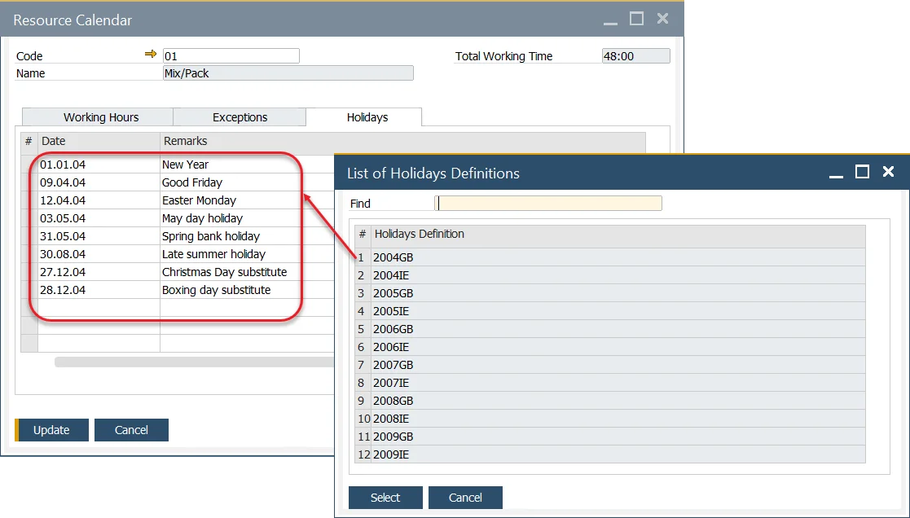

# Resource Calendar

The Resource Calendar is a tool that helps in planning and managing the weekly capacity of specific resources, including exceptions (such as additional work capacity) and holidays (time-offs). It can be created manually or by assigning a predefined calendar template, offering flexibility in managing resource schedules. This tool plays a crucial role in optimizing resource allocation and ensures that you can track and manage the availability of resources effectively, enabling smooth production workflows.

---

To access the Resource Calendar, navigate through the following path:

:::info Path
    Production → Routings → Resource Calendar
:::

## Purpose

Use the Resource Calendar to:

- Define and track working hours for each resource.
- Record exceptions such as overtime or added capacity.
- Manage holidays and non-working days.
- Apply and maintain consistent scheduling using calendar templates.

---

## Resource Calendars

A Resource Calendar is automatically created when a resource is added.

You can open it:

- Through the navigation path above, or
- By clicking the yellow arrow beside the Resource Calendar field.

    

## Resource Calendar tabs

### Working Hours

The Working Hours tab defines the standard weekly schedule for the resource.

- Set multiple work periods per day using From Time and To Time fields.
- The system automatically calculates the Total Time for each period.
- The total working time for the entire week appears in the Total Working Time field.

This setup ensures accurate scheduling and prevents resource overloading.

### Exceptions

Exceptions are used to extend a resource’s working capacity temporarily — for instance, during peak production or overtime scenarios.

Each exception record includes:

- Date and Time of the exception.
- Remarks for context or justification.

You can manage exceptions through the You Can Also button:

- Remove past exceptions – Deletes previous entries automatically.
- Create exceptions based on current working days till... 
– Duplicates current workday settings until a specified Till Date.

This flexibility helps manufacturers easily manage capacity adjustments.

### Holidays

The Holidays tab defines non-working days for a resource, such as company holidays or planned time-offs.

You can:

- Add holidays manually and include remarks.
- Use the You Can Also → Copy a list of Holidays defined in the system option to import predefined holiday data.

    

To access Holidays, navigate to:

:::info Path
Administration → System Initialization → Company Details → Accounting tab → Holidays
:::

Here, new holidays can also be created for assignment to resources.

## Resource Calendar Update Tool

To access Calendar Updates, navigate to:

:::info Path
    Production → Routings → Calendar Updates
:::

The Resource Calendar Update Tool allows you to assign a predefined calendar template to multiple resources simultaneously.

This ensures scheduling consistency across machines or work centers.

### Resource Calendar Template

To create a template, go to:

:::info Path
    Administration → Setup → Production → Resource Calendar Template
:::

To Create a Template:

1. Open the Resource Calendar Template window.
2. Enter the required working hours, exceptions, and holidays (similar to a regular Resource Calendar).
3. Click Add to save the template.

These templates can later be applied to multiple resources through the Calendar Update Tool, ensuring uniform scheduling and reducing manual configuration.

### Update

The Resource Calendar Update Tool allows you to assign predefined calendar templates to specific resources, ensuring consistent scheduling across multiple resources. To use this feature, go to:

---
