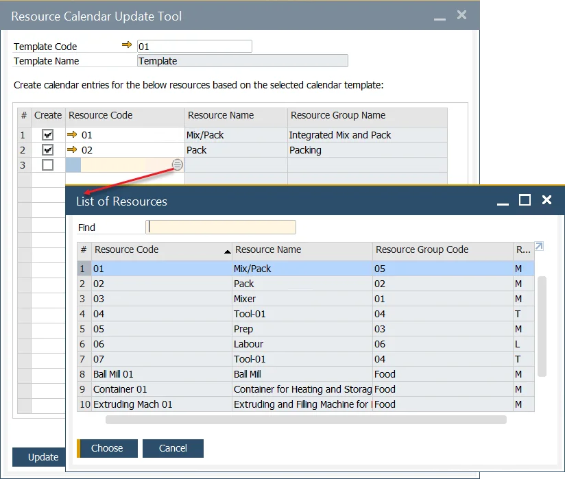

# Resource Calendar

The Resource Calendar is a tool that helps in planning and managing the weekly capacity of specific resources, including exceptions (such as additional work capacity) and holidays (time-offs). It can be created manually or by assigning a predefined calendar template, offering flexibility in managing resource schedules. This tool plays a crucial role in optimizing resource allocation and ensures that you can track and manage the availability of resources effectively, enabling smooth production workflows.

---

To access the Resource Calendar, navigate through the following path:

:::info Path
    Production → Routings → Resource Calendar
:::

## Resource Calendars

A Resource Calendar is automatically created when a resource is added.

You can access the Resource Calendar either through the path mentioned above or by clicking the yellow arrow next to the Resource Calendar field.

## Resource Calendar tabs

### Working Hours

The Working Hours tab allows you to define the working hours for each day of the week. You can set multiple work periods within a single day. Once you set the "From Time and To Time", the Total Time is automatically calculated. The total working hours for the week are displayed in the Total Working Time field.

### Exceptions

Exceptions represent additional work or capacity that extends the resource's capabilities. This feature can be used to handle overwork situations, allowing you to increase a resource's capacity.

You can define the date and time for each exception, along with remarks explaining the reason for the exception.

By clicking the "You Can Also" button and selecting Remove past exceptions, you can delete previously set exceptions.

Alternatively, clicking the You Can Also button and choosing Create exceptions based on current working days till... will allow you to populate the Exceptions list with workdays (and specified hours) up until the date entered in the Till Date field.

### Holidays

In this section, you can define one-day time-offs and add remarks related to them.

By clicking the "You Can Also" button and selecting Copy a list of Holidays defined in the system, you can automatically populate the Holidays list with predefined holiday data.

Holiday dates assigned to a company can be accessed through the following menu path: Administration → System Initialization → Company Details → Accounting tab → Holidays. From here, you can also define new dates that can be later assigned. This is a feature available in SAP Business One.

## Resource Calendar Update Tool

:::info Path
    Production → Routings → Calendar Updates
:::

You can apply a predefined Resource Calendar Template to a specific resource, populating the corresponding Resource Calendar with the template's data. This allows you to assign a template to multiple Resource Calendars simultaneously.

### Resource Calendar Template

To create a template, go to:

:::info Path
    Administration → Setup → Production → Resource Calendar Template
:::

You can create a Resource Calendar Template, which can later be assigned to a specific resource. Simply complete the required fields (similar to creating a Resource Calendar) and click the "Add" button.

### Update

The Resource Calendar Update Tool allows you to assign predefined calendar templates to specific resources, ensuring consistent scheduling across multiple resources. To use this feature, go to:

---
The Resource Calendar provides a comprehensive solution for managing resource availability, working hours, exceptions, and holidays. It is an essential tool for businesses looking to optimize resource capacity and ensure smooth and efficient production schedules. By using the Resource Calendar Template and Update Tool, you can automate and standardize resource scheduling, saving time and reducing errors in manual planning.
