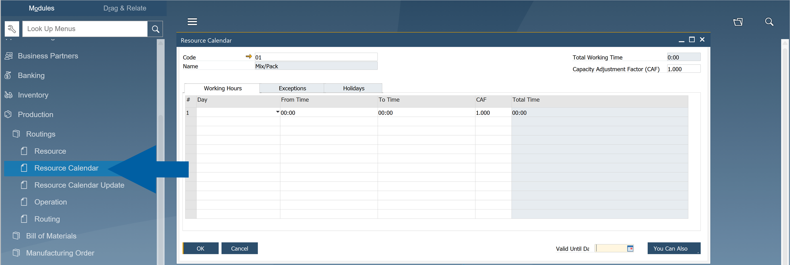
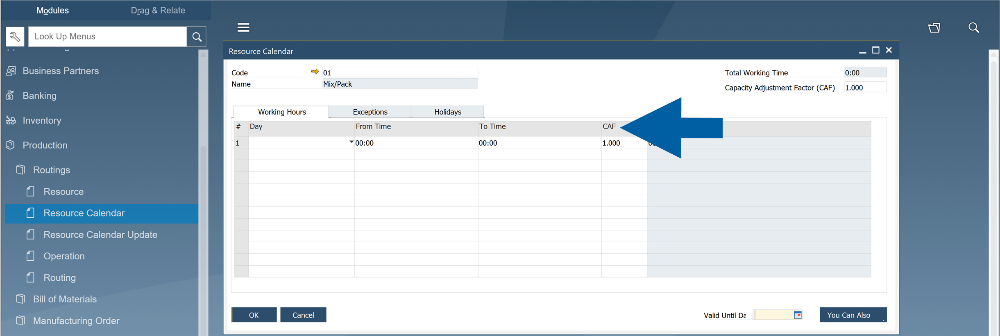
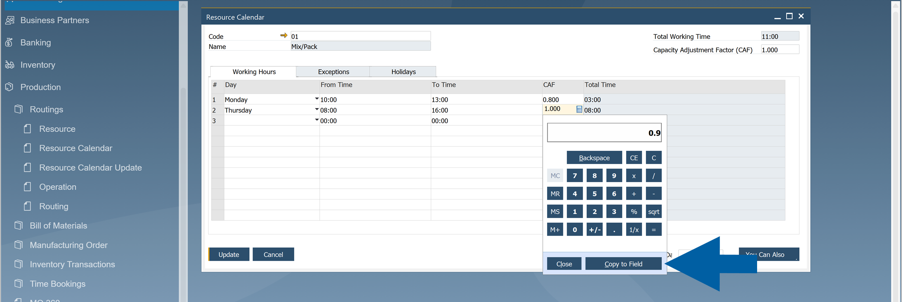
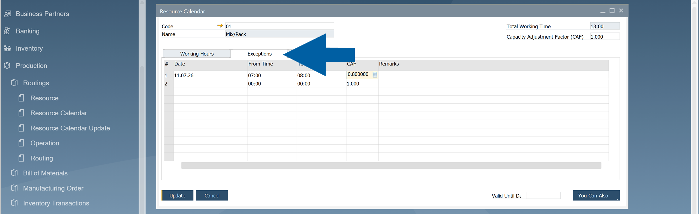
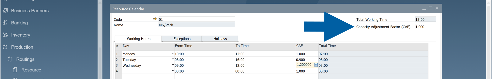
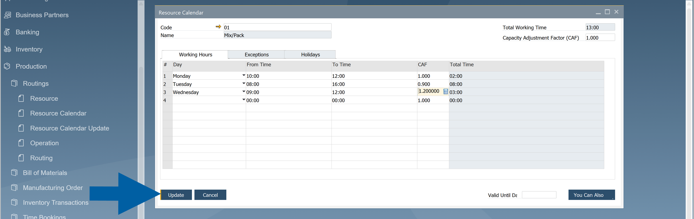

# Resource Efficiency

**Resource Efficiency** uses the **Capacity Adjustment Factor (CAF)** to reflect how efficiently a resource can perform during production.

Instead of assuming that every resource always operates at **100%** capacity, you can define a **CAF** for individual working days or specific calendar exceptions. During scheduling, **CompuTec ProcessForce** automatically adjusts the operation's run time based on the configured value.

> **Example**: If a machine normally requires 10 hours to complete an operation but is available at only 80% efficiency, the scheduler reserves 12.5 hours instead.

## When to use Resource Efficiency

Use **Resource Efficiency** when the actual capacity of a resource differs from its normal capacity.

Typical examples include:

- Machines with reduced Overall Equipment Effectiveness (OEE)
- Production lines that operate below full capacity
- Temporary efficiency increases after process optimization
- Reduced capacity caused by maintenance or staffing limitations

## Before you start

Before configuring Resource Efficiency, make sure that:

- The resource has a **Resource Calendar** assigned.
- Scheduling is performed using **CompuTec ProcessForce**.

## Configure the Resource Efficiency using CAF

To configure **Resource Efficiency** using **CAF**, follow these steps:

1. In **SAP Business One**, go to **Production** > **Routings**.

2. Navigate to **Resource Calendar**.

    

3. On the Working Hours tab, find the Capacity Adjustment Factor (CAF) field.

    

4. Enter the **Capacity Adjustment Factor (CAF)** for each working day.

    

5. (Optional) Open the **Exceptions** tab to define a different **Capacity Adjustment Factor** for specific dates.

    

    :::info[Note]
    The **Capacity Adjustment Factor (CAF)** in the header sets the default **CAF** value for all new working-hour entries you create. Changing this value does not update existing entries. You can also change the **CAF** for each individual entry when adding or editing it.
    
    :::

6. Click **Update** to save the calendar.

The scheduler uses the configured values automatically the next time **Manufacturing Orders** are scheduled.

## How the Capacity Adjustment Factor works

The **Capacity Adjustment Factor (CAF)** changes the effective capacity of a resource.

| Capacity Adjustment Factor | Resource Capacity | Scheduling Result |
| --- | --- | --- |
| 1.0 | 100% | Uses the standard run time |
| 0.8 | 80% | Extends the run time by 25% |
| 0.9 | 90% | Extends the run time slightly |
| 1.1 | 110% | Shortens the run time |
| 1.2 | 120% | Schedules the operation faster than the standard run time |

The **Capacity Adjustment Factor** affects **Run Time** only. It does not change setup time or other production parameters.

:::note[Example]
Assume a resource normally produces 100 units per hour.

| Day | Capacity Adjustment Factor | Effective Capacity |
| --- | --- | --- |
| Monday | 0.9 | 90 units/hour |
| Tuesday | 1.0 | 100 units/hour |
| Wednesday | 1.1 | 110 units/hour |

If an operation normally requires 10 hours:

- CAF = 1.0 - scheduled for 10 hours
- CAF = 0.8 - scheduled for 12.5 hours
- CAF = 1.2 - scheduled for approximately 8.3 hours

:::

## Result

After you configure the **Capacity Adjustment Factor**, **CompuTec ProcessForce** automatically adjusts resource run times during scheduling based on the configured efficiency.

No additional configuration is required when creating or scheduling **Manufacturing Orders**.
