# Scheduling Board

Scheduling Board is a production planning tool that allows scheduling (and rescheduling) several Manufacturing Orders (filtered by chosen criteria) quickly. It also allows managing Manufacturing Orders based on a multi-level Bill of Materials, considering the product structure. Due to the usage of product planning-relate-dated dates and times, the system can communicate situations when it is impossible to process a Manufacturing Order on time for the planned Delivery Date and suggest the first date available to do this.

---

## How to Open Scheduling Board / Semi-finished Product Scheduling

The Scheduling Board can be accessed from the following areas in the system:

### Scheduling

:::info
    Production → Manufacturing Order → Scheduling
:::

Here, you can select a single Manufacturing Order or multiple orders as needed.

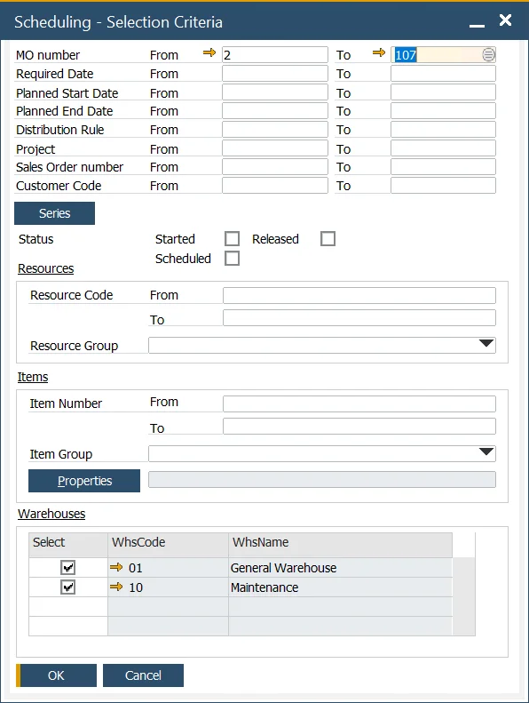

- You can select/deselect all the Warehouses by double-clicking on the top of the Select column.
- To select or deselect all Warehouses, double-click the top of the Select column.
- Use the Scheduling Selection Criteria to filter the Manufacturing Orders you want to display. After setting the criteria, click OK. If no criteria are specified, all Manufacturing Orders in the system are displayed by default.
- A list of selected Manufacturing Orders will appear. To proceed, click on the Select button and choose the Scheduling Board option:

    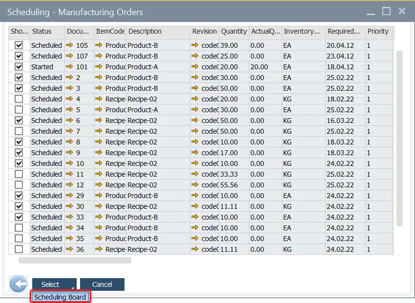

### Sales Order

:::info
    Sales A/R → Sales Order
:::

Semi-finished product Manufacturing Orders can be created from the Sales Order context menu. Simply choose the Create Manufacturing Orders option:

    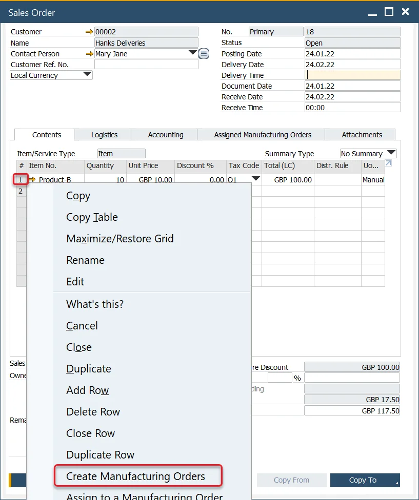

Two options are available in the context menu:

- **Create Manufacturing Orders**: opens the Scheduling Board
- **Create Manufacturing Order**: creates a single Manufacturing Order for the item in the Content tab. Clicking this option opens the context menu.

### Manufacturing Order

Semi-finished products can also be created via the context menu of a final goods Manufacturing Order:

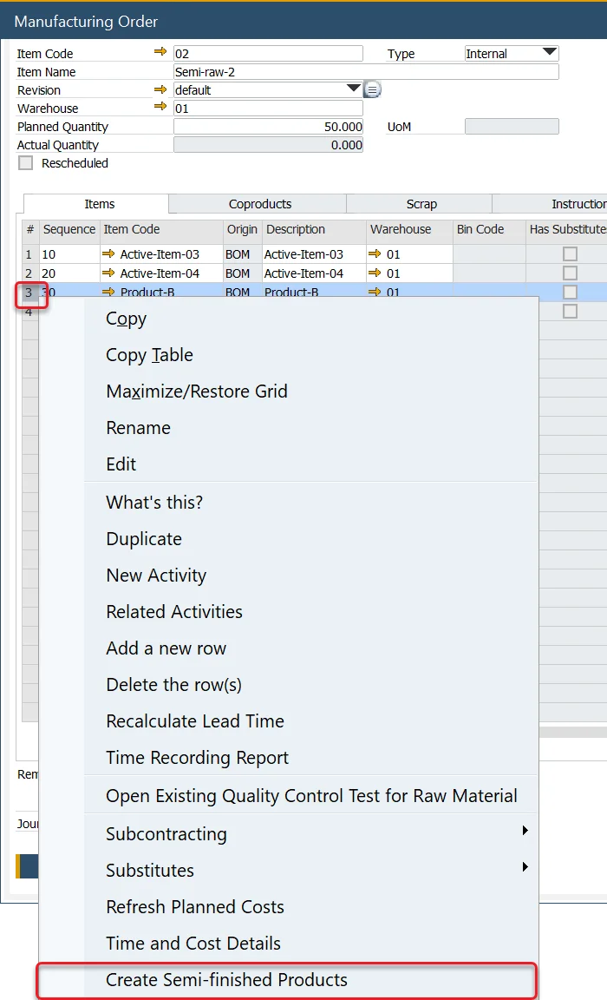

- After creating semi-finished product Manufacturing Orders, an additional option becomes available in the context menu: Scheduling → Recalculate Semi-finished Products Lead Time.
- This opens the Semi-finished Product Scheduling Board, allowing you to adjust Manufacturing Order dates and recalculate Lead Time.

### Order Recommendation

:::info Path
    MRP → Order Recommendation
:::

The Scheduling Board can also be accessed from the Order Recommendation form:

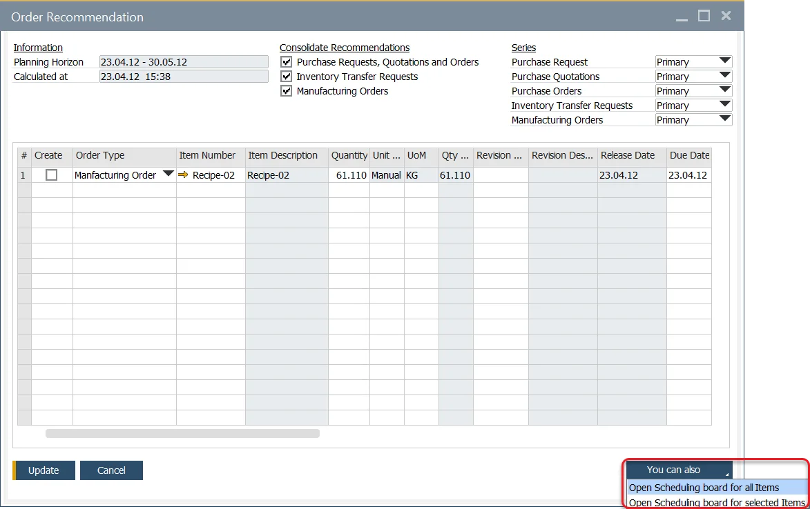

## Scheduling Board / Semi-finished Product Scheduling

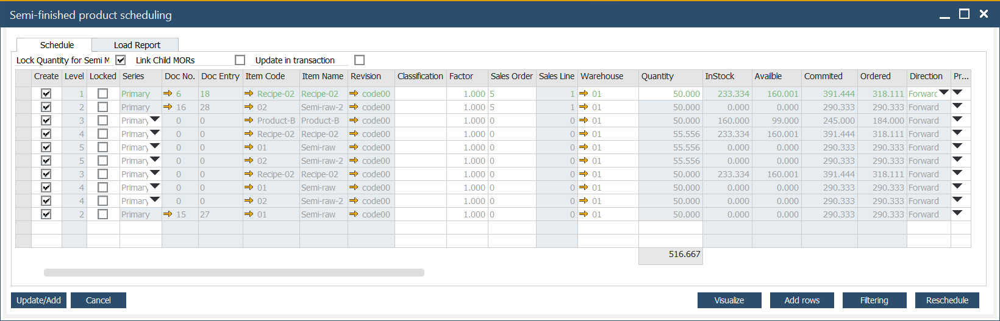

Semi-finished product scheduling is a tool for production planning, considering a product structure.

### Schedule tab

#### Create

This checkbox determines whether a Manufacturing Order for the Item will be scheduled for creation.

:::caution
    The checkbox cannot be checked if a higher-level item is disabled.
:::

#### Level

Indicates the item's position in the production structure. For items with semi-finished components, the hierarchy level is shown here. Learn more about multi-level BOMs and semi-finished items after clicking [this link](/docs/processforce/user-guide/formulations-and-bill-of-materials/bill-of-materials/multi-level-bill-of-materials/semi-finished-items/).

#### Quantity

Displays the planned item quantity. You can modify quantities at level 1, and changes will automatically cascade to lower levels.

#### Lock Quantity for Semi MORs

If the checkbox is checked, there is a possibility to change the quantity for a particular item. In this case, changing one thing does not affect other items.

#### Update in Transaction

When you click Update/Add on the Scheduling Board, the listed Manufacturing Orders will be processed. However, some Manufacturing Orders may not be added due to issues like synchronization errors or incorrect data configurations. In such cases, an error message will be displayed.

- **The checkbox is checked**: none of them will be added if there is at least one Manufacturing Order with an error.
- **The checkbox is not checked**: if there are Manufacturing Orders with errors, the correct ones will be added anyway (and the ones with mistakes not).

#### Direction

Production can be planned in two ways:

- **Forward**: the system automatically plans forward the start and end of the day, absolute time, and required date.
- **Backward**: the system automatically plans backward start and end day, absolute time, and required date. Sometimes it is impossible to make items to the required delivery date. The text on the scheduling board is red.

#### Priority

Sets the priority level of the production order.

#### Schedule Date and Time

Specifies the planned schedule's start and end date/time.

#### Date and Time of end of the Order

#### Routing

Available routing can be chosen from the Scheduling Board.

#### Filtering Option

The option allows filtering Manufacturing Orders based on the standard SAP Business One option.

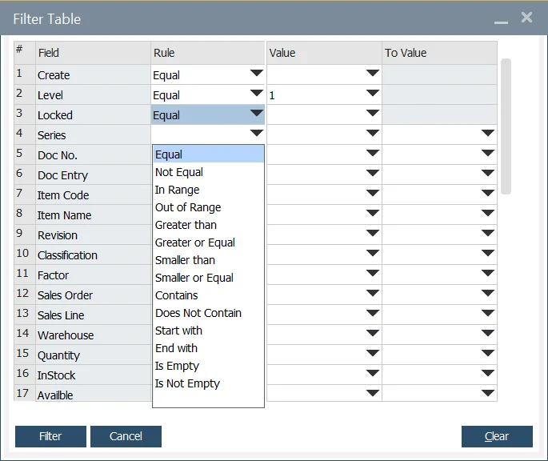

#### Visualize

Clicking this option opens a visual representation of relations between Manufacturing Orders:

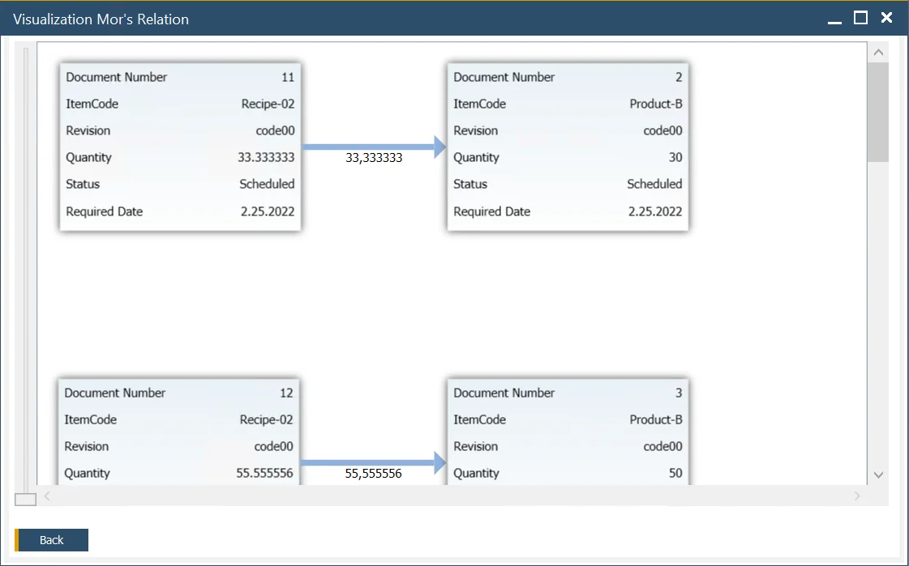

#### Copy row, Copy multiple rows

Options for copying one or multiple rows are available from the context menu in the first column.

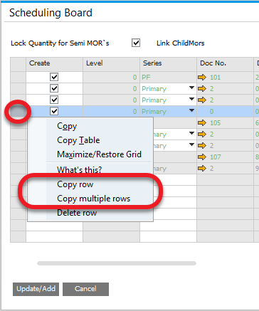

To copy multiple rows, highlight them using **Shift + Left Click** or **Ctrl + Left Click**, then right-click on any column (except the first one) to access the option:

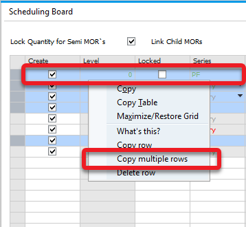

### Load Report tab

The Load Report tab provides a summary of resource usage, including Set Up Time, Run Time Machine, and Labor Resources, for a specific time period.

This report takes into account all data calculated within the Schedule tab, even if the documents have not yet been saved or created.

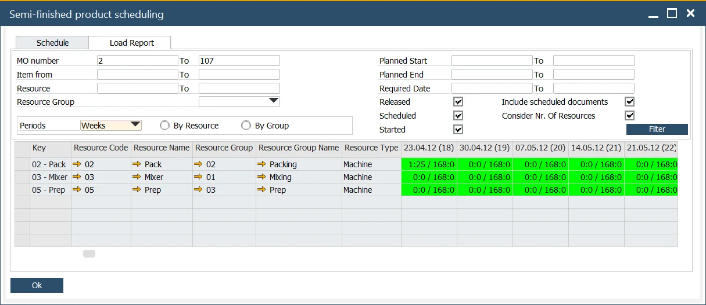

In the time columns (adjacent to the Resource Type column), values such as 1:25 / 168:00 indicate the aggregated scheduled time and the total availability based on the corresponding Resource Calendar.

Filtering options:

- **MO number**: filter by specific Manufacturing Orders.
- **Item**: filter by Final Good Items.
- **Resource**: filter by specific Resources used in the Manufacturing Orders.
- **Resource Group**: filter Manufacturing Orders that involve at least one Resource from the selected group.
- **Planned Start, Planned End, Required Date**: filter based on the Manufacturing Order dates.
- **Released, Scheduled, Started**: filter by the status of Manufacturing Orders.
- **Periods**: aggregate data into daily, weekly, or monthly intervals (columns right of the Resource Type column).
- **By Resource/ By Group**: Display data either as a list of Resources or grouped by Resource Group, including a total for each group:

    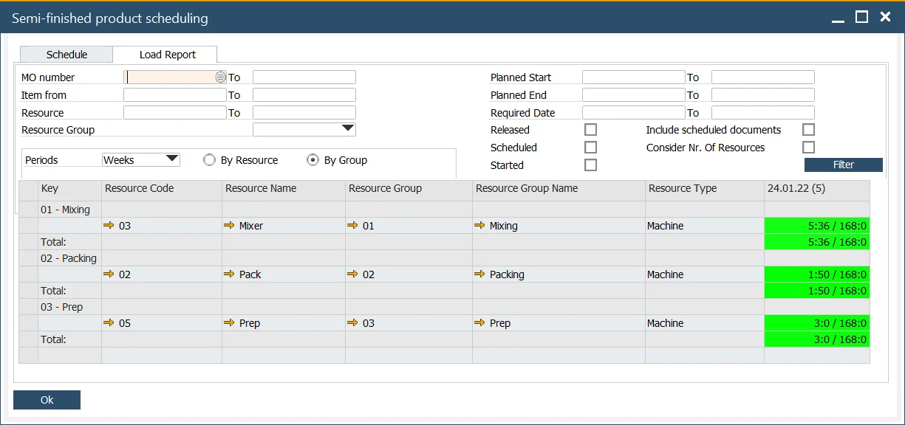

## Example

To understand how the Scheduling Board operates, let’s walk through an example of creating a Sales Order and determining its Delivery Date.

### Step 1: Create a Sales Order

Set up a Sales Order and specify its Delivery Date in the order header.

    :::info Path
        Sales A/R > Sales Order
    :::

    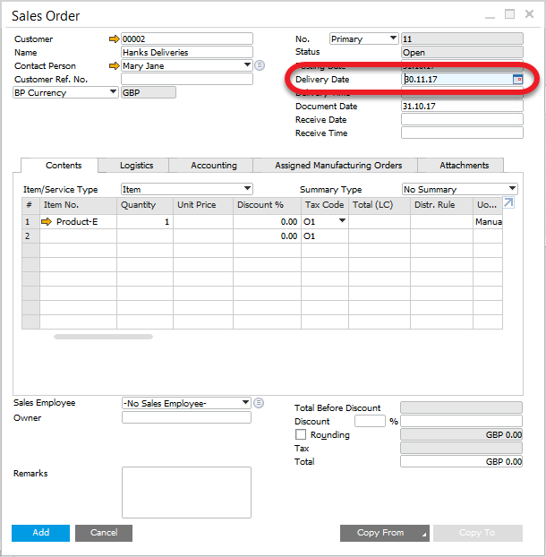

### Step 2: Evaluate Manufacturing Possibilities

To assess whether the item can be produced in time, right-click on the item within the Sales Order and select Create Manufacturing Orders.

The system automatically considers the Delivery Date, the Internal Lead Time, and plans the Start Date backward. If the calculated Start Date falls earlier than today, the system switches to Forward scheduling and calculates the earliest possible End Date instead.

### Scenarios

Let's consider two scenarios: delivery date is possible to realize, and delivery date is not possible to realize.

#### Scenario 1: Delivery date is possible to realize it

    If the delivery date can be met, the **Scheduling Board** copies the delivery date and verifies if production can be completed on time.

        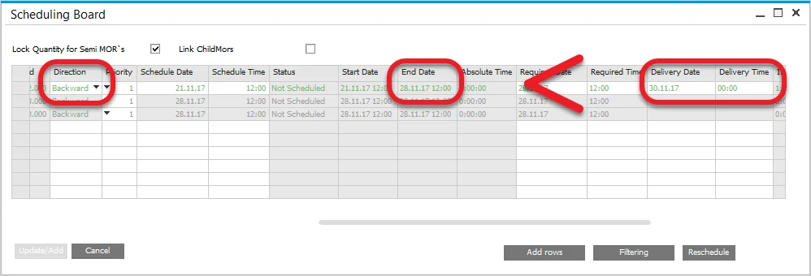

    In this example, the system determines that to meet the Delivery Date of 30.11.17, 0:00, production must finish by 28.11.17, 12:00. The green row on the **Scheduling Board** confirms that the Manufacturing Orders can be scheduled and delivered on time.

#### Scenario 2: Delivery date is not possible to realize

If the Manufacturing Order cannot be completed by the required delivery date, the order is displayed in red on the Scheduling Board. This means the current schedule is not possible.

    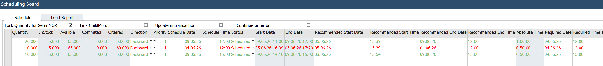

To find the earliest date when the order can be completed, follow these steps:

1. Click **Reschedule**.

    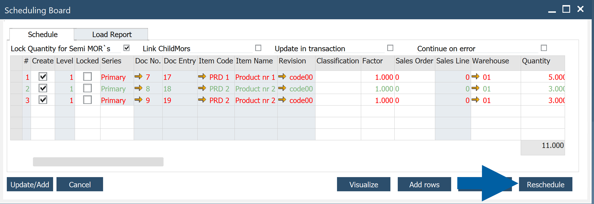

2. The system automatically changes the scheduling direction to ``Forward``.

    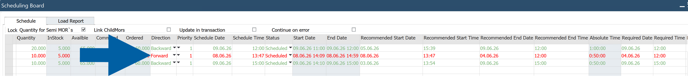

3. The system calculates the earliest possible **Start Date and Time**.

    

4. Based on the production time, the system also calculates the earliest possible **End Date and Time**.

You can use the calculated **End Date and Time** as the new **Required Date and Time**.

To reschedule the order, follow these steps:

1. Change the scheduling direction to ``Backward``.

    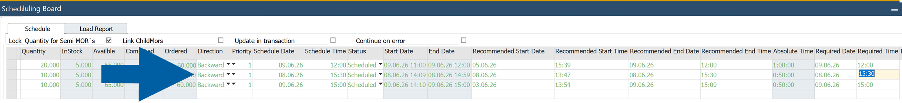

2. Enter a new **Required Date and Time**.

    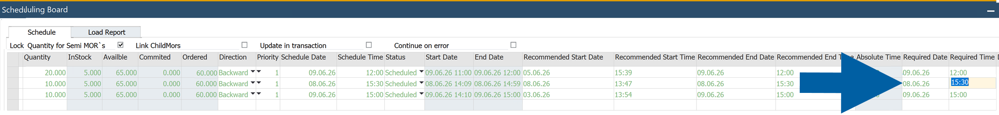

3. Click **Reschedule**.

    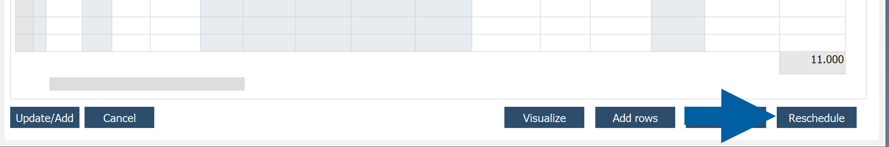

The system recalculates the schedule based on the new required date.

**Result**

If the Manufacturing Order can be completed within the new timeframe, the row changes from red to green. This indicates that the order can now be scheduled successfully.

## Sales Order Minimum Order Quantity

This option allows considering Sales Order options (Minimum and Maximum Quantity, Order Multiple) when creating Semi Finished Manufacturing Orders suggestions on Scheduling Board. This gives the sales operator a tool to provide an accurate estimated arrival time.

---
