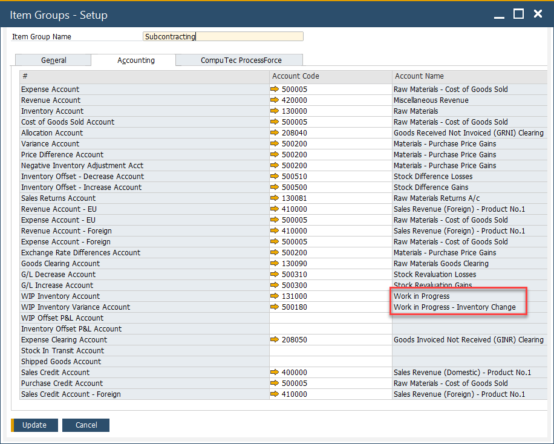

# General Ledger Settings

In managing subcontractor processes, it is essential to ensure accurate accounting and financial visibility. This how-to guide  outlines how the general ledger settings are configured to account for inventory consumed at a subcontractor and how financial postings are managed for both inventory and production activities. By setting up the right accounts, businesses can track production values and maintain clear records of subcontractor transactions.

---

## Overview

1. **Understand the Financial Flow**

    - Inventory consumed at a subcontractor is accounted for in the same way as production within a manufacturer.
    - When inventory is issued to and received back from the subcontractor, financial postings are made to the External WIP (Work in Process) account.
    - This ensures production value is tracked accurately during subcontractor operations.

2. **Set Up the Required G/L Accounts**

    - Following SAP Business One rules, accounts can be set at various levels including Warehouse, Item Group, and Item, or through Advanced G/L Account Determination.
    - For Subcontracting Activities:
        - External WIP Account: Assign this to track the value of inventory while it's with the subcontractor.
        - WIP Variance Account: Define this to capture any variances that arise during production at subcontractors.

        >**Note**: Make sure these account codes are defined at the appropriate level (Warehouse, Item Group, or Item) based on your chart of accounts structure and costing method.

        

3. **Configure Expense Account for Service Items**

    Service-type items (typically used to represent subcontracting services) must have an Expense Account assigned for proper cost recognition

    ✅ This step is mandatory for accurate service cost tracking in subcontractor processes.

    

---
