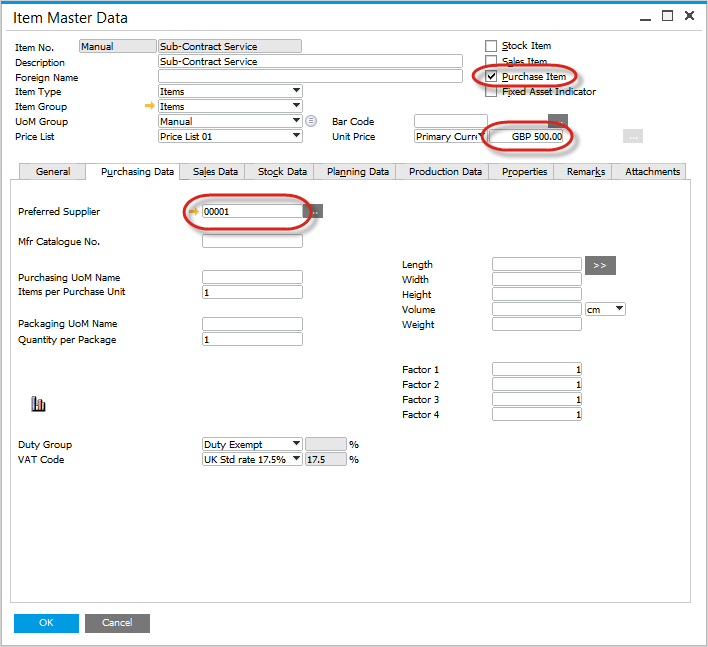
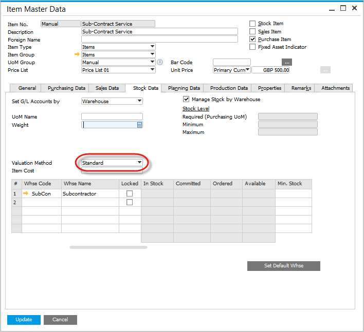
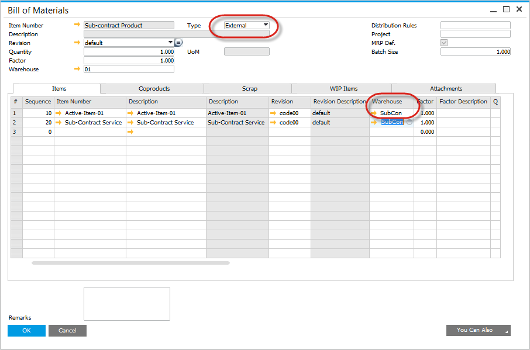
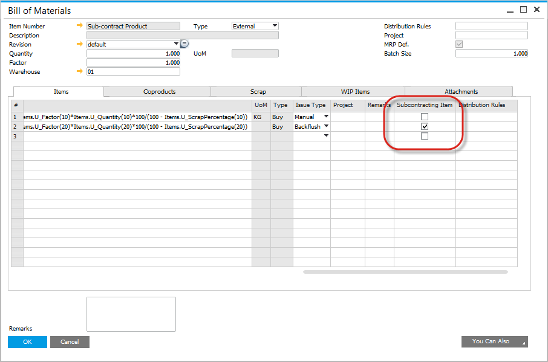

# Master Data Settings

To successfully manage subcontracting procedures, accurate master data settings are critical. These settings define the items involved, including the subcontract sub-assembly, the services to be purchased, and how costs are handled. This section covers the necessary steps for configuring item master data, bill of materials, and item costing to ensure smooth and efficient subcontracting operations.

---

## Item Master

### Subcontract Sub-Assembly Parent

- Create an Item Master for the Subcontract Sub-Assembly parent just like a normally manufactured item.
- Ensure that the default warehouse is set to the company warehouse where the inventory will be managed.

### Service to be Purchased

- Create an Item Master for the service.
- Set the Item as follows:
  - Purchase Item,
  - Preferred Supplier Code,
  - Unit Price or Price List.

    

- On the Inventory Data tab, set the Valuation Method to Standard.

  

## Bill of Material

- Create a Bill of Material for the Sub-Assembly to define which items are needed.
- Items can be configured as either "Manual" or "Backflush".
  - Set to "Backflush" if you don’t want to track the confirmed consumption of inventory from the subcontractor.
  - Set to "Manual" if you prefer to confirm consumption either by the production planner or the subcontractor themselves.
- Select Type = "External" to indicate that the assembly is done externally.
- Within the Items Tab, add the Item for the Service to be Purchased.
- The Warehouse for the Item represents the subcontractor warehouse where the inventory is moved to and related inventory transactions performed.

  
- For this Item, check the column "Subcontracting Item".

  

## Item Costing

- The cost for the subcontracted sub-assembly is the sum of material costs and the unit purchase price of the service.
- For the Items which are in inventory, set the costing records as normal.
- For the Item for the Service to be Purchased, set the Type to the Price List.
- Perform the cost roll-up manually or via the cost roll-up function.
- Perform the cost roll-over.

---
By properly configuring master data settings, companies can streamline their subcontracting processes and ensure that inventory and service costs are accurately managed. This setup also provides clear visibility into the production and cost flow of subcontracted items, ensuring efficiency and compliance in manufacturing and purchasing activities.
