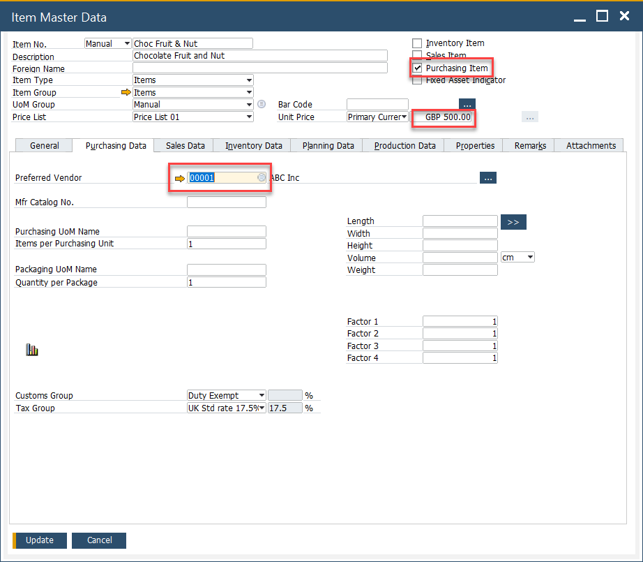
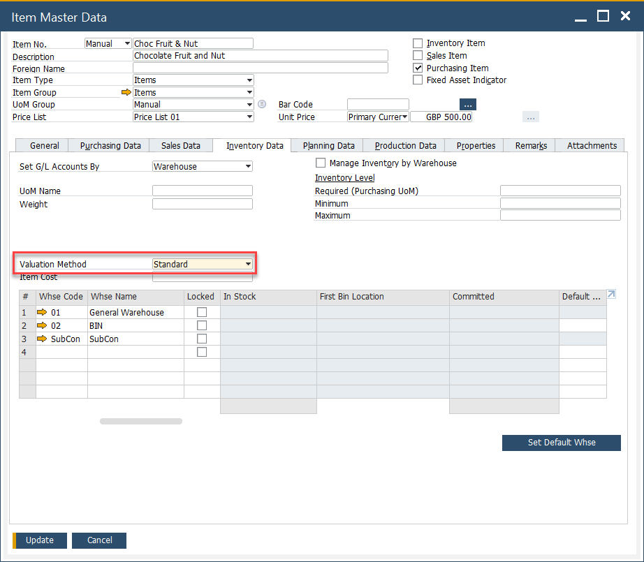
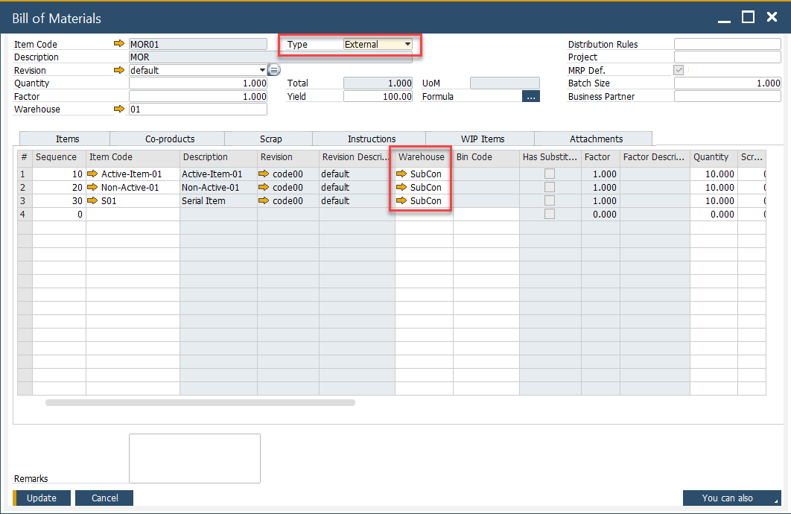
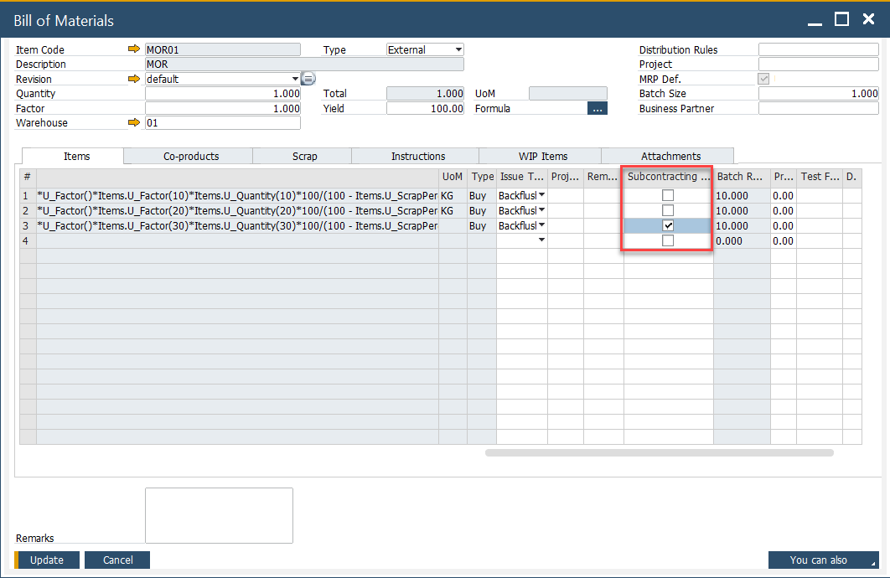

# Master Data Settings

To successfully manage subcontracting procedures, accurate master data settings are critical. These settings define the items involved, including the subcontract sub-assembly, the services to be purchased, and how costs are handled. This section covers the necessary steps for configuring item master data, bill of materials, and item costing to ensure smooth and efficient subcontracting operations.

---

## Item Master Configuration

### 1. Subcontract Sub-Assembly Parent

- Create an Item Master for the subcontracted sub-assembly, similar to how you define any manufactured item.
- Ensure the default warehouse is set to your company warehouse, where inventory will be tracked and managed.

### 2. Subcontracted Service Item

- Create an Item Master for the service.
- Configure the Item as follows: Purchase Item, Preferred Supplier Code, Unit Price or Price List.

    

- On the Inventory Data tab, set the Valuation Method to **Standard**.

  

---

## Bill of Materials Configuration

- Create a Bill of Material for the Sub-Assembly to define which items are needed.
- Items can be configured as either "Manual" or "Backflush".
  - Set to **Backflush** if you don’t want to track the confirmed consumption of inventory from the subcontractor.
  - Set to **Manual** if you prefer to confirm consumption either by the production planner or the subcontractor themselves.
- Select Type = **External** to indicate that the assembly is done externally.
- Within the Items Tab, add the Item for the Service to be Purchased.
- The Warehouse for the Item represents the subcontractor warehouse where the inventory is moved to and related inventory transactions performed.

  
- For this Item, check the column **Subcontracting Item**.

  

---

## Item Costing Setup

- The cost for the subcontracted sub-assembly is the sum of material costs and the unit purchase price of the service.
- For the Items which are in inventory, set the costing records as normal.
- For the Item for the Service to be Purchased, set the Type to the Price List.
- Perform the cost roll-up manually or via the cost roll-up function.
- Perform the cost roll-over to finalize the updated sub-assembly cost.

---
