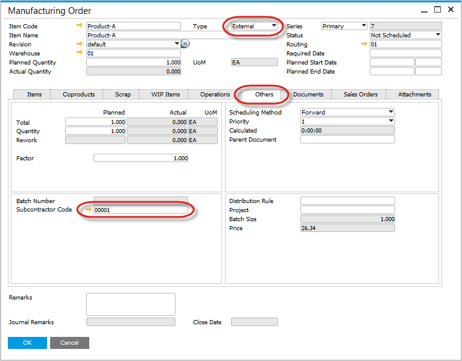
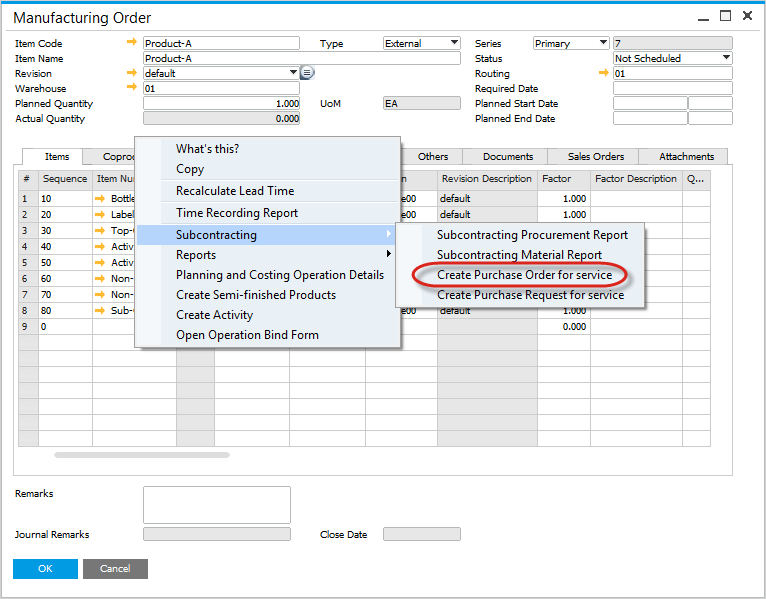
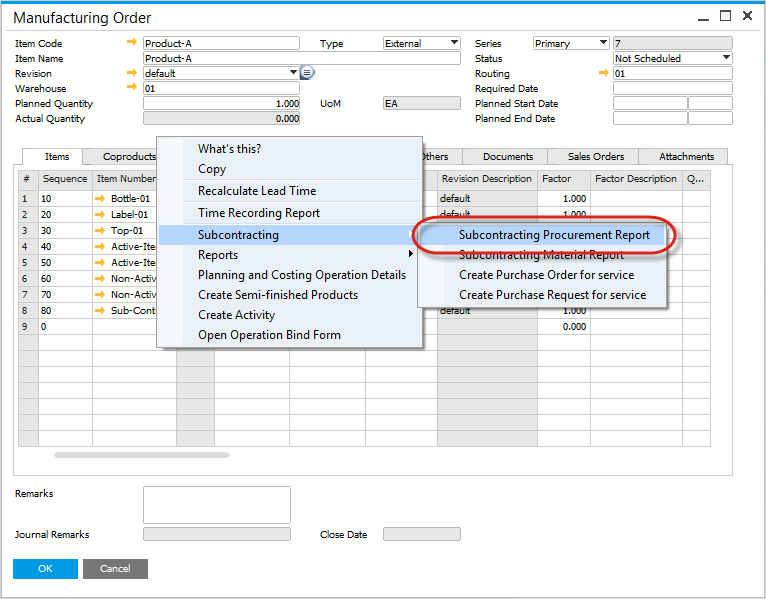
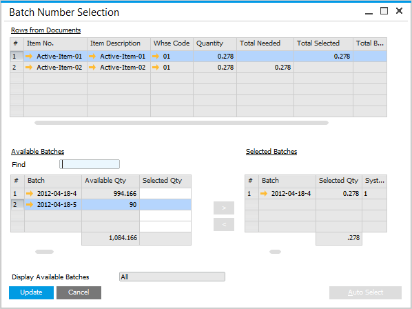
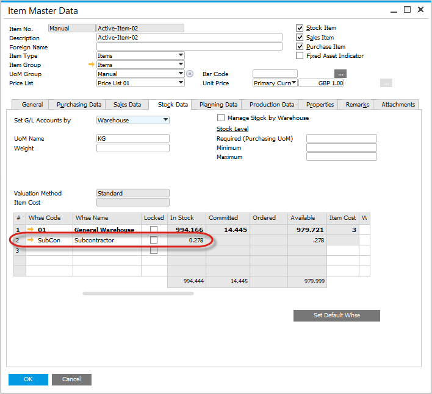
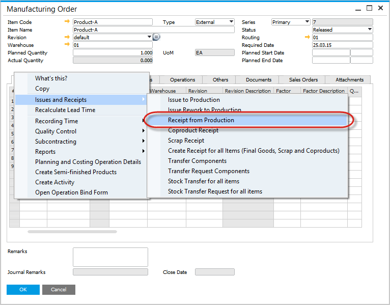

# Process Flow

Subcontracting is an essential process in manufacturing that involves outsourcing specific tasks or services to external suppliers. This guide outlines a detailed step-by-step process to effectively utilize the subcontracting function by adding items to a manufacturing order. Following these steps ensures smooth execution, accurate record-keeping, and seamless integration within SAP Business One.

---

## Create a Manufacturing Order

- The order type defaults to "External".
- The Subcontractor Code (found on the "Others" tab) is automatically populated based on the item purchased for the service.

    

## Create a Purchase Order for the Service

- Use the context menu in the manufacturing order to generate a related purchase order.
    

- Alternatively, configure automatic generation of purchase orders or purchase order requests for subcontracting tasks after posting the manufacturing order. You can check how to do that [here](../../system-initialization/general-settings/subcontracting-tab.md)

### Purchase Order is created

- Supplier Code defaults from the subcontractor code in the manufacturing order.
- Manufacturing Order number is copied into the Purchase Order for reference.
- Planned Quantity of the Service item is copied into the Purchase Order.
- Price of the Item defaults from the SAP Business One Price List.

### Review Related Purchase Orders

- Access the Subcontracting Procurement Report via the context menu in the manufacturing order.

    

- This report lists all purchase orders linked to the manufacturing order for easy tracking.

    

## Move Inventory Items to Subcontractor Warehouse

- Use Transfer All Components to move all inventory associated with the manufacturing order, regardless of what has already been transferred.
- Use Transfer Components to move only the required inventory. If no transfer occurs, it indicates that sufficient inventory is already available in the subcontractor’s warehouse for the manufacturing order.

    

### Inventory Transfer

- An Inventory Transfer document is created.
- Business Partner defaults from the Manufacturing Order
- The Items and To Warehouse fields are prefilled with details from the manufacturing order.

    

### Batch Number Selection

- If the Item is Batch Traced, have to select the batch to be issued,
- For items set to Backflush, ProcessForce will automatically backflush batches according to the queue definition specified in the item details, such as FIFO, FEFO, or FMFO.

### Subcontracting Materials Report

Select this function to view the Inventory Transfers related to the manufacturing order.

    
    

### Inventory Data

The Inventory Transfer moves inventory from the central warehouse to the subcontractor's warehouse.

    

## Manually Pick Inventory

**Recording Inventory Usage**

To manage inventory issued by the subcontractor, navigate to the Issues and Receipts menu and select Issue to Production.

    

### Recording Inventory Usage

To handle inventory issued by the subcontractor, go to the Issues and Receipts menu and choose Issue to Production.

### Pick Order

- Enter the amount of inventory consumed.
- Business Partner is copied from the Manufacturing Order.
- The Warehouse serves as the source for inventory reduction.
- The External WIP account code will be used for journal postings.

### Batch Number Selection

If the item is batch-managed, select the appropriate batch number.

### Create the Production Issue

This action generates the SAP Goods Issue document and the corresponding financial posting.

### Journal Entry

A journal entry is created, recording the inventory value under the External WIP account.

## Record Subcontract Production

After production is completed, use the Receipt from Production function to record the finished product:

    

### Pick Receipt

- Enter the quantity produced by the subcontractor.
- Business Partner defaults from the Manufacturing Order.
- External WIP account defaults from the SAP Business One settings/configuration.
- Production Receipt is created,
- SAP Goods Receipt is created, and the corresponding financial postings.

### Purchase Order Goods Receipt

Upon completing the receipt from production, a Goods Receipt PO is automatically created for the subcontract service purchase order. Key actions include:
    - Recording the Goods Receipt PO in the Documents Tab for reference.
    - Creating a journal entry for the service item to ensure financial postings are complete.

---
Subcontracting in manufacturing is a streamlined process when managed effectively using SAP Business One. By following the steps outlined above, you can maintain efficient operations, ensure accurate inventory tracking, and seamlessly handle financial postings. Proper execution of subcontracting processes not only saves time but also strengthens supplier collaboration, paving the way for sustained operational success.
