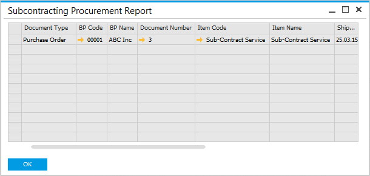
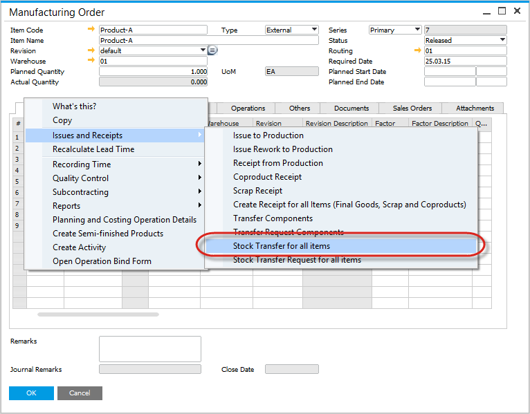
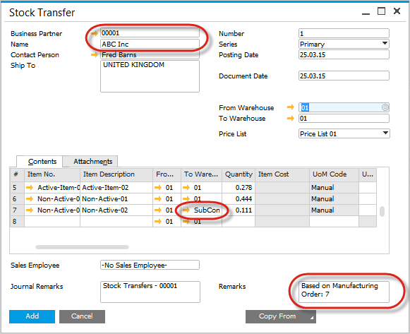
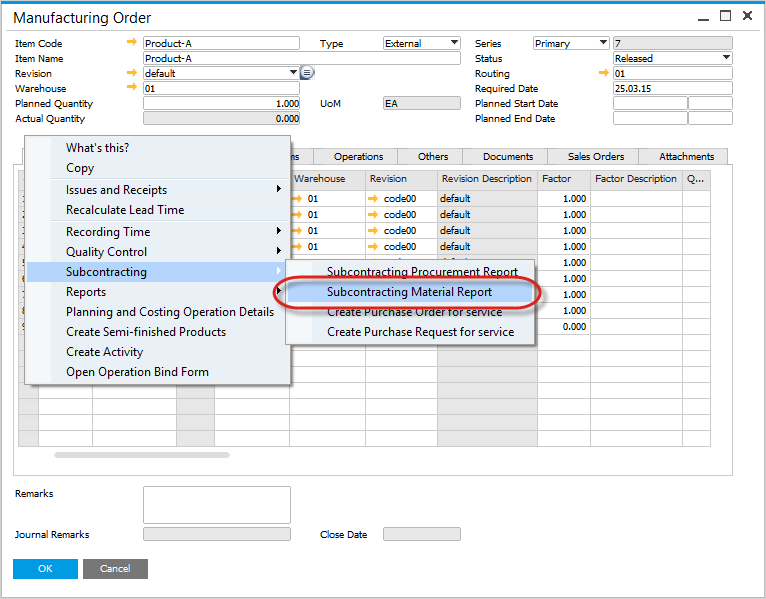
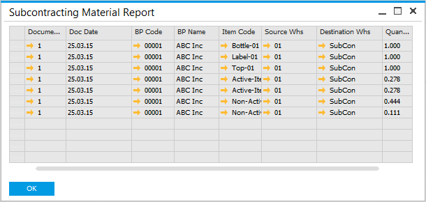
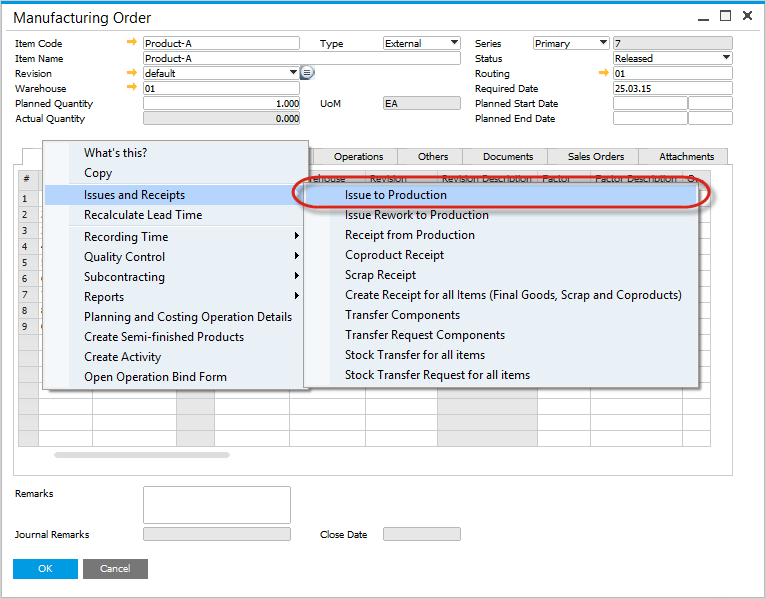

# Process Flow

Here you can find a step-by-step guide on how to use subcontracting function by adding Item to Manufacturing Order.

---

## Create a Manufacturing Order

- Type will default to "External."
- Subcontractor Code (displayed on the Others tab) will default from the Item for Purchasing the Service.

## Create a Purchase Order for the Service

Choose the related option from the Manufacturing Order's context menu.

Note that you can set automatic generation of Purchase Order or Purchase Order Request for subcontracting after posting Manufacturing Order. You can check how to do that [here](../../system-initialzation/general-settings/subcontracting-tab.md)

### Purchase Order is created

- Supplier Code defaults from the Manufacturing Order "Subcontractor Code.",
- Manufacturing Order number is copied into the Purchase Order for reference,
- Planned Quantity of the Service item is copied into the Purchase Order,
- Price of the Item defaults from the SAP Business One Price List.

### Review Related Purchase Orders

To review related purchase orders, select Subcontracting Procurement Report from the Manufacturing Order's context menu.

List of related purchase orders:

## Move Inventory Items to Subcontractor Warehouse

- Select Transfer All Components to move inventory related to the manufacturing order, and ignore what inventory has already been transferred,
- Select Transfer Components to move inventory. If the transaction does not occur, this means there is already enough inventory in the subcontractor warehouse to be used for the manufacturing order.

### Inventory Transfer

- An Inventory Transfer document is created,
- Business Partner defaults from the Manufacturing Order,
- Items and To Warehouse default from the Manufacturing Order.

### Batch Number Selection

- If the Item is Batch Traced, have to select the batch to be issued,
- If the Item is set to Backflush, ProcessForce will backflush the batches based on the queue definition based on the Item Details, i.e. FIFO, FEFO or FMFO.

### Subcontracting Materials Report

Select this function to view the Inventory Transfers related to the manufacturing order.

### Inventory Data

The Inventory Transfer will move the inventory from the central warehouse to the subcontractor's warehouse.

## Manually Pick Inventory

**Recording Inventory Usage**

To manage the inventory issued by the subcontractor, select the Issues and Receipts menu, Issue to Production

### Recording Inventory Usage

To manage the inventory issued by the subcontractor, select the Issues and Receipts menu, Issue to Production.

### Pick Order

- Enter the amount of inventory consumed.
- Business Partner is copied from the Manufacturing Order.
- The Warehouse is the source warehouse for the inventory reduction.
- The External WIP account code will be used for the journal posting.

### Batch Number Selection

If batches manage the item select the batch number.

### Create the Production Issue

This will create the SAP Goods Issues document and the financial posting.

### Journal Entry

The Journal Entry will be posted with the inventory value posted to External WIP.

## Record Subcontract Production

Select the Receipt from Production function to record the finished production.

### Pick Receipt

- Enter the quantity produced by the subcontractor.
- Business Partner defaults from the Manufacturing Order.
- External WIP account defaults from the SAP Business One settings/configuration.
- Production Receipt is created,
- SAP Goods Receipt is created, and the corresponding financial postings.

### Purchase Order Goods Receipt

- On completing the Receipt from the Production process, a Goods Receipt PO is automatically created for the Subcontract Service Purchase Order.
- The Goods Receipt PO document is recorded within the Documents Tab for reference.
- A Journal Entry for the Service Item is also created.
