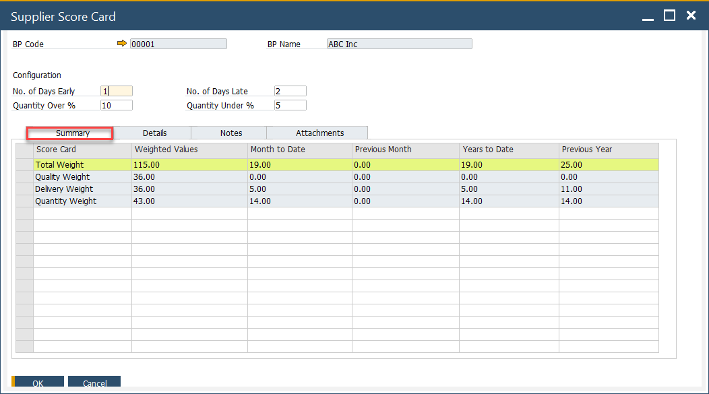
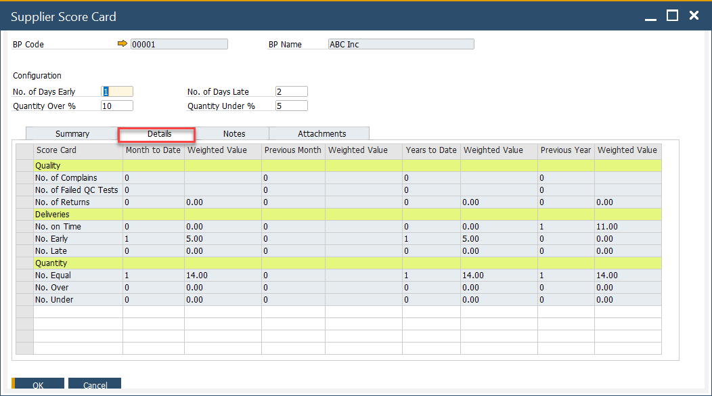
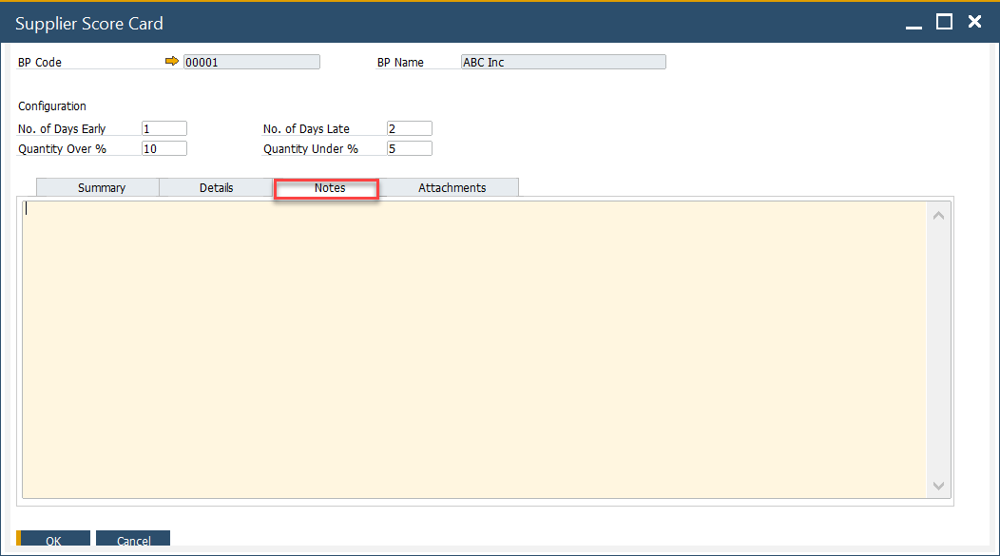
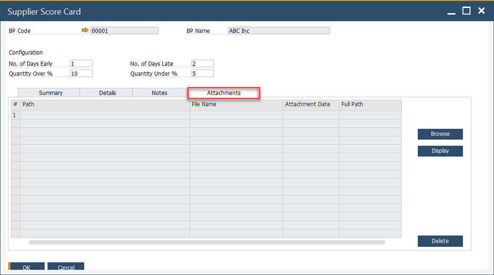

# Supplier Score Card

The Supplier Score Card provides a structured and measurable way to evaluate supplier performance across key metrics such as quality, delivery accuracy, and timeliness. Using a weighted scorecard system, it helps identify strengths and areas for improvement, supporting better procurement decisions.

---

:::info caution
    - The delivery and quantity calculations on the Supplier Score Card are based on the relationship between Purchase Order and Goods Receipt PO documents. It is crucial that a specific Purchase Order and corresponding Goods Receipt PO are linked correctly for the function to work properly. This can be achieved by creating a Goods Receipt Purchase Order using the "Copy To" option from a Purchase Order, or by linking the Purchase Order using the "Copy From" option in the Goods Receipt PO.
    - Please note that dates are compared between the individual lines of the documents, not the document header dates.
:::

## Settings

### General Settings

To access Supplier Score Card, navigate to:

:::info Path
    Administration → System Initialization → General Settings → ProcessForce tab → Supplier Score Card tab
:::

➡️ Learn more about [Supplier Score Card General Settings Options](./system-initialization/general-settings/reports-tab.md#supplier-score-card)

## Supplier Score Card from Business Partner

You can also access the form for a specific Business Partner from the Business Partner form header context menu (available only when the BP type is set to Supplier for this Business Partner).

:::info Path
Business Partners → Supplier Score Card
:::

### 1. Header

  In this section, you can define additional settings for a specific Supplier related to delivery and quantity.

    - No of Days Early and No of Days Late define a period before and after the order date in which delivery is still acceptable.

        **Example**

          - The order date is 01.07.2025
          - No of Days Early: 1
          - No of Days Late: 2
          - Every delivery before 14.11.2016 will be deemed as early, and every delivery after 18.11.2016 will be considered late.
    - Quantity Over % and Quantity Under % define a range of quantity of delivery that is still acceptable.

        **Example**

          - The ordered quantity is 108
          - Quantity Over %: 10
          - Quantity Under %: 5
          - Every delivery less than 103 will be deemed too small, and delivery more than 119 will be considered too big.

### 2. Summary

    

      - **Weighted Values**: These are preset in the General Settings and are based on key quality indicators such as the number of complaints, failed quality control checks, product returns, and similar metrics.
      - **Months to Date**: Represents the total number of transactions recorded from the start of the current month up to today. For instance, if today is October 15, it includes transactions from October 1 to 15.
      - **Previous Month**: Refers to the weighted values calculated for the entire preceding month.
      - **Years to Date**: Denotes the accumulated weighted values from January 1 through the current date of the ongoing year.
      - **Previous Year**: Captures the total weighted values for the full previous calendar year, from January to December.

### 3. Details

    

    On this tab, the values from the Summary tab are broken down into specific weighted scorecard positions. The values in the Details tab are displayed solely based on specific settings and transactions, e.g., QC Tests, Returns, etc.

    **Details tab Calculation**

    Note Grade = Amount / Total and Weighted Score = Weight x Grade

    |        Quality         |                        No of weighted                        |                                              Weighted Value                                              |
    | :--------------------: | :----------------------------------------------------------: | :------------------------------------------------------------------------------------------------------: |
    |   No. of Complaints    |      A = Total Number of Complaints (for this supplier)      | ( A / Total number of Complaints (for all suppliers) ) x No of Complaints (value from General Settings)  |
    | No. of Failed QC Tests | B = Number of Failed Tests (QC Test has the status = Failed) | ( B / Total number of QC Tests (Passed + Failed) ) x No of Failed QC Tests (value from General Settings) |
    |     No. of Returns     |                    C = Number of Returns                     |               ( C / Total number of GRPO's ) x No of Returns (value from General setting)                |

    | Deliveries  |                                                         No of                                                         |                             Weighted Value                             |
    | :---------: | :-------------------------------------------------------------------------------------------------------------------: | :--------------------------------------------------------------------: |
    | No. On Time |              D = Total number of GRPOs where the GRPO Posting Date is = to Purchase Order Delivery Date               | ( D / Total number of GRPO ) x No on Time (value from General setting) |
    |  No. Early  | E = Total number of GRPOs where the GRPO Posting Date - No of Days Early Value is < than Purchase Order Delivery Date |  ( E / Total number of GRPO ) x No Early (value from General setting)  |
    |  No. Late   | F = Total number of GRPOs where the GRPO Posting Date + No of Days Late Value is → than Purchase Order Delivery Date  |  ( F / Total number of GRPO ) x No Late (value from General setting)   |

    | Quantity  |                                              No of                                              |                            Weighted Value                             |
    | :-------: | :---------------------------------------------------------------------------------------------: | :-------------------------------------------------------------------: |
    | No. Equal |       G = a Total number of GRPOs where the Purchase Order and GRPO quantity are the same       | ( G / Total number of GRPO ) x No Equal (value from General Settings) |
    | No. Over  | H = Total number of GRPO where the quantity is → the Purchase Order quantity + Quantity Over %  | ( H / Total number of GRPO ) x No Over (value from General Settings)  |
    | No. Under | I = Total number of GRPO where the quantity is < the Purchase Order quantity - Quantity Under % | ( I / Total number of GRPO ) x No Under (value from General Settings) |

### 4. Notes

    You can add any relevant comments or observations related to the scorecard.

    

### 5. Attachment

    Here you can add, display or delete files connected to the Score Card.

    

## Usage

1. Activate the Supplier Score Card form.
2. Select the supplier you wish to assess.
3. Fill in exceptions like delivery delays or quantity discrepancies.
4. Add document  as necessary for additional context.
5. Find/load created Supplier's Score Card.
6. Review Summary and Details.

---
