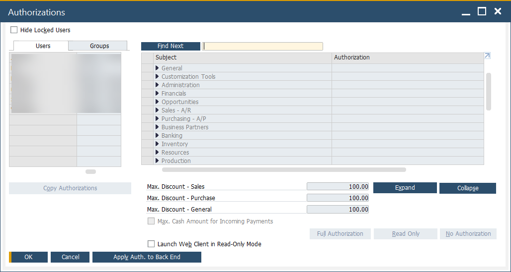
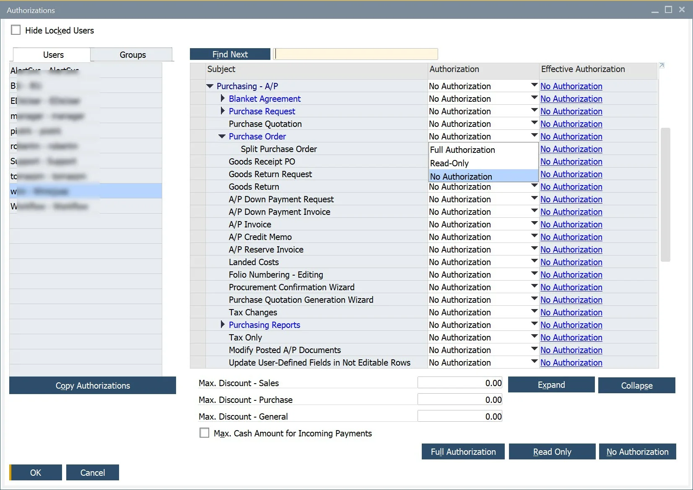
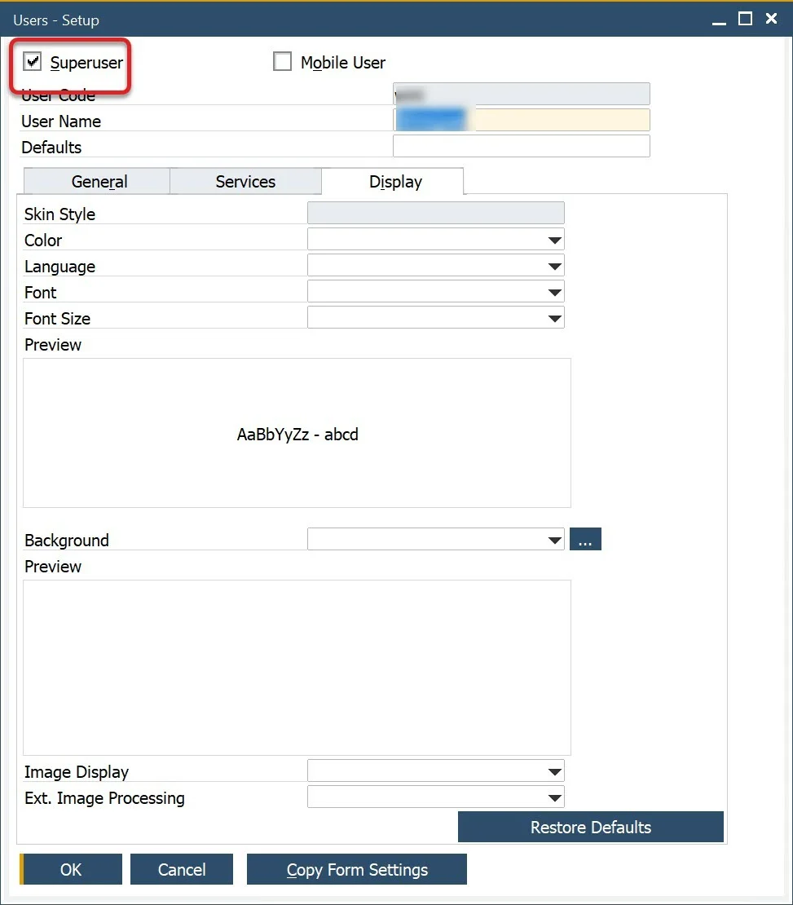

# Authorizations

Proper user authorizations are essential for managing CompuTec ProcessForce documents efficiently. Assigning the right access ensures that users can perform necessary actions while maintaining system security and compliance.

---

The creation of CompuTec ProcessForce documents depends on specific user authorizations. To manage user authorizations, navigate to:

:::info Path
    Administration → System Initialization → Authorizations → General Authorizations
:::

Click on a specific username to view and modify the authorizations assigned to that user.

ProcessForce-related authorizations are located at:

:::info Path
Authorizations Form → Users → ProcessForce
:::

A specific authorization can have one of three values:

- **Full Authorization**: Allows users to create, modify, and post a specific document.
- **Read Only**: grants view access without editing rights.
- **No Authorization**: restricts access to the document entirely.

    

If authorization settings appear grayed out, the user has superuser privileges, granting them full access to all functions.

To grant superuser privileges, go to:

:::info Path
    Administration → Setup → General → Users
:::

>Note: Only users with a Professional license assigned can modify authorizations.

To work with certain ProcessForce documents, specific authorizations are needed. For example, to create, modify, and post Production Goods Receipts and Production Goods Issues, as well as the corresponding Pick Orders and Pick Receipts, you must grant Full Authorization for the following permissions:

- **Goods Receipt and Goods Issue**: Authorizations form → Inventory → Inventory Transactions → Goods Receipt [and] Goods Issue
- **Journal Entry**. This setting is required for Goods Receipt and Goods Issue to reflect on financials: Authorizations Form → Financials → Journal Entry
- **Pick Receipt and Pick Order**: User Authorization → ProcessForce → Production → Inventory Transaction → Pick Receipt [and] Pick Issue
- **Numbering Series**: This is needed for documents series management: Authorizations form → Administration → Numbering Series.

---
