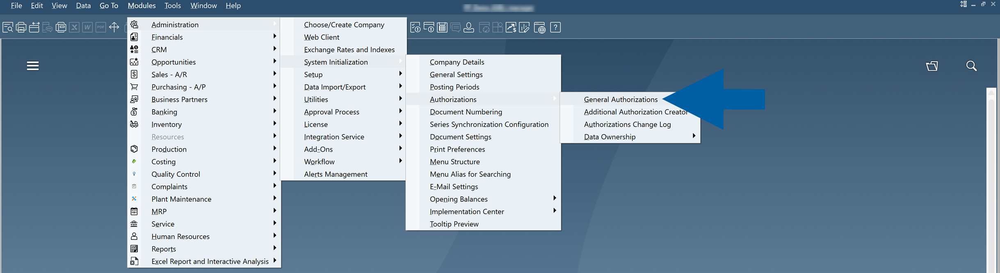
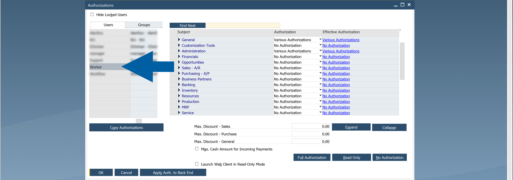
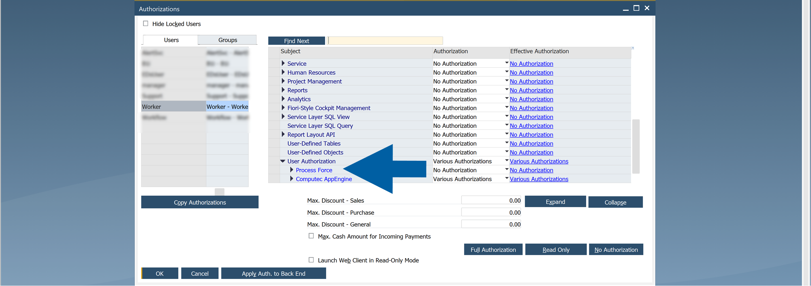
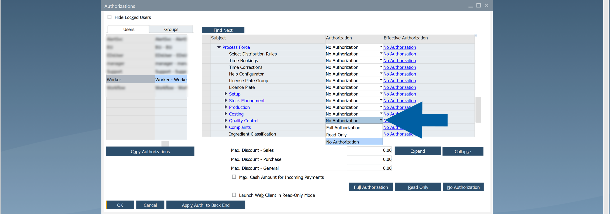
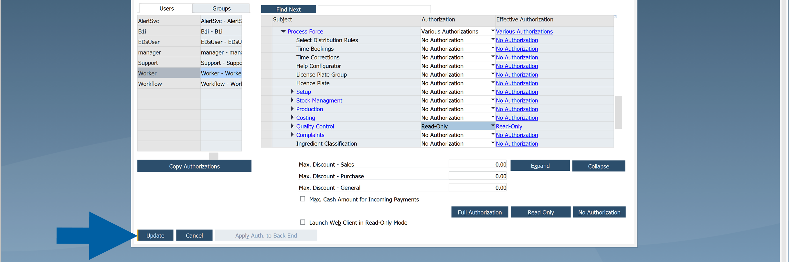
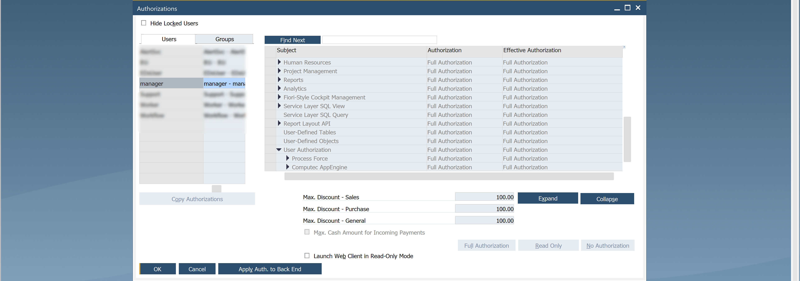
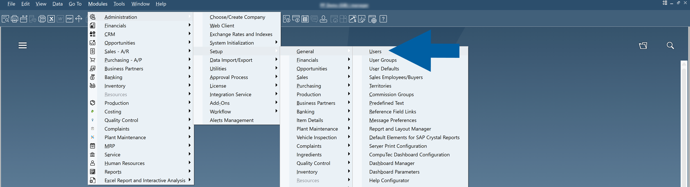

# Authorizations

Use **Authorizations** to control which **CompuTec ProcessForce** features and documents users can access.

You configure **CompuTec ProcessForce** authorizations using the standard **SAP Business One** authorization framework.

## Before you start

Make sure you have the **Professional** license so you can modify user authorizations.

## Configure User Authorizations

To manage user permissions, follow these steps:

1. In **SAP Business One**, go to **Administration** > **System Initialization** > **Authorizations** > **General Authorizations**.

    

2. Select a user (or a group) whose permissions you want to configure.

    

3. Navigate to **User Authorization** > **ProcessForce**.

    

4. Choose the appropriate authorization level from the list for each feature.

    

5. Click **Update**.

    

## Authorization Levels

You can assign one of the following authorization levels:

- **Full Authorization**: The user can view, create, modify, and process documents.
- **Read Only**: The user can view information but cannot make changes.
- **No Authorization**: The user cannot access the feature.

:::note[info]
If the authorization options are unavailable (grayed out), the user has **Superuser** authorization level.

:::

### Assign Superuser authorization

To assign **Superuser** atuthorization, follow these steps:

1. Go to **Administration** > **Setup** > **General** > **Users**.

    

2. Enter the **User Code** or **User Name** to choose the user.
3. Check the **Superuser** box.

    

4. Click **Update**.

    

## Additional SAP Business One authorizations

Some **CompuTec ProcessForce** functions also require standard **SAP Business One** authorizations.

- **Goods Receipt:** **Inventory** > **Inventory Transactions** > **Goods Receipt**
- **Goods Issue:** **Inventory** > **Inventory Transactions** > **Goods Issue**
- **Journal Entry:** **Financials** > **Journal Entry**
- **Pick Receipt:** **ProcessForce** > **Production** > **Inventory Transactions** > **Pick Receipt**
- **Pick Order:** **ProcessForce** > **Production** > **Inventory Transactions** > **Pick Order**
- **Document Series:** **Administration** > **Numbering Series**

## Understanding User Authorization Behavior

- **Granular Control**: Authorizations are assigned per user and per feature, offering precise control over system access.
- **Superuser Override**: Users with superuser status automatically have full access to all forms and transactions.
- **Dependency on License Type**: Only users with a **Professional license** can be granted or edit authorizations.
- **Integration with SAP Business One**: CompuTec ProcessForce leverages SAP's built-in authorization framework to control access uniformly across modules.

## Troubleshooting

If a user cannot perform an action:

- Verify that the user has **Full Authorization** for the required **CompuTec ProcessForce** feature.
- Verify that any required **SAP Business One** authorizations are also assigned.
- If the user is a **Superuser**, authorization settings cannot be modified because Superusers always have full access.

## Result

After you configure the required authorizations, the user can access and work only with the **CompuTec ProcessForce** features and documents permitted by their assigned permissions.
