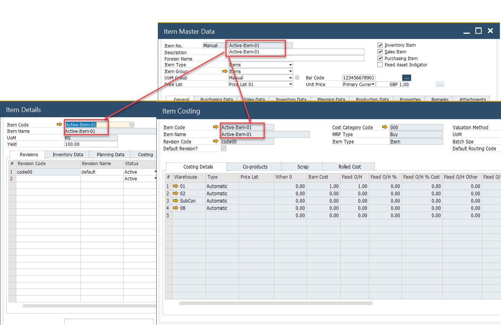
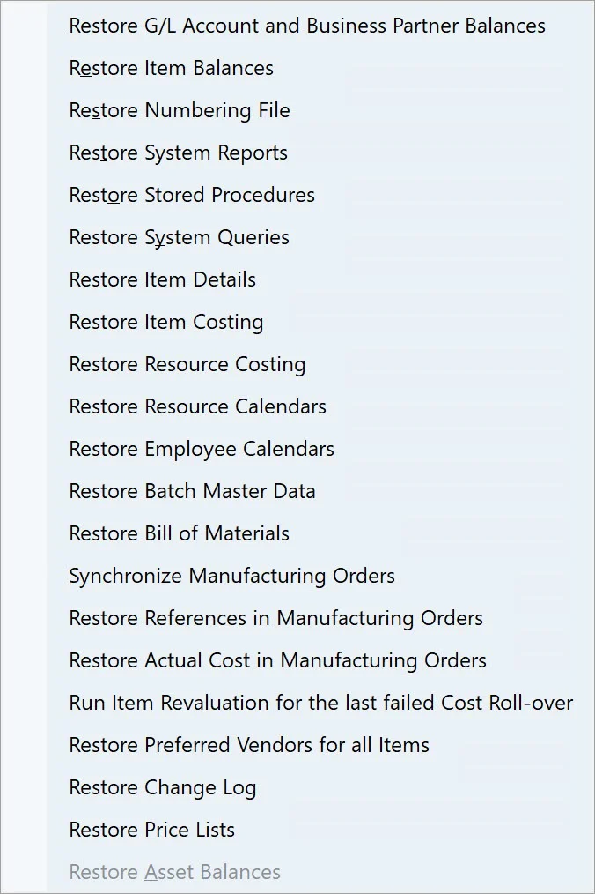
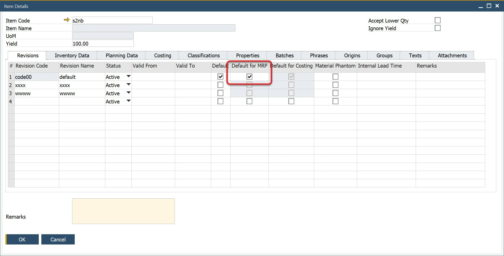

# Data Restore

Data synchronization between SAP Business One and ProcessForce is crucial for maintaining system performance and data integrity. When users add, modify, or delete Item Master Data in SAP Business One, key data elements are automatically updated in ProcessForce, including:

- [Item Details](../item-details/overview.md): a default revision code is created.
- [Item Costing](../costing-material-and-resources/item-costing/overview.md): a cost record is generated for an item, revision, and warehouse.
- [Cost Category](../costing-material-and-resources/configuration/overview.md): cost classification is updated accordingly.

However, if data is added manually or via Data Transfer Workbench (DTW) while ProcessForce is not installed or running, Restore functions must be executed. Failing to run these functions may result in slow system performance and inconsistencies between SAP Business One and ProcessForce.

After installing ProcessForce, ensure that the following restore functions are run to synchronize data properly:

- Batch Details
- Bill of Materials

---

## Full Restore Functions List

## Restore Batch Details

:::info Path
    Help → Support Desk → Restore → Restore Batch Master Data
:::

- To simplify batch information, the SAP Batch Details and ProcessForce Batch Master Data form have been consolidated into a single form.
- Run the restore function to populate the combined data object.
- If you add User-Defined Fields to the SAP Business One Batch Details tables, the same User Defined Fields need to be added to the ProcessForce Batch Master Data tables.
- If, for any reason, SAP and ProcessForce Batch Master Data for a specific Batch become inconsistent, using the Restore function will will update the SAP Batch Details with the ProcessForce Batch Master Data.

## Restore Bill of Materials

:::info Path
    Help → Support Desk → Restore → Restore Bill Of Materials
:::

When changes are made to Item Descriptions—for example, through DTW or PowerShell—the Restore BOM function ensures updates appear correctly in Choose From Lists and Bill of Materials forms.

**Key Considerations for BOM Synchronization**:

- Synchronization always flows from ProcessForce to SAP Business One. Creating or updating a ProcessForce BOM will overwrite the corresponding SAP B1 BOM.
- The "Enable Bill of Materials synchronization between ProcessForce and SAP Business One" option must be enabled in General Settings (under ProcessForce → Bill of Materials and Manufacturing Orders section).
- Only Bill of Material variants with the "Is MRP Default" checkbox selected will be used for synchronization:

Click [here](../system-initialization/general-settings/overview.md) to find out more about General Settings.

Only a Bill of Material variant with Is MRP Default check box checked on the Item Details form will be used for synchronization:

Please note that this functionality only updates the description in the Bill of Materials records. It does not synchronize the Production Tree and Bill of Materials. It synchronizes the ItemName from the OITM database table to the U_Description field of the CT_PF_OBOM database table.

## Restore Item Data

:::info Path
    Help → Support Desk → Restore → Restore Item Details

    Help → Support Desk → Restore → Restore Item Costing
:::

The Restore Item Details and Item Costing functions must be run in the following cases:

- ProcessForce is installed in a database that already contains Item Master Data before the add-on installation.
- Item Master Data records were created while ProcessForce was not running.

### Restore Item Details

Every time an Item Master Data record is created in SAP Business One, a corresponding Item Details record is generated in ProcessForce. If this process does not occur (e.g., due to missing ProcessForce integration at the time of creation), running Restore Item Details ensures synchronization.

### Restore Item Costing

When the Restore Item Costing function is executed, cost records are created for every item in each revision and cost category.

:::info
    Upon initiating an Item Costing restore, the following system message appears:

    

    Note that by default, option No is marked.
:::

## Restore Resource Costing

:::info Path
    Help → Support Desk → Restore → Restore Resource Costing
:::

This function creates cost records for every resource in each cost category, ensuring financial consistency in ProcessForce.

## Restore Resource Calendar and Employee Calendar

:::info Path
    Help → Support Desk → Restore → Restore Resource Calendars

    Help → Support Desk → Restore → Restore Employee Calendars
:::

When a Resource or Employee Master Data record is created in ProcessForce, a corresponding Calendar is generated. If this does not happen (e.g., due to missing integration during data entry), running the Restore function will create the missing calendars.

## Goods Issue and Goods Receipt Restore

This function restores all Goods Issue and Goods Receipt references within Manufacturing Orders.

The purpose of this option is to address scenarios where a Goods Issue or Goods Receipt document has been deleted, yet the reference remains in the Manufacturing Order's Document tab. This situation can lead to errors when attempting to update the Manufacturing Order.

---
