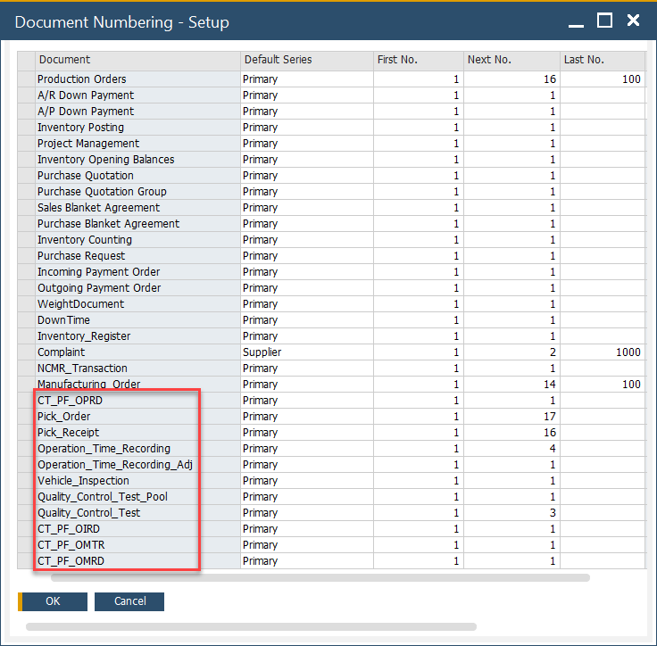
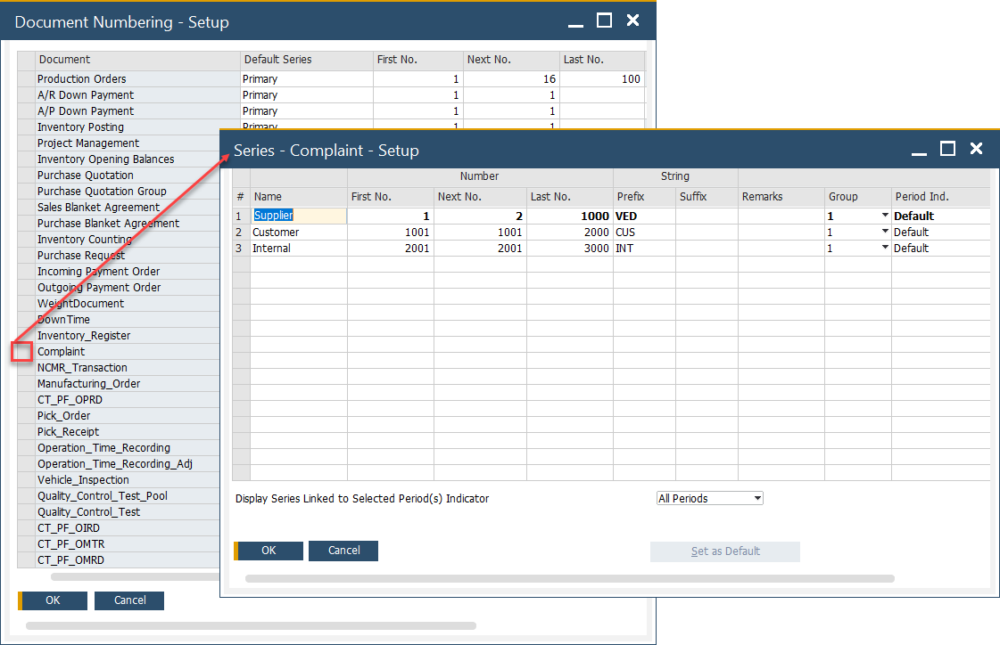
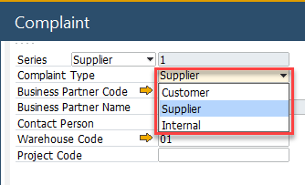

# Document Numbering

Document Numbering is an essential feature in SAP Business One and CompuTec ProcessForce, ensuring that all newly created documents receive a unique and sequential number. By default, the document series starts at 1, but it can be adjusted to any other starting value. Each new document is automatically assigned the next number in the predefined sequence, helping maintain order and consistency in transaction records.

In SAP Business One, Document Numbering applies to both standard transactions and CompuTec ProcessForce-specific documents, allowing businesses to organize their records efficiently.

:::info Path
    Administration → System Initialization → Document Numbering
:::

---

The following objects are available for document numbering in CompuTec ProcessForce:

The following objects are available for document numbering in ProcessForce:

| Object       | Document             |
|--------------|----------------------|
| CT_PF_OPRD   | Orderless Production |
| CT_PF_OMTR   | Maintenance Order    |
| CT_PF_OIRD   | Inspection Reading   |
| CT_PF_OMRD   | Meter Reading        |

The Document Numbering form allows users to configure numbering series for the following transactions:

Users can define multiple numbering series for a specific document type by double-clicking on the first column of the respective document type, such as Complaints.

To add a new series:

- Right-click on the first column in the first row.
- Select "Add Row" from the menu.
- Enter the starting number for the new series.

When creating a document, users can select a specific numbering series, ensuring that the document number field is automatically filled with the next available number in that series.

---
