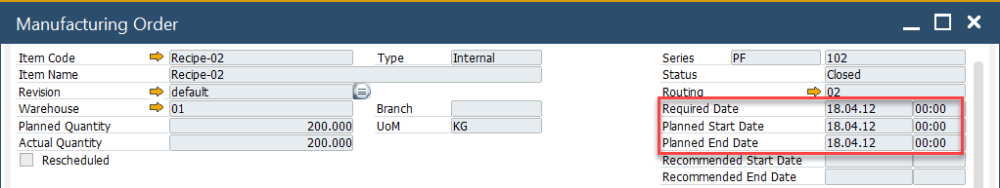

# Bill of Materials and Manufacturing Orders tab

This section provides detailed configuration options for managing Bills of Materials (BOM) and Manufacturing Orders (MOR) within CompuTec ProcessForce. The tab allows users to define default calculation formulas, manage SAP synchronization, set manufacturing priorities and optimize planning for semi-finished products.

This document outlines the key features and functionalities available in this tab to help users better understand and configure their manufacturing operations effectively.

To access Bill of Materials and Manufacturing Orders tab, navigate to:

:::info Path
Administration → System Initialization → General Settings → ProcessForce tab → Bill of Materials and Manufacturing Orders tab
:::


---

## Key Settings

### General

This option is related to synchronization between CompuTec ProcessForce and SAP Business One, along with additional manufacturing order behaviors.


#### Synchronization Options

- SAP Business One references the Inventory Data tab in the Item Master Data to generate make-or-buy recommendations during MRP runs.
- CompuTec ProcessForce integrates with SAP Business One through the MRP Wizard, allowing smooth and consistent data synchronization.
- Additional information is available in the MRP tab.

1. **Bill of Materials**

    - Enabling this option allows CompuTec ProcessForce's BOM data to sync with SAP Business One BOM objects.
    - The key data synchronized includes values from the Result Column.

        

2. **Manufacturing Orders**

    To synchronize Manufacturing Orders between CompuTec ProcessForce and SAP:

    - Ensure both systems use the same document numbering series.
    - The sync includes planned and actual quantities from CompuTec ProcessForce MOs to SAP Production Orders.

    Ensure numbering series match in SAP and CompuTec ProcessForce before enabling synchronization.

    

3. **Due Date Synchronization**

    - SAP Production Orders have a Due Date, while CompuTec ProcessForce Manufacturing Orders have Required Date and Planned Start Date.
    - You can define whether the Required Date or the Planned Start Date from a ProcessForce MO should populate the Due Date field in SAP Production Orders.

        

#### Other Settings

- **Automatically Calculate Ratio on Operations**: When this is enabled, the system automatically distributes the ratio and binding quantity for items assigned to multiple operations.

    Example: If an item is used in two operations, the system sets a ratio of 0.5 to each, automatically calculating the binding quantity.

- **Aggregate Duplicated Semi-Finish**: When checked, it consolidates repeated semi-finished items into a single Manufacturing Order. If the same semi-finished product appears multiple times within a BOM, the system will create only one Manufacturing Order instead of separate ones for each occurrence.

### Formulas

CompuTec ProcessForce provides a flexible method for configuring relationships among parent items, co-products, scrap, phantom items, scrap percentages, and calculation factors.

When a Bill of Materials (BOM) is created, default formulas are automatically applied to each item. These predefined formulas are made available in this tab as part of CompuTec ProcessForce installation.


#### Default Formulas

- **Items**:

    ```sql
    =U_Quantity()*U_Factor()*Items.U_Factor(<sequence>)*Items.U_Quantity(<sequence>)*100/(100 - Items.U_ScrapPercentage(<sequence>))
    ```

- **Coproducts**:

    ```sql
    =U_Quantity()*U_Factor()*CoProducts.U_Factor(<sequence>)*CoProducts.U_Quantity(<sequence>)
    ```

- **Scrap**:

    ```sql
    =U_Quantity()*U_Factor()*Scraps.U_Factor(<sequence>)*Scraps.U_Quantity(<sequence>)
    ```

- **Phantom**:

    ```sql
    =U_Quantity()*U_Factor()*Phantoms.U_Factor(<sequence>)*Phantoms.U_Quantity(<sequence>)
    ```

- **Naming**:

    |                          Items Tab                          |                       Coproducts Tab                        |                        Scrap Tab                         |                       Phantoms Tab                       |
    | :---------------------------------------------------------: | :---------------------------------------------------------: | :------------------------------------------------------: | :------------------------------------------------------: |
    | ```U_Quantity = Quantity field value within the form header |  U_Quantity = Quantity field value within the form header   | U_Quantity = Quantity field value within the form header | U_Quantity = Quantity field value within the form header |
    |    U_Factor = Factor field value within the form header     |    U_Factor = Factor field value within the form header     |   U_Factor = Factor field value within the form header   |   U_Factor = Factor field value within the form header   |
    |             Items.U_Factor = Factor field value             |          CoProducts.U_Factor = Factor field value           |           Scrap.U_Factor = Factor field value            |          Phantom.U_Factor = Factor field value           |
    |           Items.U_Quantity = Quantity field value           |        CoProducts.U_Quantity = Quantity field value         |         Scrap.U_Quantity = Quantity field value          |        Phantom.U_Quantity = Quantity field value         |
    |   Items.U_ScrapPercentage = Scrap Percentage field value    | CoProducts.U_ScrapPercentage = Scrap Percentage field value |  Scrap.U_ScrapPercentage = Scrap Percentage field value  | Phantom.U_ScrapPercentage = Scrap Percentage field value |
    |      `<sequence>` = sequence number of the item master      |      `<sequence>` = sequence number of the item master      |    `<sequence>` = sequence number of the item master     |    `<sequence>` = sequence number of the item master     |

    

>**Note**: No default formula is provided for Yield. Learn how to [define custom formulas for Yield].(../../formulations-and-bill-of-materials/formula.md#using-user-defined-fields-in-formulas).

### Goods Transactions

Each checkbox enables or disables specific automation or behavior in production goods transactions:

- **Automatically issue materials on Pick Order Add/Update**: When enabled, materials are automatically issued as soon as a Pick Order is added or updated.

- **Automatically receive materials on Pick Receipt Add/Update**: Automatically receives materials into inventory upon adding or updating a Pick Receipt. Ideal for auto-posting goods receipts when the production output is confirmed.

- **Issue Residual Quantity on next Goods Receipt when possible**: If there’s a shortfall in the previous Goods Receipt, the system will issue any remaining quantity in the next receipt when this option is enabled.

- **Don’t use corrected Fixed Backflush**: Disables the use of the corrected fixed backflush logic.

- **Use Header dimensions for backflushed inventory items**: When enabled, the system uses dimension values from the document header for inventory items backflushed during production.

- **Copy Classification during Pick Receipt**: Automatically transfers classification codes from the Manufacturing Order to the Pick Receipt document.

---

## Default Priority for Production

- You can configure Manufacturing Order Priority for the Scheduling Board, with one being the highest and ten the lowest.
- In General Settings, you can define a default priority for all newly created Manufacturing Orders.

### Priority Level

If the Default Priority is set at the Business Partner Master Data level, it will be applied to every newly created Manufacturing Order for that partner when generated from a Sales Order via the Scheduling Board.

:::info Path
    Business Partner Master Data > Business Partner Master Data > General tab
:::


If the Default Priority is set to "0" in the Business Partner Master Data, the system will use the priority defined in General Settings.

### Manufacturing Order

You can check (and change – if it is in any other than Finished status) Priority for a specific Manufacturing Order:

:::info Path
    Production → Manufacturing Order → Manufacturing Orders → Others tab
:::


---
