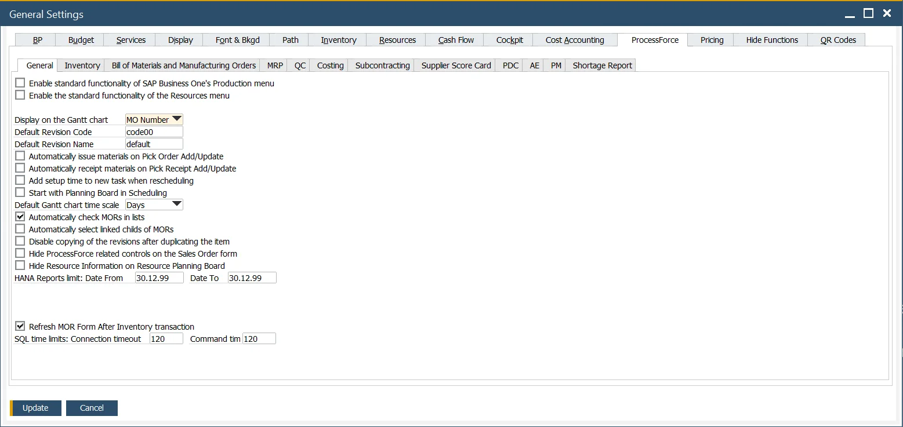

# Costing tab

The Costing tab is used to define various costing parameters, including evaluation types for different item categories, resource cost postings, and variance calculations. These settings help ensure accurate cost tracking and financial reporting in the manufacturing process.

---

To access Costing tab, navigate to:

:::info Path
    Administration > System Initialization > General Settings > ProcessForce tab > Costing tab
:::

## Costing tab Settings

- **Post resource confirmation**: check this box if you wish to have financial postings for resources (Machines and Labor). Once a financial journal has been posted, this field is grayed out and cannot be unchecked.

- **Post variance on Manufacturing Order closure**: check this field to calculate WIP variances when a manufacturing order status is changed to Closed.

- **Enable Resource Costing editing for the 000 cost category**: if this box is checked, resource cost details can be changed in the 000 cost category. Note that in this case, changes in Resource Cost will not automatically affect Item Cost after performing Rollover. It has to be done manually. **It is not recommended to use this option as it may cause inconsistencies in Item Costing**.

- **Use Multistructure Fixed and Variable Cost**: if it is checked, multi-structure fixed and variable costs can be set during the costing process. Click [here](../../costing-material-and-resources/item-costing/multistructure-fixed-and-variable-overhead-costs.md) to find out more.

- **Receipt Evaluation Type**: there are three options to determine the source from which the system obtains the value of the Goods Receipt:
  - **Dynamic**: this is used for Moving Average and FIFO
  - **Item Costing**: this is used in Standard Costing, where the value comes from the Item Code field within the Item Master Data form, Inventory Data tab. This can also be used for Moving Average, where the value is based on the Estimated Moving Average (using the Item Costing Form)
  - **Costing**: cost is taken from Item Costing from the moment of Manufacturing Order creation (further changes of costs do not affect Cost). This method also allows for a cost to be calculated based on a Formatted Search or Transaction Notification.

- **CoProducts and Scrap based items can be evaluated based on**:
  - **Item Costing**: this is used in Standard Costing, where the value comes from the Item Code field within the Item Master Data form, Inventory Data tab. This can also be used for Moving Average, where the value is based on the Estimated Moving Average (using the Item Costing Form)
  - **Costing**: cost is obtained from Item Costing from the moment of creation of the Manufacturing Order (later changes of costs do not affect Cost). This method also allows for a cost to be calculated based on a Formatted Search or Transaction Notification.

- **Issue Info Price List**: defines the price list used for cost determination.

- **Enable dynamic Costing calculation engine**: checking this checkbox enables alternative costing functions. Click [here](../../costing-material-and-resources/faster-costing-calculation-and-restoration-engine.md) to find out more.

- **Save cost roll-up calculation results and Item Costing restored data in CSV files**: this setting specifies whether the data calculated during the new Cost Roll-up process is saved to CSV files for analysis or testing purposes. If the option is selected, CSV files are saved to C:\ProgramData. The The information is saved in the following name format:
  - `CT_PF_OITC_YYYYMMDD_HHmmss_ProcessId.csv`
  - `CT_PF_ITC1_YYYYMMDD_HHmmss_ProcessId.csv`
  - `CT_PF_ITC2_YYYYMMDD_HHmmss_ProcessId.csv`
  - `CT_PF_ITC3_YYYYMMDD_HHmmss_ProcessId.csv`
  - `CT_PF_ITC5_YYYYMMDD_HHmmss_ProcessId.csv`

- **Save data in LOG tables during the Item Costing restoration process**: saves detailed costing logs for auditing and troubleshooting.

- **Refresh Planned Costs in Manufacturing Order when a status change to**: determines when planned costs should be updated in Manufacturing Orders based on status changes.

- **Default type of Costing determination**: specifies the standard method for costing evaluation.

- **Default price list of Costing**: sets the default price list used in costing calculations.

---
