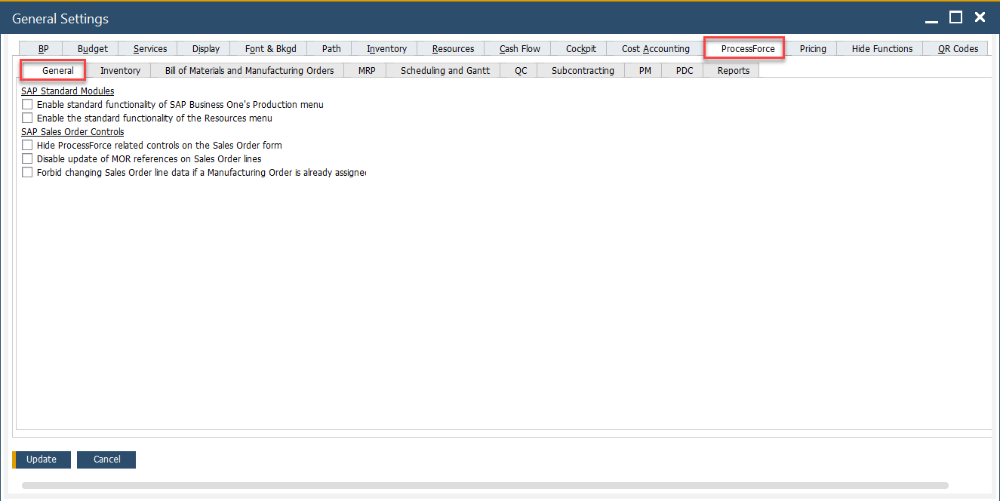
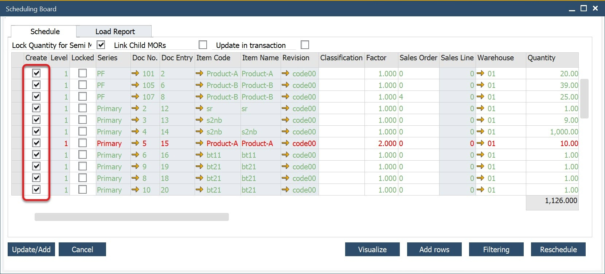

# General tab

The General Tab in SAP Business One's production settings provides various configuration options to customize system behavior, enhance usability, and streamline manufacturing processes. These settings control visibility, automation, scheduling, and data display preferences within the production and resource management modules. Below is a breakdown of the key settings available in this tab.

---

## Key Settings

- **Enable standard functionality of SAP Business One's Production menu**: when enabled, all default SAP Business One production menu entries are visible.
- **Enable the standard functionality of the Resources menu**: when enabled, allows access to SAP Business One’s standard resource menu options, excluding the ProcessForce Resource menu.in Enabled status, standard SAP Business One Resource menu options are available (apart from ProcessForce Resource option)
- **Display on the Gantt chart**: a default value is displayed on the Gantt chart. Options include Related Resource Code, Resource Remarks, Manufacturing Order Number, Item Code, Planned Quantity, Actual Quantity, Required Date, and Priority.
    :::tip
        You can use the Resource Remarks field to display custom text on Gantt work progress bars.
    :::
- **Default Revision Code, Default Revision Name**: assign a default Revision Code and Revision Name for global settings.
- **Automatically issue materials on Pick Order Add/Update, Automatically receipt materials on Pick Receipt Add/Update**: set up Auto Pick and Auto Receipt.
    

        
Click here to find out more

        

            The process flow of picking and receiving materials has been simplified by checking one or both options.

            For more details, click [here](../../manufacturing/auto-pick-issue-and-auto-pick-receipt.md)
        
            **Pick Issue**
            - Perform the usual steps of picking non-trace and batch-traced Items.
            - Click "Update "on the Pick Issue Form.
            - The system automatically creates an **Issue to Production** transaction. 
            - Pick Order is updated and set to "Close" status.
            - Documents are visible within the Manufacturing Order > Document tab.

            **Pick Receipt**
            - Record received quantities from production.  
            - Click "Update".
            - The system automatically creates a **Receipt from Production** transaction.
            - The Pick Receipt is closed.
            - Documents appear in the Manufacturing Order Document tab.
        

    

- **Add setup time to a new task when rescheduling**: if a partially booked Manufacturing Order Task is rescheduled, setup time is included again if this option is enabled.
- **Start with Planning Board in Scheduling**: choose whether Scheduling opens with the Resources tab or the  [Resource Planning Board](../../scheduling/gantt-chart/resource-planning-board.md) tab.
- **Default Gantt chart time scale**: you can choose the time scale for Gantt charts Days, Weeks, and Months
- **Automatically check MORs in lists**: if this checkbox is checked, Manufacturing Order lines are checked by default on forms, e.g., on Scheduling Board:

    

- **Automatically select linked children of MORs**: when this checkbox is checked, the Link ChildMors checkbox is enabled on the Scheduling Board form (Create Manufacturing Orders option from the context menu on the Sales Order form).
- **Disable copying of the revisions after duplicating the item**: prevents related Revisions from being copied when duplicating an Item Master Data record.
- **Hide ProcessForce-related controls on the Sales Order form**: removes ProcessForce-related fields from the Sales Order Header if enabled.

    

- **Hide Resource Information on Resource Planning Board**: when enabled, the Resource Information panel is hidden on the Resource Planning Board.

    

- **HANA Reports limit: Date From, Date To**: the option is related to one of the [Data Model](../../../administrator-guide/data-model/overview.md) reports. It limits the results to the ones within specific time constraints.

---
