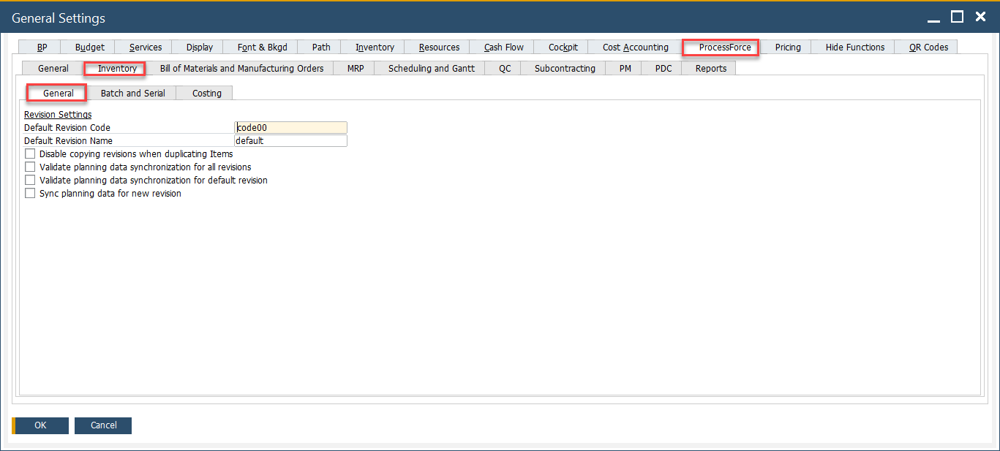
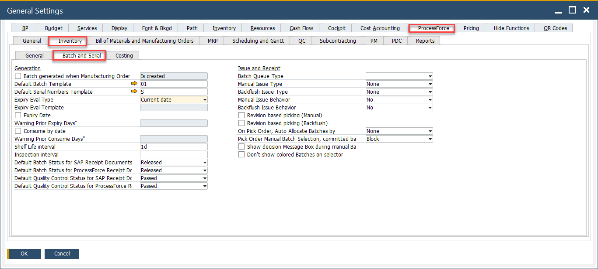
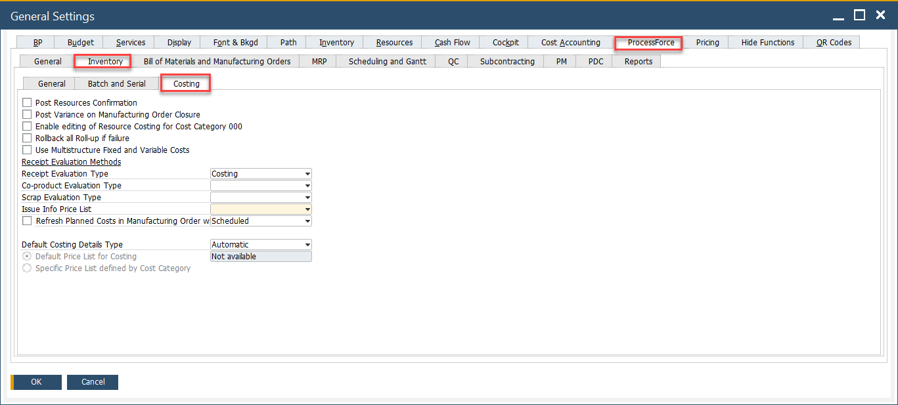

# Inventory tab

 The Inventory tab in the General Settings window allows configuration of key behaviors related to item revisions, batch/serial management, and manufacturing costing in CompuTec ProcessForce. These options define the business rules for inventory allocation, quality control and compliance during the production process. It is divided into three subtabs: General, Batch and Serial, Costing

To access Inventory tab, navigate to:

:::info Path
Administration → System Initialization → General Settings → ProcessForce tab → Inventory tab
:::

---

## Key Settings

Below is a detailed breakdown of the key settings available in this tab.

### 1. General

This section defines how item revisions are created, named, and synchronized.

        - **Default Revision Code**: Sets a standard code (e.g., code00) that is automatically assigned to new revisions.
        - **Default Revision Name**: Defines the default name (e.g., default) for newly created item revisions.
        - **Disable copying revisions when duplicating items**: Prevents the system from copying existing revision data when duplicating an item.
        - **Validate planning data synchronization for all revisions**: Enables checks to ensure that planning data remains consistent across all revisions.
        - **Validate planning data synchronization for default revision**: Restricts validation checks to only the default revision, avoiding unnecessary validation overhead.
        - **Sync planning data for new revision**: Automatically aligns planning data when a new revision is created.

### 2. Batch and Serial

This section handles the configuration for generating and managing batches and serial numbers, as well as issue and receipt behavior.

#### Generation Settings

- **Batch generated when Manufacturing Order is created**: If checked, you can choose one of the four options from a drop-down list to allocate a batch number when creating a Manufacturing Order or changing its status:

        - on creating MOR (not possible to use %MORDN% parameter in a template due to performance issues)
        - on changing status to Scheduled
        - on changing status to Released
        - on changing status to Started.
- **Default Batch Template**: Defines the format (e.g., 01) used for batch number generation.
- **Default Serial Numbers Template**: Specifies the serial number format (e.g., S) used when assigning serial numbers to items.
        >➡️ Learn how to create a new [Batch or Serial Number template](../../item-details/batch-serial-template-definition.md).
- **Expiry Date Settings**:
        - **Expiry Eval Type**: Determines how the expiry date is calculated (e.g., based on current date). Expiry Evaluation Type can be set by a specific date (current, start, required, end, create) or by a template. A template can be chosen from a list or modified (if it is already created).
        - **Expiry Eval Template**: The Expiry Eval Template field is active when the *Expiry Eval Template* value is selected in the *Expiry Eval Type* field. Click [here](../../inventory/batch-control/batch-control-settings/extended-batch-expiry-evaluation.md) to find out more about Expiry Evaluation Type Templates.
        - **Expiry Date**: Enables the functionality to track item expiry dates.
        - **Warning Prior Expiry Days**: Defines the number of days before expiry that the system will issue a warning.
        - **Consume by date**: Ensures that items are consumed before a specific date, for compliance and quality assurance.
        - **Warning Prior Consume Days**: Triggers a warning a few days before the “consume by” date is reached. It is only available when Consume Date check box is checked.
- **Shelf Life Interval**: A period used to calculate the expiry date automatically. E.g., if Shelf Life Interval is set to 30 days and a Batch record is made on June 1st, the Expiry date will be automatically charged to June 30th.
- **Inspection Interval**: Defines the recurring period after which inspection alerts are raised.
- **Default Batch Status for SAP Business One and ProcessForce receipt documents**: Sets batch status (Released, Locked, Not Accessible) upon receipt in SAP Business One or CompuTec ProcessForce.
        - If the status for a Batch is set to Not Accessible or Locked, a system message about this will be displayed before issuing this batch for production.

#### Issue and Receipt Settings

- **Batch Queue Type**: Determines the method for queueing and issuing batches during production.
        - FIFO: First In First Out
        - FEFO: First Expired First Out
        - FMFO: First Manufactured First Out.
- **Manual Issue Type / Backflush Issue Type**: Allows setting the method for manually issuing or automatically backflushing batches.
- **Manual Issue Behavior / Backflush Issue Behavior**: Defines whether batch selection should be handled manually or automatically during issue.
- **Revision-based picking (Manual)**: Ensures that users manually pick items based on the specified revision.
- **Revision-based picking (Backflush)**: Enforces revision-based picking when issuing items automatically via backflush.
- **On Pick Order, Auto Allocate Batches by**: Controls the method used for auto-allocating batches during pick order (e.g., none, FIFO, LIFO).
- **Pick Order Manual Batch Selection, committed batch behavior**: Determines what happens if a committed batch is selected manually (e.g., block or allow).
- **Show decision Message Box during manual batch selection**: Prompts a message box to confirm user actions during manual batch allocation.
- **Don’t show colored Batches on selector**: Disables the color coding of batches in the batch selection window.

### 3. Costing

This section defines how manufacturing order costs are calculated and handled.

- **Post Resources Confirmation**: Posts the cost of resources automatically once the resource confirmation is completed.
- **Post Variance on Manufacturing Order Closure**: Records the cost variance when a manufacturing order is closed.
- **Enable editing of Resource Costing for Cost Category**: Allows users to edit resource costing values for specific cost categories.
- **Rollback all Roll-up if failure**: Ensures the system reverts all cost roll-up changes if a failure occurs during cost roll-up.
- **Use Multistructure Fixed and Variable Costs**: Activates advanced costing options that separately track fixed and variable costs.
- **Receipt Evaluation Methods**:
        - **Receipt Evaluation Type**: Defines how item receipts are valued (e.g., standard costing, actual cost).
        - **Co-product Evaluation Type**: Determines how co-products (outputs from the same process) are valued.
        - **Scrap Evaluation Type**: Specifies how scrapped materials are evaluated from a cost perspective.
- **Issue Info Price List**: Sets the price list used to evaluate items issued from inventory.
- **Refresh Planned Costs in Manufacturing Order (Scheduled)**: Enables periodic refresh of planned manufacturing costs based on real-time data.
- **Default Costing Details Type**: Lets users choose between automatic or manual costing detail entry.
- **Default Price List for Costing / Specific Price List by Cost Category**: Allows selection of a general or category-based price list for costing calculations.

---

For more advanced configuration topics related to batch expiry, issue logic, or quality control, refer to these topics:

- 🔗 [Extended Batch Expiry Evaluation](../../inventory/batch-control/batch-control-settings/extended-batch-expiry-evaluation.md)  
- 🔗 [Manual and Backflush Issue Type Configuration](../../inventory/batch-control/batch-control-settings/manual-and-backflush-issue-type-configuration.md)  
- 🔗 [Batch & Quality Control Status Configuration](../../inventory/batch-control/batch-control-settings/configuration-batch-and-quality-control-status.md)  
- 🔗 [Revision-Based Picking & Backflushing](../../manufacturing/revision-based-picking.md)
