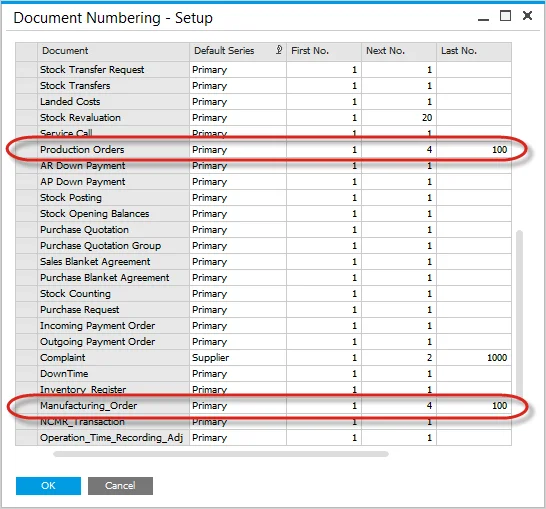
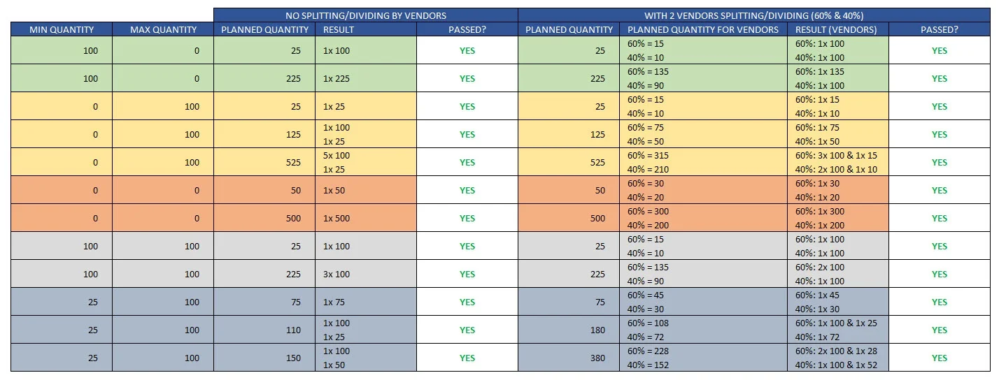

# MRP Related Configuration

SAP Business One provides robust Material Requirements Planning (MRP) functionality to streamline manufacturing and supply chain processes. Proper configuration ensures seamless synchronization between ProcessForce and SAP Business One, allowing businesses to optimize inventory management, production planning, and order fulfillment.

This page displays options relevant to SAP Business One's MRP functionality.

---

## Configuration

### Configuration Fields

**When running SAP Business One MRP please ensure the following**

- Ensure synchronization between the ProcessForce Bill of Material (BOM) and Manufacturing Order with SAP Business One.
- If the sync box is left unchecked, Bill of Materials created in ProcessForce will not synchronize with SAP Business One.
- To synchronize a Bill of Material from ProcessForce to SAP Business One, simply modify any data element within the ProcessForce BOM and click update. This action triggers the synchronization.
- Even if Coproducts are not being used, reviewing the Coproducts section below is still recommended.
- Synchronization enables supply and demand details from ProcessForce Manufacturing Orders to update and integrate with SAP Business One features, including::
  - Item Master Data -> Inventory Tab -> Committed and Ordered fields
  - Forecasts
  - MRP Wizard
  - Order Recommendation
  - Available to Promise
  - BOM Relationship Maps

## Documents Series

- Ensure that the SAP Production Order and ProcessForce Manufacturing Order share the same starting and ending number for proper synchronization.

    
    

### Example

The screenshot below illustrates an example of Manufacturing Order - Production Order series synchronization:

- 2017PF series (Manufacturing Order series) is synchronized with 2017SAP series (Production Order series).

## Multiple Manufacturing Order - Production Order Series Synchronization

:::info
    Values are required **only** when the company operates with branches. 
:::

The option is available from:

- General Settings form:

    

:::info Path
    Main Menu: Administration → System Initialization → Configuration of Series Synchronization
:::

Upon accessing this option, the following form will be displayed:

Within this form, you can assign predefined Production Order document series to corresponding Manufacturing Order document series.

For instructions on creating a document series, click [here](../../document-numbering.md).

## Transactions

- When entering a Manufacturing Order, please ensure that you use the correct document series.
- To reduce the error of entering the wrong value, assign the document series to the user.

## Coproducts

For businesses that manufacture Coproducts, completing this configuration is essential for ProcessForce to integrate with SAP Business One MRP functions.

SAP Business One does not inherently support Coproducts within its Bill of Material (BOM) functionality. To address this, during the synchronization of the Bill of Manufacturing and Manufacturing Order, a dummy BOM is created. In this setup:

- The Coproduct serves as the parent item.
- The Default Component, as defined in this configuration, is set as the component item.

Refer to the next section for detailed instructions on configuring the Default Component.

## Default Component

A Default Component should be configured with the following settings:

- Item Master Data Header: ensure that Sales Item, Inventory Item, Purchase Item, and Fixed Asset Item are all "unchecked".

    

- Item Master Data → General Tab – Serial and Batch numbers, manage by item set to "None".

    

- Item Master Data → Production Data tab – Phantom item is "unchecked".

    

- Item Master Data → Inventory Data tab: configure the Valuation Method as Standard, set Item Cost to 1, and designate a default warehouse.

    

To mark a warehouse as the default, select the first column of its row and click the Set Default Whse button:

## Default Final Component

Item set up as a Default Final Component is excluded from MRP runs.

This option can be accessed via [General Settings > ProcessForce tab > MRP tab](./mrp-tab.md):

### Settings

An Item to be chosen as a Default Final Component,  ensure the following configurations:

- Inventory Item option checked.
- Sales, Purchase, and Fixed Asset options are disabled.
- The item must not be managed by Serial or Batch numbers.
- A default Warehouse is assigned.
- The Valuation Method is set to Standard.

:::note
    Please go to the [Coproducts section](#coproducts) to check where to set up the aforementioned settings
:::

## 10.0 R3: Multiple Branches Management of Default Component and Default Final Component

Starting from this version, SAP Business One allows configuring the Default Component and Default Final Component separately for different company branches.

To enable this option, follow these steps:

1. In the SAP Business One Branches - Setup, ensure each branch has a designated default warehouse.
2. Create a separate Default Component for each branch.
3. Within each branch's Default Component, assign the relevant branch warehouses, ensuring at least one is set as default in the Item Master Data.
4. In ProcessForce Branches: Components Configuration (accessible via General Settings > ProcessForce tab > MRP tab > Components Configuration for Branches), set a default warehouse. Carefully assign the appropriate warehouse to each branch.

The same process applies to the Default Final Component. It is crucial to first define a Default Component for a specific branch before configuring the Default Final Component.

## Key MRP Settings

### Split Purchase Documents between Vendors

- Choosing this option enables automatic distribution of purchases among preferred vendors.
- Checking the checkbox results in accessing the following form from Item Master Data form, Planning Data tab:

    

- On this form, you can assign a preferred vendor and specify a percentage. If percentages are set for vendors, the quantity in a purchase document for the specific item will be distributed proportionally.
- Additionally, please refer to the table at the bottom of this page.

### Minimum and Maximum Manufacturing Order Planned Quantity

- You can configure minimum and maximum order quantity in Item Master Data, Planning Data tab:

    

The table below displays the preferred vendors along with the minimum and maximum quantities (click to enlarge).

    

---
