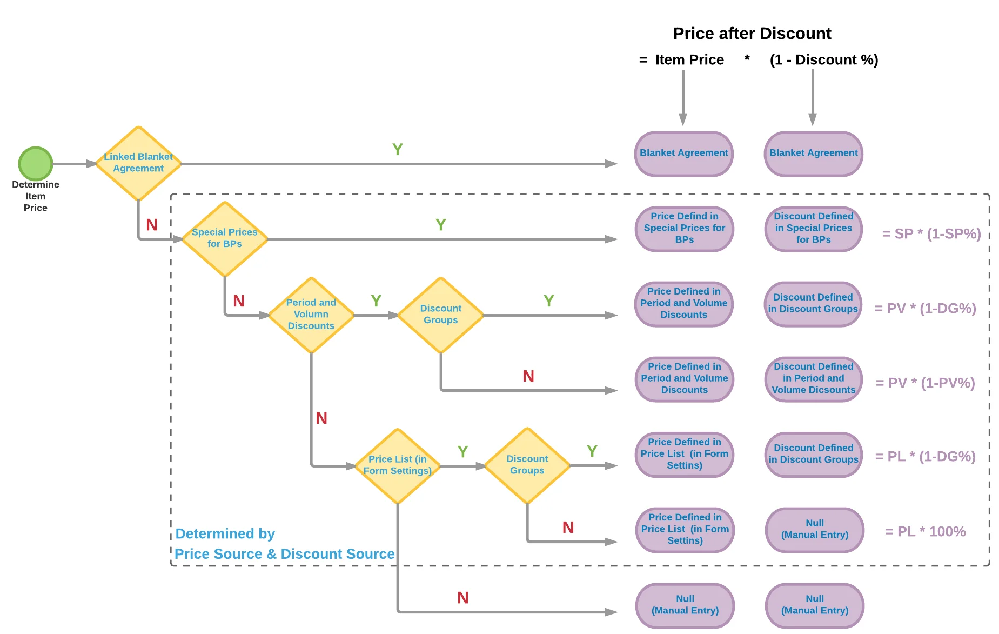

# Overview

The MRP Tab contains essential settings that influence material requirements planning (MRP) behavior within the system. These settings help define how components, purchasing, pricing, and lead times are managed in the MRP process.

---

## General MRP Settings

- **Default Component**: click [here](./mrp-related-configuration.md#default-component) to find out more about Default Component Settings.
- **Default Final Component**: a dummy item used in the synchronization between the ProcessForce Manufacturing Order and SAP Business One Production Order. This item appears in SAP’s Production Order header when the Manufacturing Order's Final Good balance is zero: (Planned - Actual) ≥ 0. Specifying this item in General Settings ensures synchronization works correctly. The item set as the Default Final Component is excluded from MRP runs.
- **Split purchase documents between vendors**: click [here](mrp-related-configuration.md#split-purchase-documents-between-vendors) to find out more about split purchase documents between vendors
- **Use SAP Business One's SDK related price determination routines for purchase recommendations**: checking this checkbox causes standard SAP Business One price determination for purchase recommendation to be used. The following chart presents this price recommendation scheme and hierarchy. The price is taken from the top level of the chart (Blanket Agreement), if not, then from the lower level. The lowest level is manual entry of prices:

    
The ProcessForce price recommendation works only down to the Special Prices for Business Partners level. Check the checkbox if you need to use the lower then this level for price recommendation. Otherwise it is possible to uncheck the checkbox for performance improvement
- **Include internal lead time for purchase document**: Lead Time is the number of days from when the item is ordered to when the item is received or produced.
- **Include internal lead time for inventory transfer**: Internal lead time is similar to additional time (for example for quality control or preparing to dispatch)
- **Consolidate Recommendations**: when enabled, multiple recommendations for the same product are merged into a single recommendation, streamlining procurement and planning.

---
