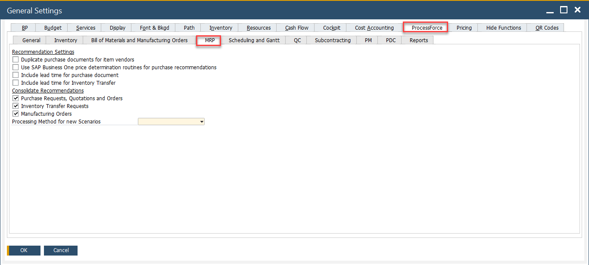

# Overview

The MRP Tab contains essential settings that influence material requirements planning (MRP) behavior within the system. These settings help define how components, purchasing, pricing and lead times are managed in the MRP process.

To access MRP tab, navigate to:

:::info Path
Administration → System Initialization → General Settings → ProcessForce tab → MRP tab
:::

---

## Key Settings

The MRP tab provides system-wide controls for how MRP recommendations are generated and processed. The options available are grouped into two main sections:

1. **Recommendation Settings**

    - **Duplicate purchase documents for item vendors**: If enabled, allows the system to generate multiple purchase documents per item vendor during MRP runs.

    - **Use SAP Business One price determination routines for purchase recommendations**: Selecting this checkbox enables the use of the standard SAP Business One price determination logic for generating purchase recommendations. The system follows a hierarchical structure for price selection, starting from the highest priority—Blanket Agreement—and moving down through predefined levels. If a price is not found at the top level, the system proceeds to the next available level, with manual price entry being the last fallback.

        

        By default, CompuTec ProcessForce supports price recommendations only up to the Special Prices for Business Partners level. If your pricing requirements extend beyond this (e.g., to manual pricing or lower-priority conditions), enabling this checkbox ensures accurate recommendations. However, if such lower-tier pricing is not required, you may leave the checkbox unchecked to optimize system performance.

    - **Include lead time for purchase document**:  Lead Time is the number of days from when the item is ordered to when the item is received or produced. Adds the lead time of purchase items when calculating MRP recommendations.

    - **Include lead time for Inventory Transfer**:  Internal lead time is similar to additional time (for example for quality control or preparing to dispatch). It considers lead times for internal transfers between warehouses.

2. **Consolidate Recommendations**: When enabled, multiple recommendations for the same product are merged into a single recommendation, streamlining procurement and planning:
        - Purchase Requests, Quotations, and Orders
        - Inventory Transfer Requests
        - Manufacturing Orders

    - **Processing Method for New Scenarios**: A dropdown to select the default MRP processing method (e.g., Standard, Backward Scheduling, etc.). This influences how scenarios are calculated when new ones are created.

---
