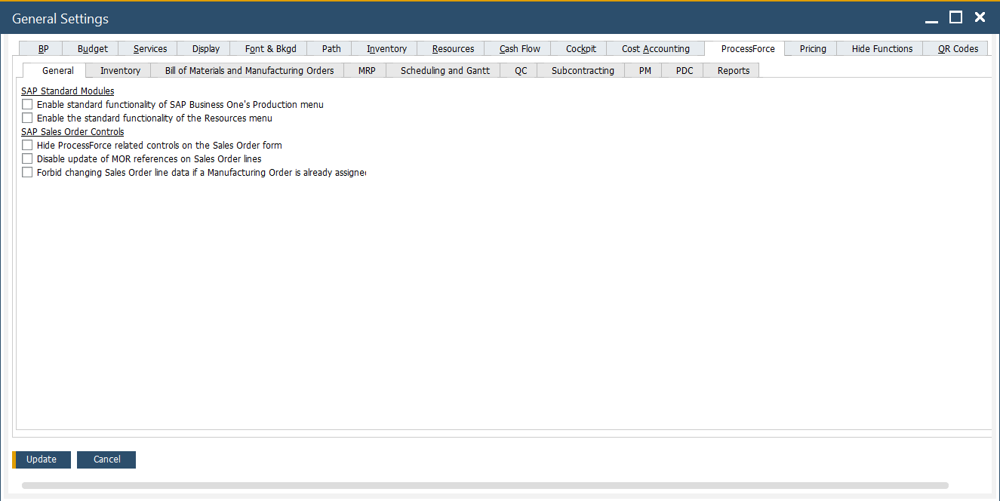

# Overview

The General Settings window serves as the central hub for key configuration options that govern how the system behaves across various functional areas. This is where most of the critical parameters are placed, allowing users to control core aspects of manufacturing, quality, costing, logistics, compliance, and more - all from a single, organized location.

CompuTec ProcessForce settings, organized into dedicated tabs, help administrators and power users manage operations efficiently and align the system with business needs. They form the foundation for module interactions, ensuring flexibility with consistent control.

To access General Settings, navigate to:

:::info path
    Administration → System Initialization → General Settings
:::

---
