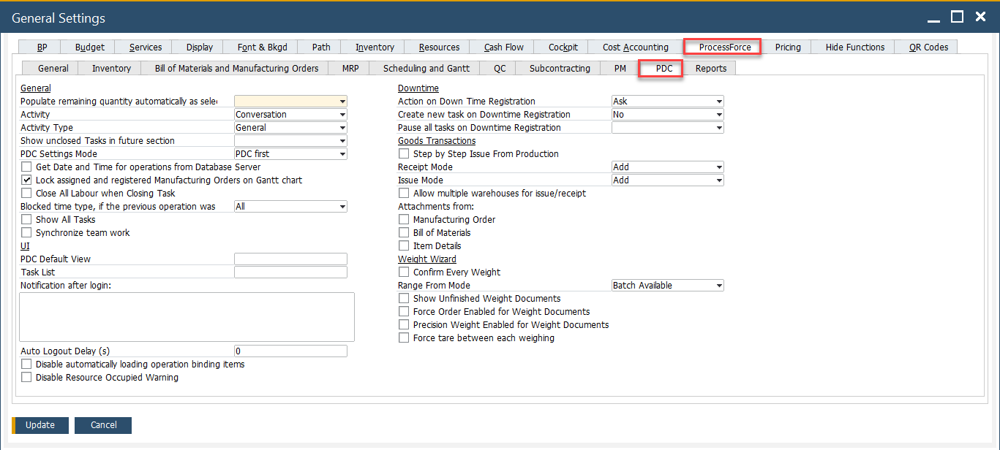

# PDC tab

The PDC (Plant Data Capture) tab allows you to configure options for integrating **CompuTec PDC** with **CompuTec ProcessForce**. This module enables real-time recording of production tasks directly from the shop floor by generating **Time Bookings**.

To access PDC tab, navigate to:

:::info Path
Administration → System Initialization → General Settings → ProcessForce tab → PDC tab
:::

---

➡️ For a detailed description of each option available on this tab, refer to the official [CompuTec PDC Documentation](https://learn.computec.one/docs/pdc/administrator-guide/setting-up-the-application/overview#processforce-settings).

---
