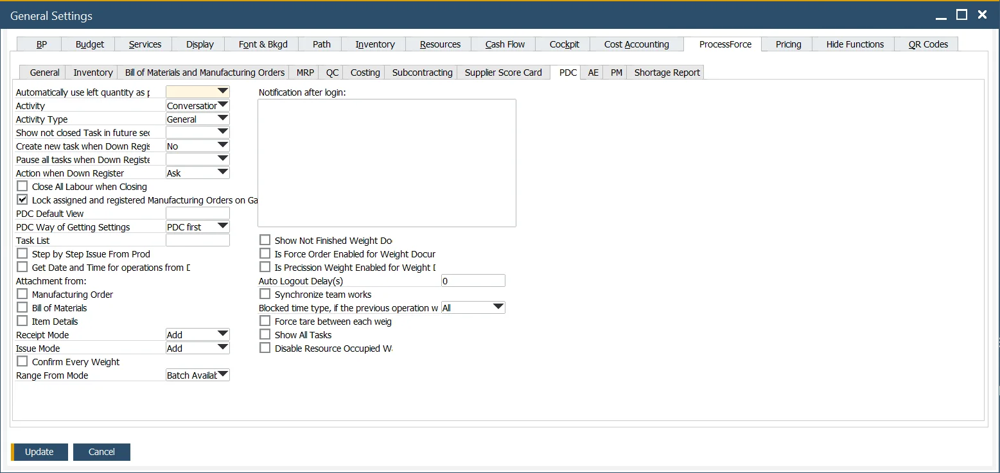

# Plant Data Capture tab

On this tab, CompuTec PDC options are available (Plant Data Capture: the application allows the record of production tasks by using ProcessForce Time Bookings documents directly from the production floor).

The options are described in [CompuTec PDC Documentation](/docs/pdc/administrator-guide/setting-up-the-application/overview#processforce-settings)

