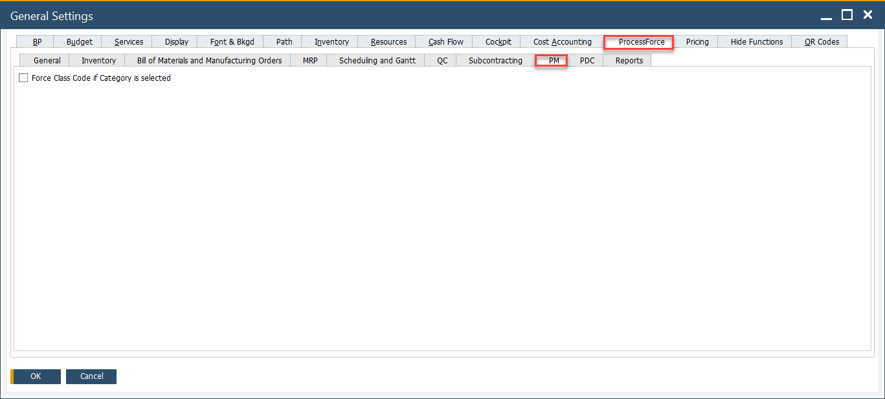

# PM tab

The PM tab allows you to configure key settings that support streamlined and standardized Plant Maintenance (PM) operations. It helps enforce classification rules and maintain consistency across maintenance orders, equipment categories, and service records. These configurations are essential for organizing both preventive and corrective maintenance activities, optimizing the use of spare parts, and enhancing overall asset reliability.

To access the PM tab:

:::info Path
Administration → System Initialization → General Settings → ProcessForce tab → PM tab
:::

## Key Settings

**Force Class Code if Category is selected**: When this checkbox is enabled, the system will enforce the assignment of a Class Code whenever a Category is selected for a maintenance object.
This ensures consistency in classification and can help standardize data across equipment and maintenance records.

➡️ Learn more: About [Plant Maintenance](../../plant-maintenance/overview.md).

---
