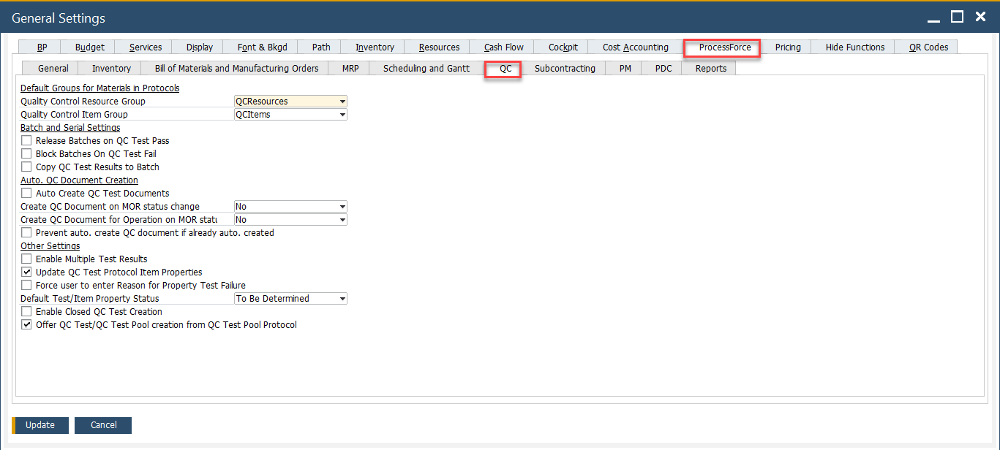
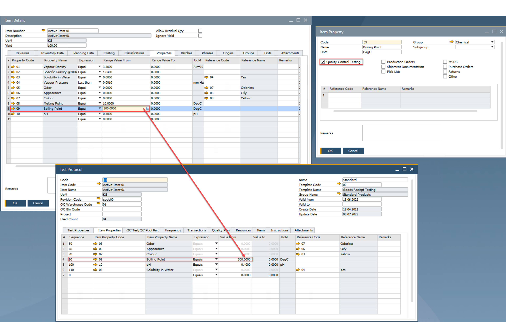

# QC tab

The QC (Quality Control) Tab in the system provides essential settings for managing quality control processes efficiently. It enables users to configure various parameters related to testing, batch release, and automated test creation. Below is an overview of the key settings and their functionalities.

To access Quality Control tab, navigate to:

:::info Path
Administration → System Initialization → General Settings → ProcessForce tab →  Quality Control tab
:::

---

## Key Settings

Below is a detailed breakdown of the key settings available in this tab.

1. **Default Groups for Materials in Protocols**

    - **Quality Control Resource Group**: Defines the default resource group (e.g., QCResources) to be used in quality control protocols. Resources from this group are assigned to execute QC tests.
    - **Quality Control Item Group**: Specifies the default item group (e.g., QCItems) used in QC-related protocols, streamlining the classification of QC-relevant inventory items.

    ➡️ Learn more about[Quality Control Configuration](../../quality-control/quality-control-configuration.md)

2. **Batch and Serial Settings**

    These settings control how inventory batches interact with QC test outcomes.

    - **Release Batches on QC Test Pass**: When this checkbox is enabled, if a QC Test status changes to "Passed" and the document status is set to "Closed," all batches assigned in the Transaction tab of the Quality Control Test will automatically be marked as "Released".
    - **Block Batches on QC Test Fail**: Blocks batches from being used if they fail QC tests, preventing defective goods from entering production or sales.
    - **Copy QC Test Results to Batch**: If checked, the results of the QC tests are stored in the batch master data for reference and traceability.

3. **Auto. QC Document Creation**

    These settings automate the generation of QC test documents under different circumstances.

    - **Auto Create QC Test Documents**: When enabled, QC test documents are automatically created based on defined protocols when related inventory transactions occur.
    - **Create QC Document on MOR Status Change**: Controls whether QC documents should be generated when a Manufacturing Order (MOR) changes status.
    - **Create QC Document for Operation on MOR Start**: Determines if a QC document should be created when an operation within a Manufacturing Order starts.
    - **Prevent auto. create QC document if already auto. created**: Prevents duplication of QC documents by avoiding regeneration when one has already been created automatically.

4. **Other Settings**

    - **Enable Multiple Test Results**: Allows recording of multiple results for the same QC test, useful for cases where repeated tests are conducted.
    - **Update QC Test Protocol Item Properties**: Automatically updates the properties in the protocol based on test results.
        
    - **Force user to enter Reason for Property Test Failure**: Enforces accountability by requiring users to input a reason whenever a QC property test fails.

5. **Default Test/Item Property Status**:

    Defines the default status for item/test properties. Options include: To Be Determined, Pass, Fail and No Impact

    - **Enable Closed QC Test Creation**: Allows users to create QC test documents with a "closed" status directly, skipping the usual QC process cycle if necessary.
    - **Offer QC Test/QC Test Pool creation from QC Test Pool Protocol**: Enables the system to prompt or offer creation of QC Test documents or pooled tests directly from the protocol level.

---
