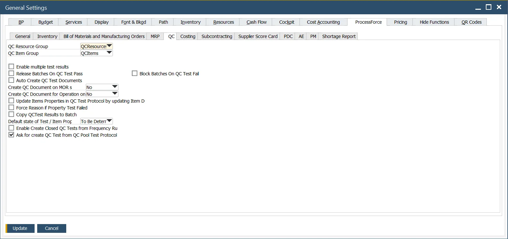
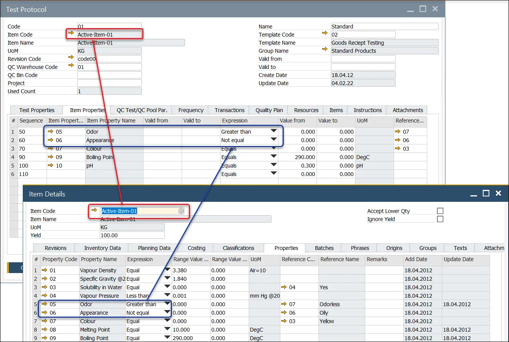

# Quality Control Tab

**QC Resource Group, QC Item** – Within the Test Protocol and Quality Control Test Forms, the user can define the Resources and Items used to conduct and complete the testing activity. For example, X-ray machines, microscopes, tooling, etc. Use QC Resource Group and QC Item Group options to choose groups that will be used for Quality Control Tests.

Click [here](../../quality-control/quality-control-configuration.md) to learn about Items and Resources for Quality Control Test configuration.

**Enable multiple test results** – Check this field to record multiple results against the Test and Item Property.

Note: when this function is checked, all Test and Item Properties data entries will be managed using this method.

Click [here](../../quality-control/quality-control-test/multiple-test-result-record.md) to find out more about the Multiple Test Results function.

**Release Batches on Quality Control Test Pass** – Checkbox checked: If QC Test status is changed to passed and document status changes to closed, assign Batches' status to Released (if any Batch is assigned to a Quality Control Test - Quality Control Test > Transaction tab).

**Auto Create Quality Control Test Documents** – This option allows the automatic creation of Quality Control Tests when specific conditions are met. Click [here](../../quality-control/automatic-creation-of-quality-control-documents.md) to find out more.

**Create Quality Control Document on MOR state** – This option determines if a related Quality Control is to be created upon a Manufacturing Order status change. It is possible to set a shift in one status or turn the option off ('No' on the drop-down list).

**Create QC Document for Operation on MOR state** – This option specifies whether a related Quality Control should be created for an Operation when the status of a Manufacturing Order changes. You can configure a status shift or disable this feature by selecting 'No' from the drop-down list. It is required to check the [QC Active checkbox](../../routings/operations.md)for this option to be available for a specific Operation.

**Update Items Properties in QC Test Protocol by updating Item Details Properties** – if this checkbox is checked, Item Properties in the Quality Control Test Protocol are automatically updated when the related Item Details Properties are updated.

    
Click here to find out more

    

        
    

**Force Reason if Property Test Failed** – If this checkbox is checked, it is impossible to save/update a Quality Control Test document with a failed Test/Item Property that does not have a Reason Code and Name set.

**Copy QCTest Results to Batch** – When a Quality Control test is moved to the Closed status, the Tested Values and Tested Reference Codes of Item Properties are copied to the related Batch Master Data.

During this process, if the system encounters any Item Property from the Quality Control Test that is not already present in the Properties Tab of the Batch Master Data, it adds the Item Property to the list.

**Default state of Test / Item Properties** – You can set a default state (To be determined/ Pass/ Fail/ Not Affected) for Test and Item Properties when adding a Test Protocol, which will apply to all Properties in the Protocol, or when adding a Property to a Quality Control Test.

**Enable Create Closed Quality Control Tests from Frequency Rules** – If a Quality Control Test is created automatically (based on the Frequency mechanism in the Test Protocol's Frequency tab), enabling this option results in Quality Control Tests being created with a Closed status and a Pass result within the specified counter values. For example, if a Quality Control Test is set to be created every five transactions, closed tests will be created for the first four transactions, and a proper Quality Control Test will be generated on the fifth transaction.

**Ask for creating Quality Control Test from QC Pool Test Protocol** – If you manually create a test and select a Test Protocol for Quality Control Test Pool while the checkbox is checked, you can choose to create either a single Quality Control Test or a Quality Control Test Pool. If the checkbox is unchecked, the system will automatically proceed to create a Quality Control Test Pool.

    
Click here to find out more

    

        
    

**Block Batches on Quality Control Test Fail** – self-explanatory.
