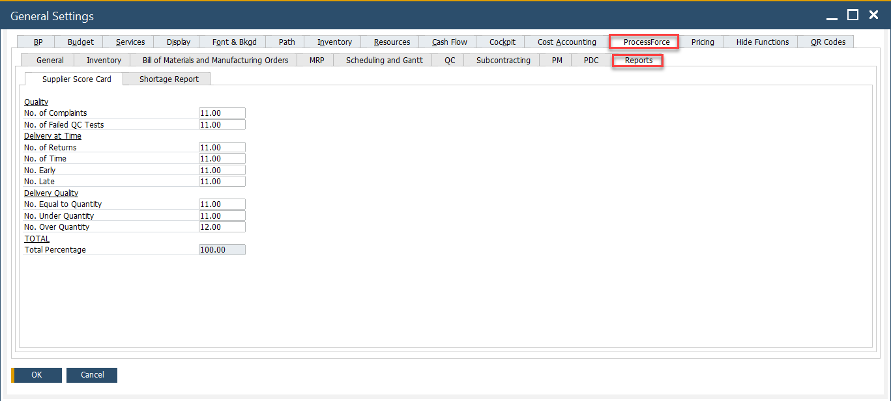
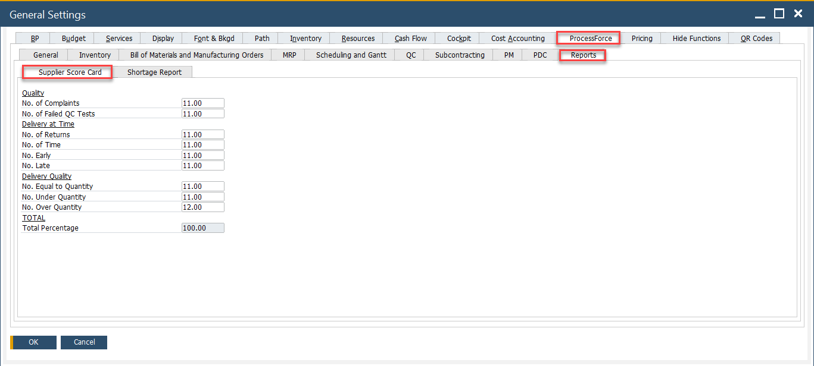
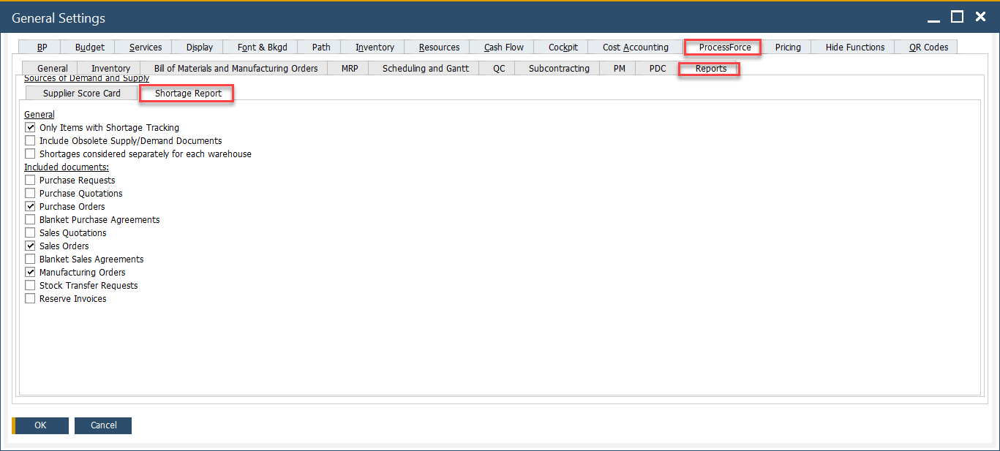

# Reports tab

This guide helps you configure reporting criteria for supplier performance and inventory shortages in CompuTec ProcessForce. These settings impact how supplier evaluation and shortage calculations are generated in various reports.

The Reports tab consists of two sections:

- **Supplier Score Card**: Used to evaluate supplier performance based on quality, delivery accuracy, and timing.
- **Shortage Report**: Used to analyze material shortages by comparing demand and supply.

---

To access Reports tab, navigate to:

:::info Path
Administration → System Initialization → General Settings → ProcessForce tab → Reports
:::

---

## Supplier Score Card

The Supplier Score Card provides a structured and measurable way to evaluate supplier performance across key metrics such as quality, delivery accuracy, and timeliness. Using a weighted scorecard system, it helps identify strengths and areas for improvement, supporting better procurement decisions.

:::info caution
    - The delivery and quantity calculations on the Supplier Score Card are based on the relationship between Purchase Order and Goods Receipt PO documents. It is crucial that a specific Purchase Order and corresponding Goods Receipt PO are linked correctly for the function to work properly. This can be achieved by creating a Goods Receipt Purchase Order using the "Copy To" option from a Purchase Order, or by linking the Purchase Order using the "Copy From" option in the Goods Receipt PO.
    - Please note that dates are compared between the individual lines of the documents, not the document header dates.
:::

To access Supplier Score Card, navigate to:

:::info Path
Administration → System Initialization → General Settings → ProcessForce tab → Reports Supplier Score Card
:::

### Supplier Score Card Options

The Supplier Score Card consists of three main categories with individual parameters. Each field allows a numeric value (percentage) to represent its influence in overall supplier evaluation.

#### 1. Quality

    - **No. of Complaints**: Weight given to the number of complaints received against a supplier. Useful for tracking customer or internal dissatisfaction.
    - **No. of Failed QC Tests**: Evaluates how often supplier products fail quality control. A higher value increases the impact of failed quality checks on overall evaluation.

#### 2. Delivery at Time

    - **No. of Returns**: Frequency of goods returned to the supplier due to defects, damage, or incorrect items.
    - **No. of Time**: Reflects timely deliveries. A higher weight means your business places high value on punctuality.
    - **No. Early**: Assigns weight to early deliveries, which may be positive or negative depending on your operational tolerance for premature arrivals.
    - **No. Late**: Measures late deliveries. Typically given high weight if delays disrupt production or order fulfillment.

#### 3. Delivery Quality

    - **No. Equal to Quantity**:Weights the accuracy of deliveries matching the ordered quantity exactly.
    - **No. Under Quantity**: Penalizes suppliers for delivering less than ordered, which can lead to shortages or delays.
    - **No. Over Quantity**: Measures the impact of suppliers delivering more than ordered - may affect inventory balance and invoicing.

>Note: **Totals** is The sum of all individual metric weights. Must be equal to **100.00**.

### Supplier Score Card from Business Partner

You can also access the form for a specific Business Partner from the Business Partner form header context menu (available only when the BP type is set to Supplier for this Business Partner).

:::info Path
Business Partners → Supplier Score Card
:::

➡️ Learn more about [Supplier Score Card from Business Partner](../../supplier-score-card.md)

## Shortage Report

The **Shortage Report** in CompuTec ProcessForce provides a detailed analysis of missing materials required for open manufacturing orders or planned production. It compares the demand for items (based on BOMs, MO reservations, or batch requirements) with current stock levels, incoming supplies and defined safety parameters.

To access Shortage Report, navigate to:

:::info Path
Administration → System Initialization → General Settings → ProcessForce tab → Reports tab → Shortage Report
:::

.

### Shortage Report Options

By adjusting settings in the **Shortage Report tab**, you control what counts as "available" stock, what lead times are considered and how dynamic the system should be when calculating shortages.

#### 1. General Settings

These checkboxes define how the shortage logic behaves at a system level:

1. **Only Items with Shortage Tracking**: Includes only those items that are flagged for shortage tracking in the Item Master Data.

2. **Include Obsolete Supply/Demand Documents**: If checked, the system will include outdated or closed documents - like canceled purchase orders or completed sales - in the calculation.

3. **Shortages Considered Separately for Each Warehouse**: When enabled, the system calculates shortages per warehouse independently, rather than aggregating stock across all locations. This is ideal for companies managing multiple warehouses with local fulfillment needs.

#### 2. Included Documents

These checkboxes determine which types of documents are considered when calculating supply and demand balances:

1. **Purchase Requests**: Includes open internal requests for purchasing materials, even if they are not yet approved or converted into purchase orders.

2. **Purchase Quotations**: Adds vendor quotations as potential future supply, though they are non-binding and not yet firm commitments.

3. **Purchase Orders**: Considers all open and confirmed purchase orders as incoming supply. This is a standard setting for accurate shortage calculation.

4. **Blanket Purchase Agreements**: Factors in long-term supplier agreements, which may not have specific order quantities assigned yet but represent committed supply over time.

5. **Sales Quotations**: Includes unconfirmed sales quotations as potential demand. Helpful for forecasting but may overestimate actual needs if not managed carefully.

6. **Sales Orders**: Adds all active sales orders to the demand calculation.

7. **Blanket Sales Agreements**: Includes recurring or long-term sales commitments which may not yet have specific delivery dates or quantities but represent ongoing demand.

8. **Manufacturing Orders**: Considers open production orders. These create demand for raw materials and components and also represent future supply for finished goods.

9. **Stock Transfer Requests**: Includes planned movements of stock between warehouses.

10. **Reserve Invoices**: Includes sales that are already invoiced but not yet delivered, ensuring committed demand is reflected in the shortage report.

---

➡️ Learn more on how to use the [Shortage Report](../../scheduling/gantt-chart/material-shortage.md#usage).
