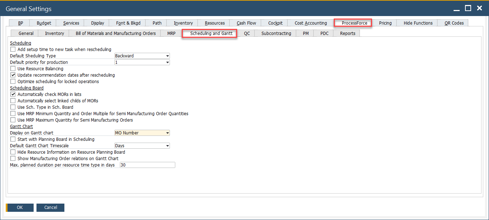
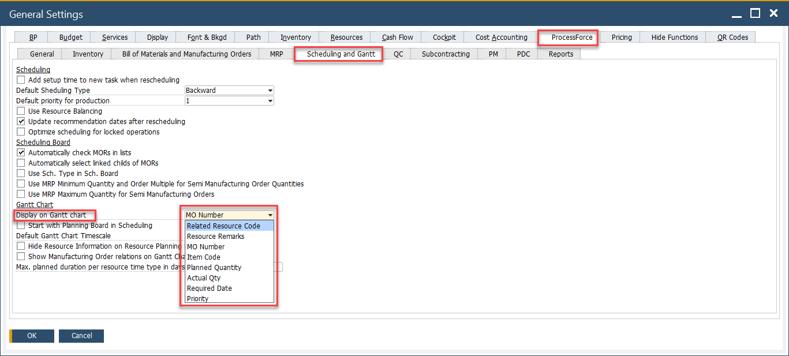

# Scheduling and Gantt

The Scheduling and Gantt tab allows users to configure advanced scheduling behavior, Gantt chart visualization, and optimization parameters for managing Manufacturing Orders (MORs). These settings ensure seamless coordination between planning, execution and visualization of production tasks within CompuTec ProcessForce.

To access Scheduling and Gantt tab, navigate to:

:::info Path
Administration → System Initialization → General Settings → ProcessForce tab → Scheduling and Gantt tab
:::

---

## Key Settings

This tab is divided into three main sections: Scheduling, Scheduling Board, and Gantt Chart. Each section provides essential options to control how tasks are scheduled, how manufacturing orders are handled, and how information is displayed visually in the planning tools.

1. **Scheduling**

    - **Add setup time to new task when rescheduling**: When enabled, any rescheduled task will include its setup time again, ensuring accurate time planning.
    - **Default Scheduling Type**: Choose between Backward or Forward scheduling methods. Backward scheduling calculates the latest possible start date based on the required finish date, while forward scheduling starts from the current date.
    - **Default priority for production**: Assigns a default priority level (1 being the highest) to newly created production orders.
    - **Use Resource Balancing**: Enables automatic load balancing among resources based on availability and capacity.
    - **Update recommendation dates after rescheduling**: Ensures that date recommendations in the system reflect the most recent rescheduling activities.
    - **Optimize scheduling for locked operations**: Allows scheduling optimization to consider operations marked as locked, improving alignment with resource constraints.

2. **Scheduling Board**

    - **Automatically check MORs in lists**: When checked, all Manufacturing Orders are auto-selected for actions within the list view.
    - **Automatically select linked childs of MORs**: Ensures that child operations or linked suborders are included in scheduling actions.
    - **Use Sch. Type in Sch. Board**: Applies the scheduling type (Backward/Forward) as configured specifically in the scheduling board.
    - **Use MRP Minimum Quantity and Order Multiple for Semi Manufacturing Order Quantities**: Controls quantity recommendations for semi-finished goods using MRP logic.
    - **Use MRP Maximum Quantity for Semi Manufacturing Orders**: Enables a cap on recommended quantities based on MRP maximums.

3. **Gantt Chart**

    - **Display on Gantt chart**: Allows users to define what is displayed on the chart.
        
    - **Start with Planning Board in Scheduling**:Launches the Planning Board interface when opening the scheduling window.
    - **Default Gantt Chart Timescale**: Defines the base unit for the Gantt chart view, such as Days, Hours, or Weeks.
    - **Hide Resource Information on Resource Planning Board**: Conceals detailed resource data from the planning interface, offering a cleaner view.
    - **Show Manufacturing Order relations on Gantt Chart**: Displays dependencies and links between manufacturing orders visually.
    - **Max. planned duration per resource time type in days**: Sets a limit on how many days of planned activity can be shown per resource time type on the chart.

---
