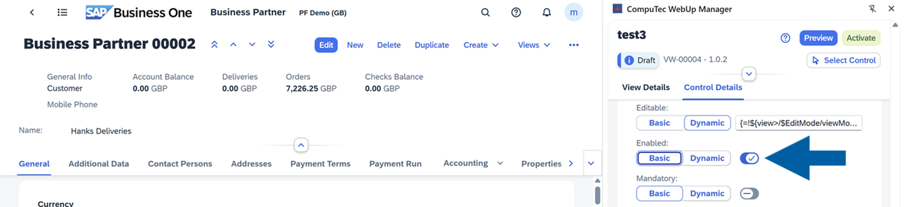
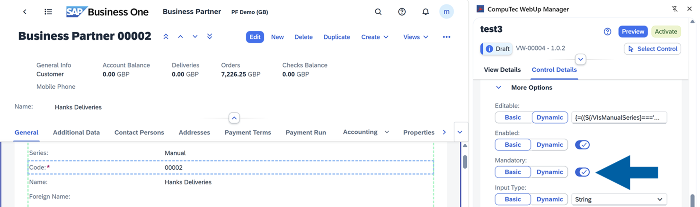

# Control Management

The **Control Management** function lets you define, edit, and organize how UI controls are arranged in the SAP Business One Web Client.

You can review, modify, and reposition controls across supported SAP views.
All layout changes are context-aware and saved in the active user profile.

Before making advanced layout adjustments, you must first create an editable view for the current SAP Web Client screen using **Create New View**.

:::info[note]
You can access each CompuTec WebUp function from the **CompuTec WebUp Side Panel** inside the SAP Business One Web Client. Features open only if the current **SAP Business One** screen supports extensibility.
:::

## Key functions of Control Management

- **Select Control**: Precisely select specific controls

    

    :::note[info]
    Each control in SAP Business One Web Client has its **Global Unique Identifier (GUID)**. You can copy it and use it in the script during the **View Actions** creation to precisely reference a control in your SAP Business One interface.  
    To reference controls precisely when building actions, you can use the **Select Control** tool, the right-click **Inspect Element** or **Copy GUID** options.

    
    :::

- **Basic Options**: Edit control details such as name, visibility, and position

    

- **Position**: Move or reorder controls within a section or between different sections

    

- **Mode**: View and edit control properties using **Basic** or **Dynamic** options:
  - **Basic**: Allows you to quickly update to standard control attributes (label, visibility, mandatory settings). It's ideal for simple layout changes that do not require data binding.
  - **Dynamic**: In this option, the control’s value reacts dynamically to changes in a data source (for example, Sales Quotation Total). It's useful for dynamic layouts that are adjusted based on a condition: business logic or user input.

    

:::info[Note]
If a view is not supported by the SAP Web Client Extensibility model, the system displays `Unsupported View`, and editing is disabled.

Some view sections don't have visible titles. In these cases, they are identified by their order in the layout instead of a label.
:::

## Control Management use cases

- Hiding unused fields in the `Sales Quotation` or `Business Partner` view.

    

    ▶ **Watch**: [CompuTec WebUp - How to Hide Controls](https://www.youtube.com/watch?v=HBFxPcV0ris&list=PLtT6kgaz5YneoXw5aRFA-SxXwzzB-u4vl&index=2)

- Moving the `Display Currency` control to a different section.

    

    ▶ **Watch**: [CompuTec WebUp - How to Move Controls](https://www.youtube.com/watch?v=bUEkcdizCLY&list=PLtT6kgaz5YneoXw5aRFA-SxXwzzB-u4vl&index=3)

- Making the `Code` field mandatory.

    

    ▶ **Watch**: [CompuTec WebUp - Controls - Other Configurations](https://www.youtube.com/watch?v=MQk_z-cr-v8&list=PLtT6kgaz5YneoXw5aRFA-SxXwzzB-u4vl&index=4)
