# Control Management

The **Control Management** function lets you define, edit, and organize how UI controls are arranged in the SAP Business One Web Client.

You can review, modify, and reposition controls across supported SAP views.
All layout changes are context-aware and saved in the active user profile.

Before making advanced layout adjustments, you must first create an editable view for the current SAP Web Client screen using **Create New View**.

:::info[note]
You can access each CompuTec WebUp function from the **CompuTec WebUp Manager Side Panel** inside the SAP Business One Web Client. Features open only if the current **SAP Business One** screen supports extensibility.
:::

## Key functions of Control Management

- **Select Control**: Precisely select specific controls

    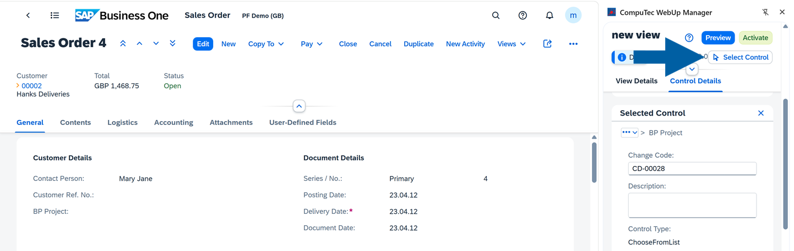

    :::note[info]
    Each control in SAP Business One Web Client has its **Global Unique Identifier (GUID)**. You can copy it and use it in the script during the **View Actions** creation to precisely reference a control in your SAP Business One interface.  
    To reference controls precisely when building actions, you can use the **Select Control** tool, the right-click **Inspect Element** or **Copy GUID** options.

    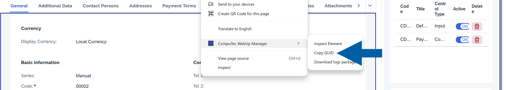
    :::

- **Basic Options**: Edit control details such as name, visibility, and position

    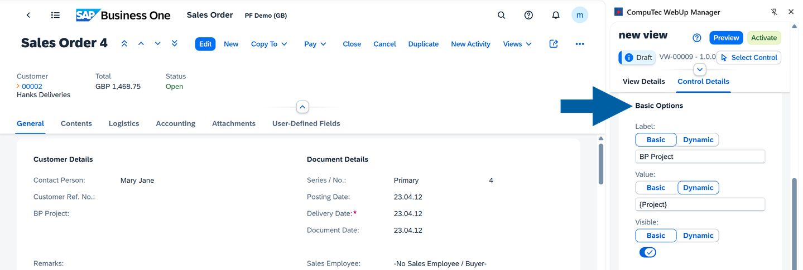

- **Position**: Move or reorder controls within a section or between different sections

    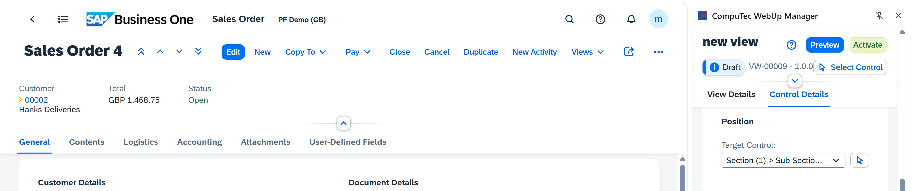

- **Mode**: View and edit control properties using **Basic** or **Dynamic** options:
  - **Basic**: Allows you to quickly update to standard control attributes (label, visibility, mandatory settings). It's ideal for simple layout changes that do not require data binding.
  - **Dynamic**: In this option, the control’s value reacts dynamically to changes in a data source (for example, Sales Quotation Total). It's useful for dynamic layouts that are adjusted based on a condition: business logic or user input.

    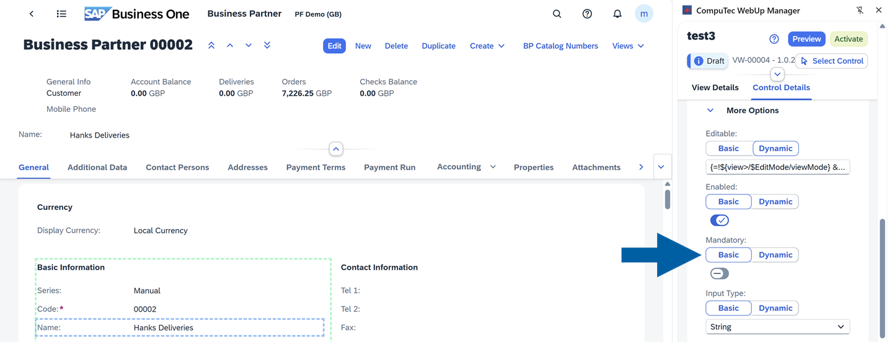

:::info[Note]
If a view is not supported by the SAP Web Client Extensibility model, the system displays `Unsupported View`, and editing is disabled.

Some view sections don't have visible titles. In these cases, they are identified by their order in the layout instead of a label.
:::

## Control Management use cases

### Hide an unused control

If you want to hide an unused control, follow these steps:

1. Log in to **SAP Business One Web Client**.
2. Navigate to the screen you want to edit. In our example it's **Sales Order**.
3. Open **CompuTec WebUp Manager** by clicking on its browser extension icon.
4. In **Control Details** section of **CompuTec WebUp Manager** side panel, click **Select Control**.

    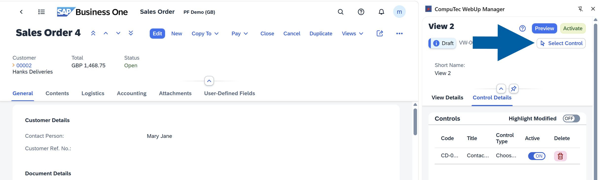

5. On the left panel, click the **Control** you want to hide on the **SAP Business One Web Client** screen. In our example, we want to hide the **Additional Information** section.

    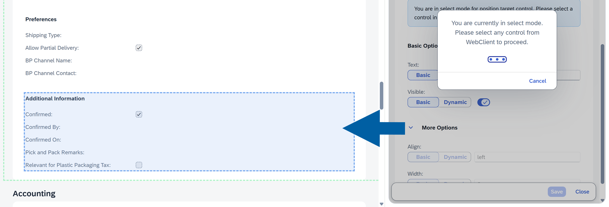

6. In **Computec WebUp Manager** side panel on the right, find **Visible** option, and click **the toggle** to turn it off.

    

7. Click **Save**.

    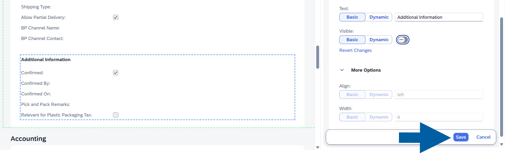

8. Click **Preview** to see the changes.

    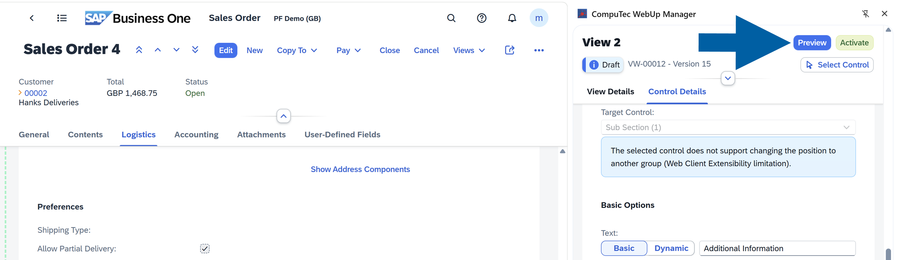

9. Click **Activate** when you’re satisfied with the result.

    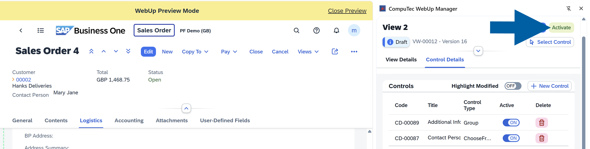

10. Done! The control is hidden.

#### Video walkthrough

    ▶ **Watch**: [CompuTec WebUp - How to Hide Controls](https://www.youtube.com/watch?v=HBFxPcV0ris&list=PLtT6kgaz5YneoXw5aRFA-SxXwzzB-u4vl&index=2)

### Move a control to a different section

If you want to move a control to a different section, follow these steps:

1. Log in to **SAP Business One Web Client**.
2. Navigate to the screen you want to edit. In our example it's **Sales Order**.
3. Open **CompuTec WebUp Manager** by clicking on its browser extension icon.
4. In **Control Details** section of **CompuTec WebUp Manager** side panel, click **Select Control**.

    

5. On the left panel, click the **Control** you want to move on the **SAP Business One Web Client** screen. In our example, we want to move the **Contact Person** field higher, to directly under the **Customer** field.

    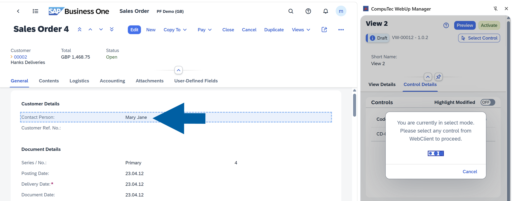

6. In **Computec WebUp Manager** panel on the right, find the **Position** section, and click **the arrow** to turn on new location selection for the control.

    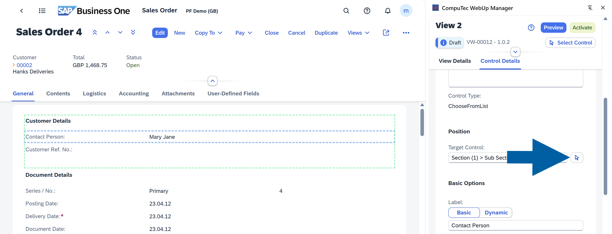

7. Click the section where you want to move the control.

    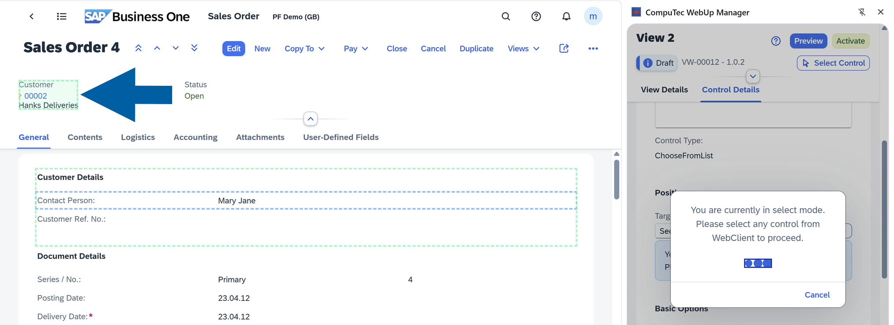

8. Click **Save** to continue.

    

9. Click **Preview** to review your changes, then click **Activate** when you’re satisfied with the result.

    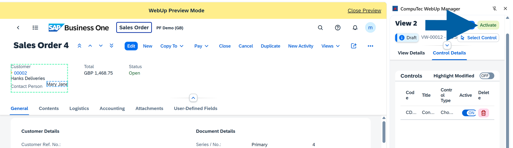

10. Done! You've successfully moved the control.

#### Video walkthrough

    ▶ **Watch**: [CompuTec WebUp - How to Move Controls](https://www.youtube.com/watch?v=bUEkcdizCLY&list=PLtT6kgaz5YneoXw5aRFA-SxXwzzB-u4vl&index=3)

### Make a field mandatory

If you want to make a field mandatory, follow these steps:

1. Log in to **SAP Business One Web Client**.
2. Navigate to the screen you want to edit. In our example it's **Sales Order**.
3. Open **CompuTec WebUp Manager** by clicking on its browser extension icon.
4. In **Control Details** section of **CompuTec WebUp Manager** side panel, click **Select Control**.

    

5. On the left panel, click the **Control** you want to make mandatory on the **SAP Business One Web Client** screen. In our example, we want to make the **Currency** field mandatory.

    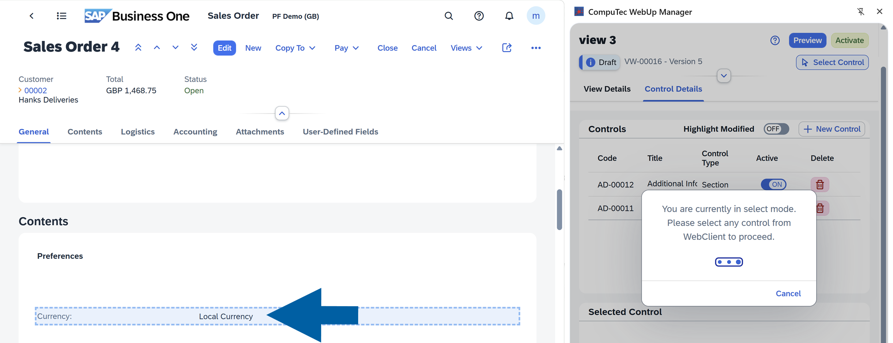

6. In the **Control Details** tab of the **CompuTec WebUp Manager** side panel, navigate to **Mandatory** section, and turn on **the toggle**.

    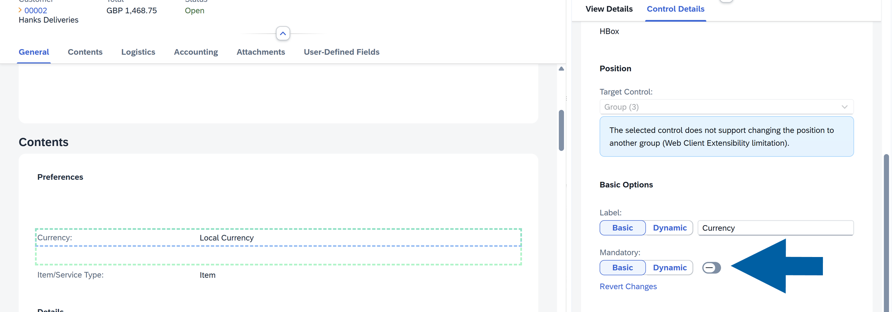

7. Click **Save** to continue.

    

8. Click **Preview** to review your changes, then click **Activate** when you’re satisfied with the result.

    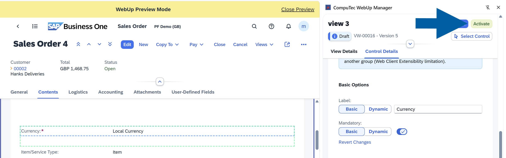

9. Done! You've successfully made the control mandatory.

#### Video walkthrough

    ▶ **Watch**: [CompuTec WebUp - Controls - Other Configurations](https://www.youtube.com/watch?v=MQk_z-cr-v8&list=PLtT6kgaz5YneoXw5aRFA-SxXwzzB-u4vl&index=4)
