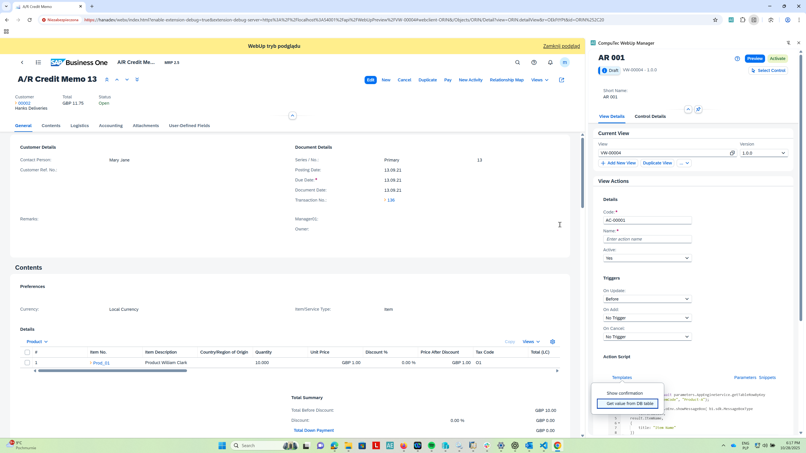
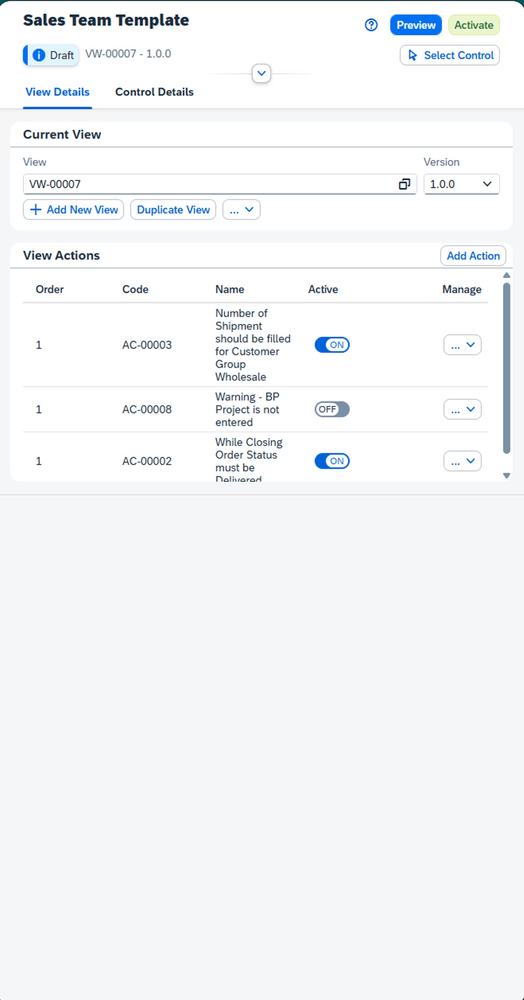
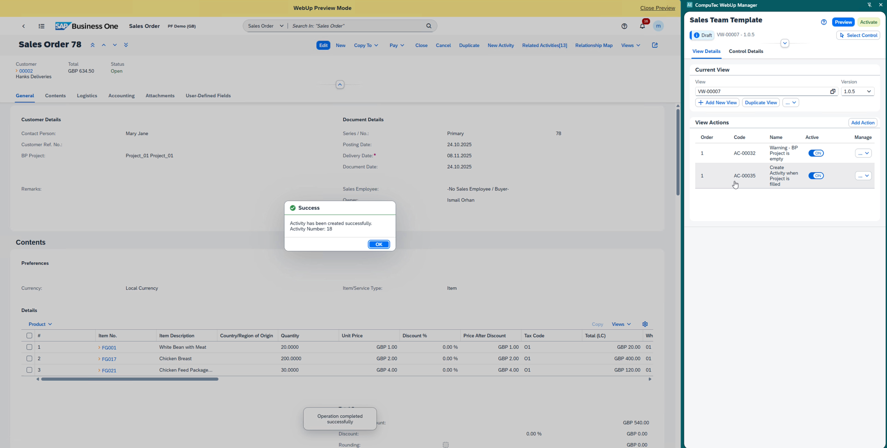

# Interactive Actions

The **Interactive Actions** component enables the creation of **event-driven logic** executed during user interactions within the **SAP Business One Web Client (AE)**.

Each action is tied to a specific **event** and processed through the **Logic Layer (Event & Action Processing)** of the **AppEngine**.

This component allows consultants and administrators to extend standard SAP Web Client behavior without modifying core objects or source code.

---

## Available Event Types

### **On Update**

Executed during record update or validation.  
Triggered after field values are modified and confirmed within the current object context.  
Typical use cases include:

- Data validation
- Recalculation of dependent fields
- Triggering updates to related objects

### **On Add**

Executed when a new record is being added.  
Triggered after mandatory fields are populated but before the object is committed to the database.  
Common use cases:

- Initializing default values  
- Assigning numbering sequences  
- Performing pre-save validations

### **On Cancel**

Executed when the record creation or editing process is canceled.  
Allows rollback of unsaved changes, clearing of temporary data, or restoring the interface to its previous state.  
May also stop or revert custom actions executed within the current session.

### **On Close**

Executed when the related form or panel is being closed.  
Typically used for:

- Session finalization  
- Saving metadata (e.g., editing duration, user info)  
- Releasing resources  
- Triggering cleanup operations such as detaching event listeners

---

## Key Elements

- **Templates** – predefined logic structures for common automation scenarios such as confirmations, validations, and data retrieval.  
  Provide a structured starting point for building actions without writing logic from scratch.

- **Parameters** – variables allowing direct reference to **SAP Business One model attributes**, field names, or **control GUIDs**.  
  Used to dynamically link action logic with the user interface or underlying database context.

- **Snippets** – small, reusable code fragments that perform a specific task (e.g., single-line validations, data formatting, or conditional checks).  
  Can be inserted into templates to extend or override default logic.

- **Copy Grid** – a utility that captures the structure and context of a selected grid in the Web Client.  
  Simplifies parameter configuration by automatically detecting available columns and data bindings.

- **Action Preview** – an interactive testing tool that enables **real-time validation** of configured logic directly within the Web Client environment.  
  Allows users to verify results, confirm parameter values, and adjust actions before deployment.

---

## Example Scenario

A **“Confirmation”** action is created for the **On Update** event to display a message box prompting the user to confirm saving changes.

When the user triggers a record update, the action intercepts the event and opens an interactive dialog:  
> *“Do you want to save your changes?”*

The user’s response determines whether the transaction continues or is canceled.

Action parameters may reference **model attributes** (e.g., `BusinessPartner.CardCode`, `Document.Total`) or **specific UI controls** identified via **Copy GUID** from the editor.  
This enables context-aware confirmations that adapt dynamically to the active record or form.

*WebUp Action definition*

*WebUp Actions list showing configured logic events and their activation states*

*Automation confirmation message after activity creation – AppEngine successfully triggered WebUp Action*
